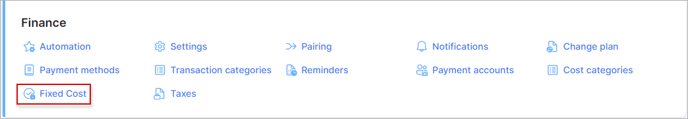
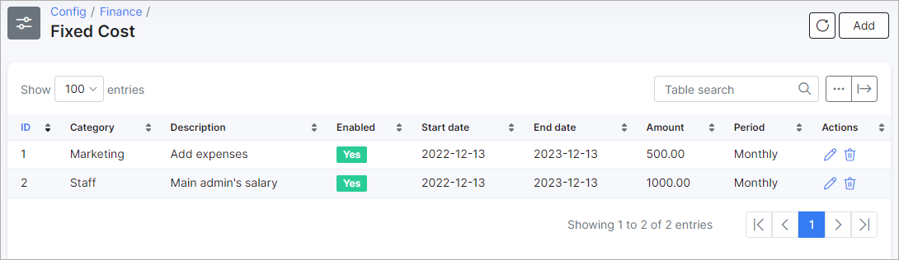

Fixed costs
====

In this section you can specify fixed expenses of the company like a salary, these are static expenses of the comapny

To set up fixed costs navigate to `Config → Finance → Fixed costs`.

We've added a few fixed costs and will be able to use them in the `Finance -> Costs` on the dashboard. 
