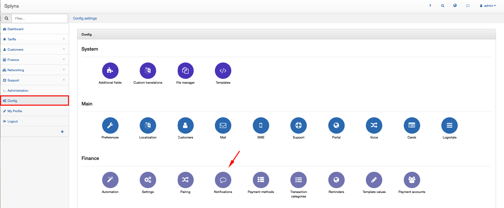
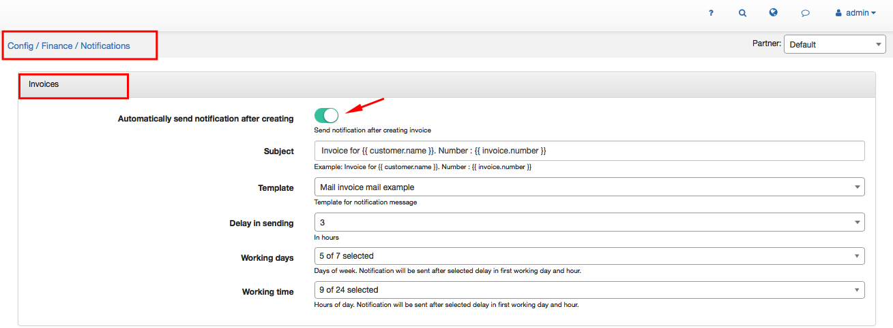
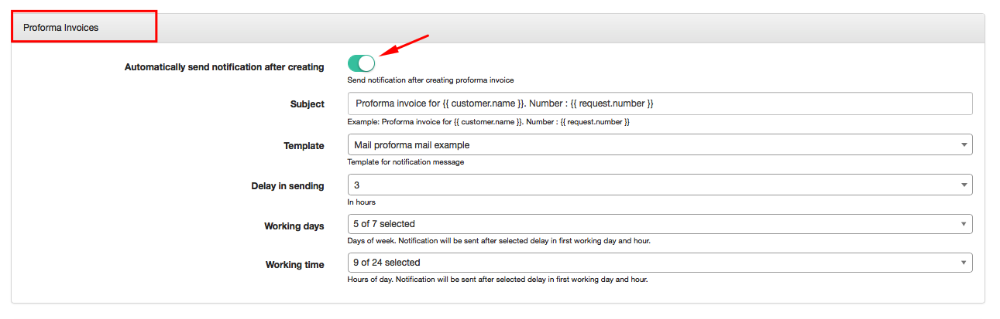
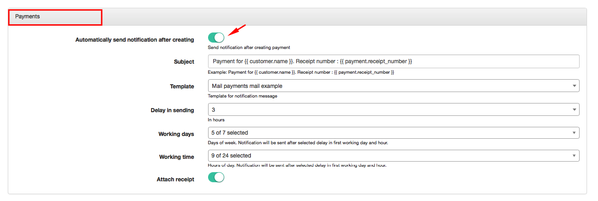
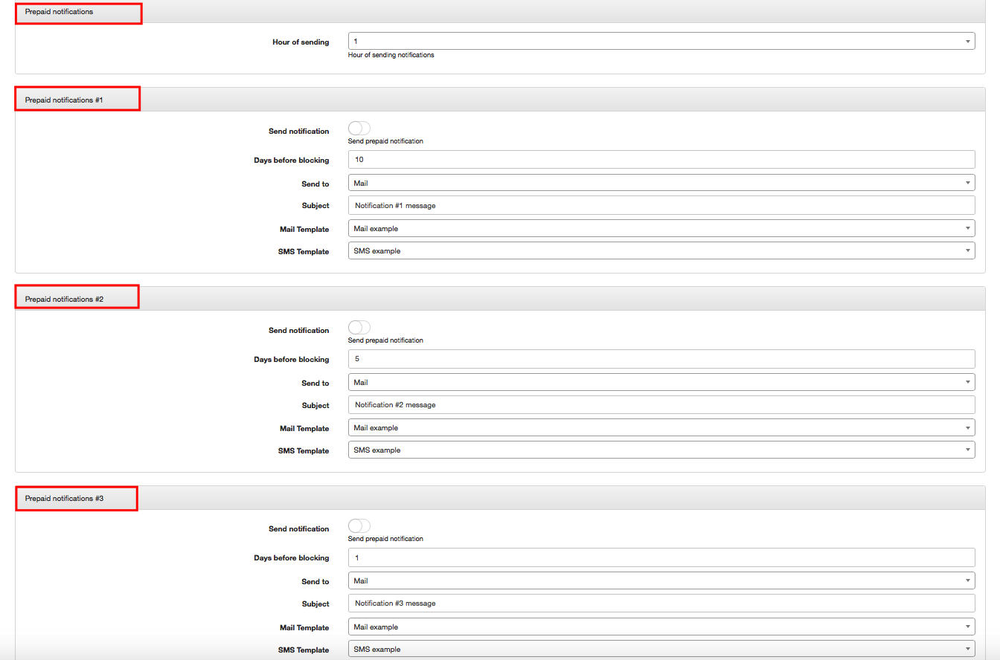
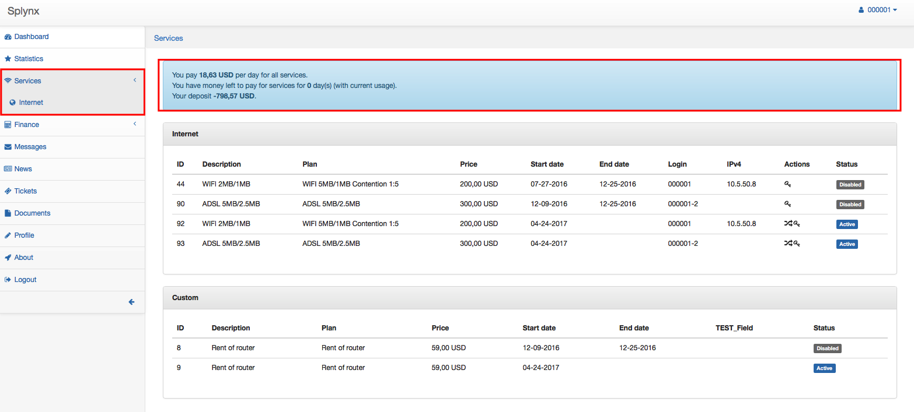
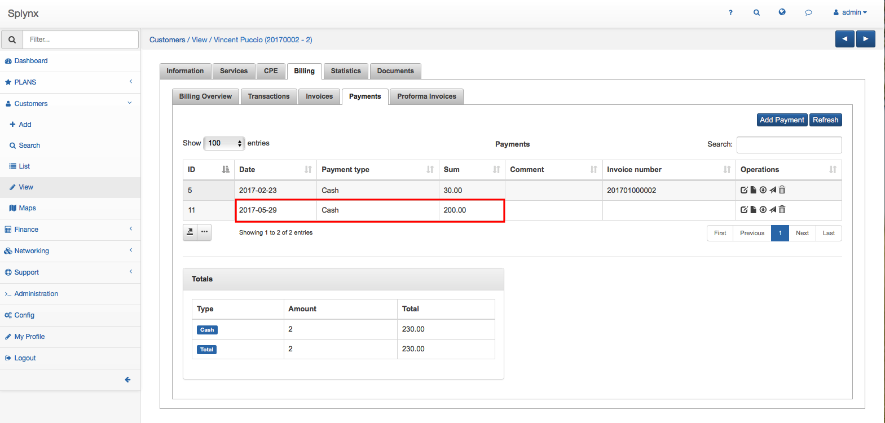
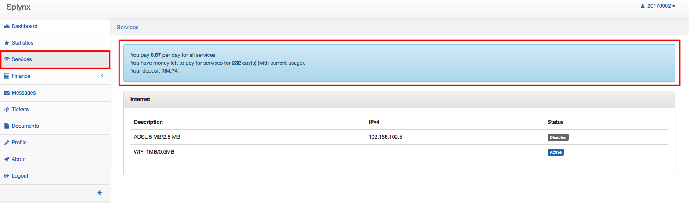

Notifications
=============

To set up Notifications click on `Config → Finance → Notifications`.

There are two main types of Notifications which can be configured here: Notifications of created Invoice, Proforma Invoice or Payment and Prepaid Notifications.

### Notifications of created Invoice, Proforma Invoice or Payment

When Invoice, Profoma Invoice or Payment will be created customer will receive a notification by email with its attachment.

#### Invoices Notifications

You can define here the following parameters of Invoices notifications:

* **Automatically send notification after creating** - enable/ disable the option of sending notifications automatically after creating the Invoice.
* **Subject** - write the subject of notification message.
* **Template** - choose the template for notification message.
* **Delay in sending** - choose in how many hours notification will be sent after Invoice creation. The options are: in 1, 3, 6, 12, 24, 48, 72 hours.
* **Working days** - select days of week when Notification will be sent. It will be sent after selected delay in hours  on the first working day and hour.
* **Working time** - select working hours for the notification sending. Notification will be sent after selected delay in hours on the first working day.

#### Proforma Invoices Notifications

The following parameters of Proforma Invoices Notifications can be set here:

* **Automatically send notification after creating** - enable/ disable the option of sending notifications automatically after creating the Proforma Invoice.
* **Subject** - write the subject of notification message.
* **Template** - choose the template for notification message.
* **Delay in sending** - choose in how many hours notification will be sent after creation of Proforma Invoice. The options are: in 1, 3, 6, 12, 24, 48, 72 hours.
* **Working days** - select days of week when Notification will be sent. It will be sent after selected delay in hours  on the first working day and hour.
* **Working time** - select working hours for the notification sending. Notification will be sent after selected delay in hours on the first working day.

#### Payments Notifications

The following parameters of Proforma Invoices Notifications can be set here:

* **Automatically send notification after creating** - enable/ disable the option of sending notifications automatically after creating the Payment.
* **Subject** - write the subject of notification message.
* **Template** - choose the template for notification message.
* **Delay in sending** - choose in how many hours notification will be sent after the Payment creation. The options are: in 1, 3, 6, 12, 24, 48, 72 hours.
* **Working days** - select days of week when Notification will be sent. It will be sent after selected delay in hours  on the first working day and hour.
* **Working time** - select working hours for the notification sending. Notification will be sent after selected delay in hours on the first working day.
* **Attach receipt** - you can enable or disable option to attach receipt.

#### Prepaid notifications

Prepaid Notifications are the same as Payment Reminders. The only difference is that **Prepaid Notifications are used in Prepaid Billing** and **Payment Reminders in Recurring billing**.

Prepaid Notification is an email, SMS or email+SMS prompt sent to customers to notify them about their low balance and remind them to make a payment.

The following parameters of Prepaid Notifications #1, #2 and # 3 can be configured here:

* **Hour of sending** - choose the hour when Prepaid notification will be sent.
* **Send notification** - enable/disable option of sending Prepaid notification
* **Days before blocking** - choose and write how many days will be left until blocking the customer
* **Send to** - select the sending option of prepaid notification: Mail, SMS or Mail+SMS. Information about configuring SMS can be found in our tutorial page - [SMS config](configuration/main_configuration/sms_config/sms_config.md).
* **Subject** - write the subject of Notification message.
* **Mail Template** - choose template for the mail notification.  
* **SMS Template** - choose template for the SMS notification.

If customer has Prepaid type of billing he will also be notified about his current balance in Customer `Portal → Services`.

Below is an example of notification for the customer in blocked status with minus deposit on his account:

This is an example of active customer's notification in Customer portal after he made a payment by cash:

* **Admin portal**: Payment's been received:

  

* **Customer portal**: customer can check his current deposit and how many days he can pay for services:

  
