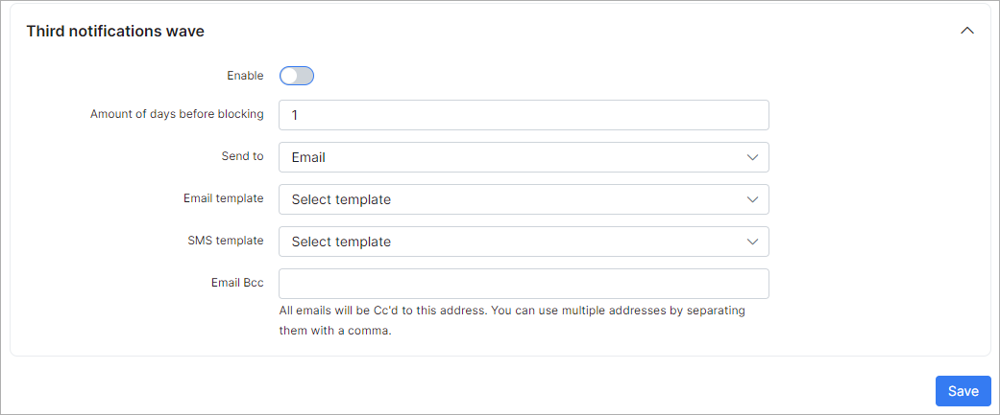
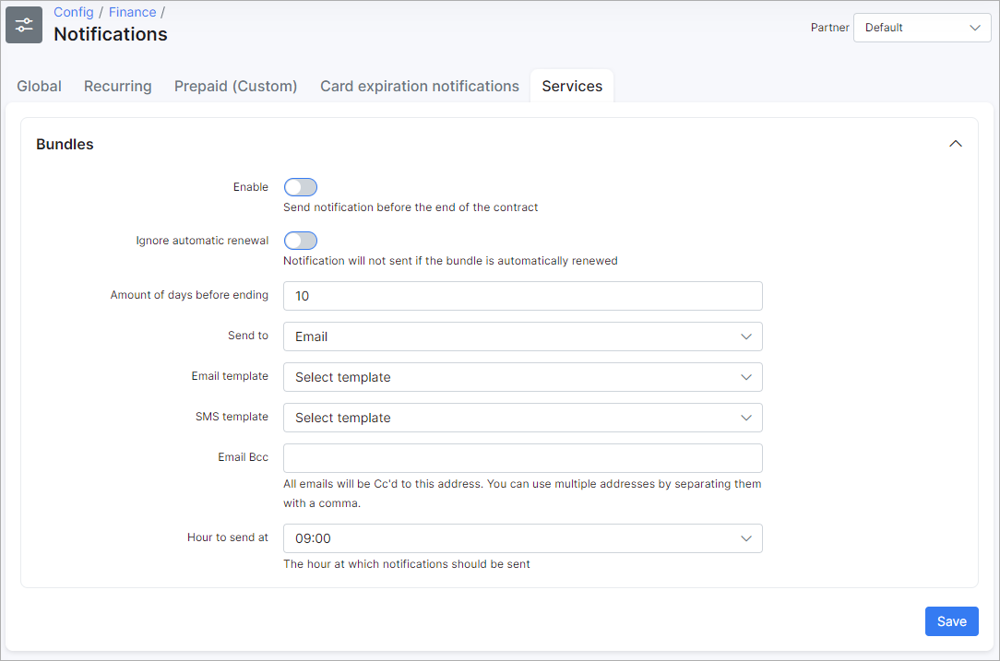

Notifications
=============

In this section we can configure the parameters for the notifications of the finance module.

To set up finance Notifications navigate to `Config → Finance → Notifications`.

**Note** to send notifications via Emails - [email sending](configuration/main_configuration/email_config/email_config.md) must be configured, and to send notifications via SMS - [sms sending](configuration/main_configuration/sms_config/sms_config.md) must be configured

There are two main types of notifications which can be configured here: billing notifications and service notifications.

On Finance tab can be configured notifications for all billing types. Configuration for prepaid(daily) and prepaid(custom) are the same but separated on two different tabs. Don't forget to select partner at right top corner.

# **Finance**

### RECURRING
#### Invoices

Notifications for invoices can be configured here:

* **Auto-send notifications after creating an invoice** - enables/disables auto sending of invoices after creation;
* **Subject** - notification email subject;
* **Template** - select a email template to use for the body of the message(can be added under [Config/System/Templates/Email](configuration/system/templates/templates.md);
* **Email BCC** - send a copy to this email;
* **Delay in sending notifications** - delay in hours to send notifications after invoice creation;
* **Notification days** - available days to send notifications;
* **Notification hours** - available hours to send notifications.

#### Proforma invoices

Notifications for proforma invoices can be configured here:

* **Auto-send notifications after creating an invoice** - enables/disables auto sending of proforma invoices after creation;
* **Subject** - notification email subject;
* **Template** - select a email template to use for the body of the message(can be added under [Config/System/Templates/Email](configuration/system/templates/templates.md);
* **Email BCC** - send copy to this email;
* **Delay in sending notifications** - delay in hours to send notifications after proforma invoice creation;
* **Notification days** - available days to send notifications(will be sent in the first available day);
* **Notification hours** - available hours to send notifications(will be sent in the first available hour).

#### Payments

Notifications for payments can be configured here:

* **Auto-send notifications after creating payments** - enables/disables auto sending of notifications when payments are created;
* **Subject** - notification email subject;
* **Template** - select a email template to use for the body of the message(can be added under [Config/System/Templates/Email](configuration/system/templates/templates.md);
* **Email BCC** - send copy to this email;
* **Delay in sending notifications** - delay in hours to send notification after payment creation;
* **Notification days** - available days to send notifications(will be sent in the first available day);
* **Notification hours** - available hours to send notifications(will be sent in the first available hour).

#### Blocking wave

Blocking wave notifications can be configured here:

* **Enable** - enables/disables sending of notifications after blocking of customers;
* **Send to** - type of notification: email, SMS or email+SMS;
* **Subject** - subject of the notification;
* **Email template** - select a template for email notifications(can be added under [Config/System/Templates/Email](configuration/system/templates/templates.md);
* **SMS template** - select a template for SMS notifications(can be added under [Config/System/Templates/SMS](configuration/system/templates/templates.md);
* **Email BCC** - send a copy of the notification to this email;
* **Hour of sending** - select the hour of day to send this notifications.

#### Inactive wave

Inactive wave notifications can be configured here:

* **Enable** - enables/disables sending of notifications when customers become inactive;
* **Send to** - type of notification: email, SMS or email+SMS;
* **Subject** - subject of notification;
* **Email template** - select a template for email notifications(can be added under [Config/System/Templates/Email](configuration/system/templates/templates.md);
* **SMS template** - select a template for SMS notifications(can be added under [Config/System/Templates/SMS](configuration/system/templates/templates.md);
* **Email BCC** - send a copy of the notification to this email;
* **Hour of sending** - select the hour of day to send this notifications.

### PREPAID

Notifications for Prepaid(daily) and Prepaid(custom) has the same parameters.

#### Main settings

* **Hour of sending** - select the hour of day to send notifications.

#### Blocking wave

Blocking wave notifications can be configured here:

* **Enable** - enables/disables sending of notifications after blocking of customers;
* **Send to** - type of notification: email, SMS or email+SMS;
* **Subject** - subject of notification;
* **Email template** - select a template for email notifications(can be added under [Config/System/Templates/Email](configuration/system/templates/templates.md);
* **SMS template** - select a template for SMS notifications(can be added under [Config/System/Templates/Email](configuration/system/templates/templates.md);
* **Email BCC** - send a copy of the notification to this email.

#### First notifications wave

First wave notifications can be configured here:

* **Enable** - enables/disables sending of notification;
* **Days before blocking** - amount of days before blocking to send this notifications;
* **Send to** - type of notification: email, SMS or email+SMS;
* **Subject** - subject of notification;
* **Email template** - select a template for email notifications(can be added under [Config/System/Templates/Email](configuration/system/templates/templates.md);
* **SMS template** - select a template for SMS notifications(can be added under [Config/System/Templates/SMS](configuration/system/templates/templates.md);
* **Email BCC** - send a copy of the notification to this email.

#### Second notifications wave

Second wave notifications can be configured here:

* **Enable** - enables/disables sending of notifications;
* **Days before blocking** - amount of days before blocking to send this notifications;
* **Send to** - type of notification: email, SMS or email+SMS;
* **Subject** - subject of notification;
* **Email template** - select a template for email notifications(can be added under [Config/System/Templates/Email](configuration/system/templates/templates.md);
* **SMS template** - select a template for SMS notifications(can be added under [Config/System/Templates/SMS](configuration/system/templates/templates.md);
* **Email BCC** - send a copy of the notification to this email.

#### Third notifications wave

Third wave notifications can be configured here:

* **Enable** - enables/disables sending of notifications;
* **Days before blocking** - amount of days before blocking to send this notifications;
* **Send to** - type of notification: email, SMS or email+SMS;
* **Subject** - subject of notification;
* **Email template** - select a template for email notifications(can be added under [Config/System/Templates/Email](configuration/system/templates/templates.md);
* **SMS template** - select a template for SMS notifications(can be added under [Config/System/Templates/SMS](configuration/system/templates/templates.md);
* **Email BCC** - send a copy of the notification to this email.

For example, a customer will be blocked on 26th of the current month, today we are on the 3rd and all 3 wave notifications are enabled. The customer will receive the first notification 10 days before blocking(16th day of the month), the second notification 5 days before blocking(21th day of the month) and the third 1 day before blocking(25th day). All notifications will be send at that the time you have specified in "Hour of sending".

# **Services**

Notifications for bundle services can be configured here.

* **Enable** - enables/disables sending of notifications;
* **Ignore automatic renewal** - Notifications will not send if  automatic renewal bundle is enabled;
* **Days before ending** - amount of days before the end of the bundle contract;
* **Send to** - type of notification: email, SMS or email+SMS;
* **Subject** - subject of notification;
* **Email template** - select a template for email notifications(can be added under [Config/System/Templates/Email](configuration/system/templates/templates.md);
* **SMS template** - select a template for SMS notifications(can be added under [Config/System/Templates/SMS](configuration/system/templates/templates.md);
* **Email BCC** - send a copy of the notification to this email;
* **Hour of sending** - select the hour of day to send notifications.
