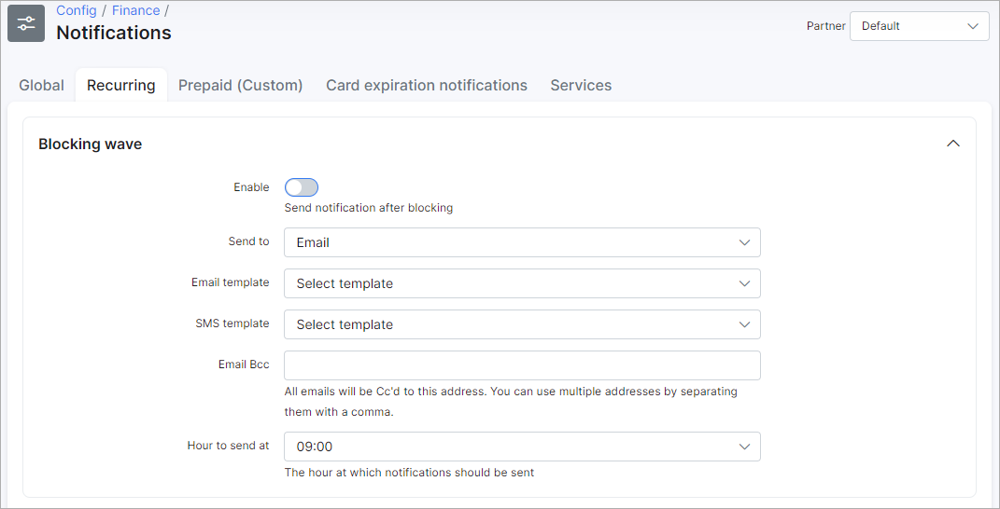
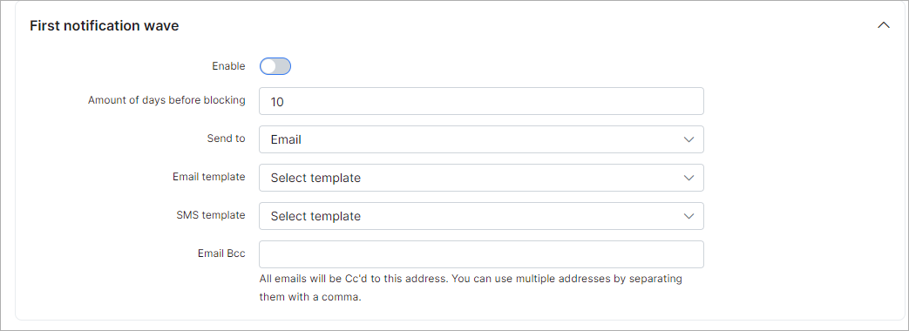

Notifications
=============

In this section we can configure the parameters for the notifications of the finance module.

To set up finance Notifications, navigate to `Config → Finance → Notifications`.

<icon class="image-icon"></icon> To send notifications via Emails - [email sending](configuration/main_configuration/email_config/email_config.md) must be configured, and to send notifications via SMS - [sms sending](configuration/main_configuration/sms_config/sms_config.md) must be configured.

There are the following types of notifications which can be configured here: *Global*, *Recurring*, *Prepaid (Custom)*, *Card expiration notifications*, *Services*:

Please don't forget to select the partner at the top right corner.

## Global

### Invoices

Notifications for invoices can be configured here:

* **Auto-send notifications after creating an invoice** - enables/disables auto sending of invoices after creation;
* **Send to** - choose where to send notifications to: *Email*, *SMS* or *Email + SMS*;
* **Email Template** - select an email template to use for the body of the message; can be added under [Config → System → Templates → Email](configuration/system/templates/templates.md);
* **SMS Template** - select an SMS template to use for the body of the message; can be added under [Config → System → Templates → SMS](configuration/system/templates/templates.md);
* **Email Bcc** - send a copy to this email;
* **Delay in sending notifications** - delay in hours to send notifications after the invoice creation;
* **Notification days** - available days for sending notifications;
* **Notification hours** - available hours for sending notifications.

### Proforma invoices

Notifications for proforma invoices can be configured here:

* **Auto-send notifications after creating proforma** - enables/disables auto sending of proforma invoices after creation;
* **Send to** - choose where to send notifications to: *Email*, *SMS* or *Email + SMS*;
* **Email Template** - select an email template to use for the body of the message; can be added under [Config → System → Templates → Email](configuration/system/templates/templates.md);
* **SMS Template** - select an SMS template to use for the body of the message; can be added under [Config → System → Templates → SMS](configuration/system/templates/templates.md);
* **Email Bcc** - send a copy to this email;
* **Delay in sending notifications** - delay in hours to send notifications after proforma invoice creation;
* **Days on which notifications can be sent** - available days to send notifications (will be sent in the first available day);
* **Hours at which notifications can be sent** - available hours to send notifications (will be sent at the first available hour).

### Payments

Notifications for payments can be configured here:

* **Auto-send notifications after creating a payment** - enables/disables auto sending of notifications when payments are created;
* **Send to** - choose where to send notifications to: *Email*, *SMS* or *Email + SMS*;
* **Email Template** - select an email template to use for the body of the message; can be added under [Config → System → Templates → Email](configuration/system/templates/templates.md);
* **SMS Template** - select an SMS template to use for the body of the message; can be added under [Config → System → Templates → SMS](configuration/system/templates/templates.md);
* **Email Bcc** - send a copy to this email;
* **Delay in sending notifications** - delay in hours to send notifications after payment creation;
* **Days on which notifications can be sent** - available days to send notifications (will be sent in the first available day);
* **Hours at which notifications can be sent** - available hours to send notifications (will be sent at the first available hour);
* **Attach receipt** - enable this option to attach a receipt to the message;
* **Attach related invoice/proforma invoice** - enable this option to attach a related invoice or proforma invoice to the message.

### Credit notes

Notifications for credit notes can be configured here:

* **Auto-send notifications after creating a credit note** - enables/disables auto sending of notifications when credit notes are created;
* **Send to** - choose where to send notifications to: *Email*, *SMS* or *Email + SMS*;
* **Email Template** - select an email template to use for the body of the message; can be added under [Config → System → Templates → Email](configuration/system/templates/templates.md);
* **SMS Template** - select an SMS template to use for the body of the message; can be added under [Config → System → Templates → SMS](configuration/system/templates/templates.md);
* **Email Bcc** - send a copy to this email;
* **Delay in sending notifications** - delay in hours to send notifications after credit note creation;
* **Notifications days** - available days to send notifications (will be sent in the first available day);
* **Notification hours** - available hours to send notifications (will be sent at the first available hour);
* **Attach related invoices** - enable this option to attach related invoices to the message.

## Recurring

### Blocking wave

Blocking wave notifications can be configured here:

* **Enable** - enables/disables sending of notifications after blocking of customers;
* **Send to** - type of notification: email, SMS or email+SMS;
* **Email Template** - select an email template to use for the body of the message; can be added under [Config → System → Templates → Email](configuration/system/templates/templates.md);
* **SMS Template** - select an SMS template to use for the body of the message; can be added under [Config → System → Templates → SMS](configuration/system/templates/templates.md);
* **Email Bcc** - send a copy of the notification to this email;
* **Hour to send at** - select the hour of day to send these notifications.

### Inactive wave

Inactive wave notifications can be configured here:

* **Enable** - enables/disables sending of notifications when customers become inactive;
* **Send to** - type of notification: email, SMS or email+SMS;
* **Email Template** - select an email template to use for the body of the message; can be added under [Config → System → Templates → Email](configuration/system/templates/templates.md);
* **SMS Template** - select an SMS template to use for the body of the message; can be added under [Config → System → Templates → SMS](configuration/system/templates/templates.md);
* **Email Bcc** - send a copy of the notification to this email;
* **Hour to send at** - select the hour of day to send this notifications.

## Prepaid (Custom)

Notifications for Prepaid (Custom) can be configured here.

### Main settings

* **Hour to send at** - select the hour of day to send notifications.

### Blocking wave

Blocking wave notifications can be configured here:

* **Enable** - enables/disables sending of notifications after blocking of customers;
* **Send to** - type of notification: email, SMS or email+SMS;
* **Email Template** - select an email template to use for the body of the message; can be added under [Config → System → Templates → Email](configuration/system/templates/templates.md);
* **SMS Template** - select an SMS template to use for the body of the message; can be added under [Config → System → Templates → SMS](configuration/system/templates/templates.md);
* **Email Bcc** - send a copy of the notification to this email.

### First notification wave

First notification wave can be configured here:

* **Enable** - enables/disables sending of notifications;
* **Amount of days before blocking** - amount of days before blocking to send these notifications;
* **Send to** - type of notifications: email, SMS or email+SMS;
* **Email Template** - select an email template to use for the body of the message; can be added under [Config → System → Templates → Email](configuration/system/templates/templates.md);
* **SMS Template** - select an SMS template to use for the body of the message; can be added under [Config → System → Templates → SMS](configuration/system/templates/templates.md);
* **Email Bcc** - send a copy of the notification to this email.

### Second notifications wave

Second notifications wave can be configured here:

* **Enable** - enables/disables sending of notifications;
* **Amount of days before blocking** - amount of days before blocking to send these notifications;
* **Send to** - type of notifications: email, SMS or email+SMS;
* **Email Template** - select an email template to use for the body of the message; can be added under [Config → System → Templates → Email](configuration/system/templates/templates.md);
* **SMS Template** - select an SMS template to use for the body of the message; can be added under [Config → System → Templates → SMS](configuration/system/templates/templates.md);
* **Email Bcc** - send a copy of the notification to this email.

### Third notifications wave

Third notifications wave can be configured here:

* **Enable** - enables/disables sending of notifications;
* **Amount of days before blocking** - amount of days before blocking to send these notifications;
* **Send to** - type of notifications: email, SMS or email+SMS;
* **Email Template** - select an email template to use for the body of the message; can be added under [Config → System → Templates → Email](configuration/system/templates/templates.md);
* **SMS Template** - select an SMS template to use for the body of the message; can be added under [Config → System → Templates → SMS](configuration/system/templates/templates.md);
* **Email Bcc** - send a copy of the notification to this email.

<icon class="image-icon"></icon> For example, a customer will be blocked on the 26th of the current month, today we are on the 3rd and all 3 waves of notifications are enabled. The customer will receive the first notification 10 days before blocking (the 16th day of the month), the second notification - 5 days before blocking (the 21th day of the month) and the third - 1 day before blocking (the 25th day). All notifications will be sent at the time you have specified in "Hour to send at".

## Card expiration notifications

Card expiration notifications can be configured here:

* **Enable** - enables/disables sending of notifications;
* **Send to** - type of notifications: email, SMS or email+SMS;
* **Email Template** - select an email template to use for the body of the message; can be added under [Config → System → Templates → Email](configuration/system/templates/templates.md);
* **SMS Template** - select an SMS template to use for the body of the message; can be added under [Config → System → Templates → SMS](configuration/system/templates/templates.md);
* **Email Bcc** - send a copy of the notification to this email;
* **Days until expiration** - indicate the number of days until the card expiration;
* **Notification hour** - choose time for sending notifications.
## Services

Notifications for bundle services can be configured here.

* **Enable** - enables/disables sending of notifications;
* **Ignore automatic renewal** - notifications will not be sent if the automatic renewal bundle is enabled;
* **Amount of days before ending** - amount of days before the end of the bundle contract;
* **Send to** - type of notifications: email, SMS or email+SMS;
* **Email Template** - select an email template to use for the body of the message; can be added under [Config → System → Templates → Email](configuration/system/templates/templates.md);
* **SMS Template** - select an SMS template to use for the body of the message; can be added under [Config → System → Templates → SMS](configuration/system/templates/templates.md);
* **Email Bcc** - send a copy of the notification to this email;
* **Hour to send at** - select the hour of day to send notifications.

