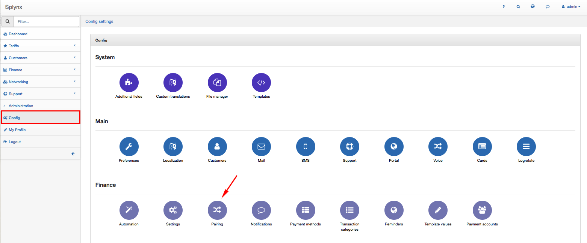
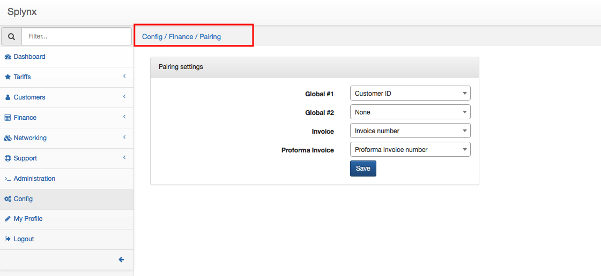

Pairing
=============

Before processing Bank statements their Paring parameters should be defined. The bank statement processing feature lets you reconcile payments receivable with invoices issued by paring them, so it can proceed multiple payments.

To configure Paring click on `Config → Finance → Pairing`.

Here you will define parameters to pair Bank statement with Invoice or Proforma Invoice: Global #1 or # 2 parameters with Invoice or Proforma Invoice parameters.

As Global parameters # 1 and # 2  for paring you can choose:
* None
* Customer ID
* Customer login
* Customer Birthday\ Firm ID
* Bank Account
* Canfone Account  
* Connected by

In our example we selected Customer ID as a Global # 1 parameter:

As Invoice parameter for pairing you can choose:
* None
* Invoice number
* Invoice ID
* Bank Account
* Canfone Account
* Connected by
* Contract ID

In our example we choose Invoice number:

You can choose the following Proforma Invoice parameters:  
* None
* Proforma Invoice number
* Proforma Invoice ID
* Bank Account
* Canfone Account
* Connected by
* Contract ID

Now, after defining Paring parameters you can process bank statements. Information about it you can find in our tutorial page -  [Bank statement processing](finance/bank_statement_processing/bank_statement_processing.md).
