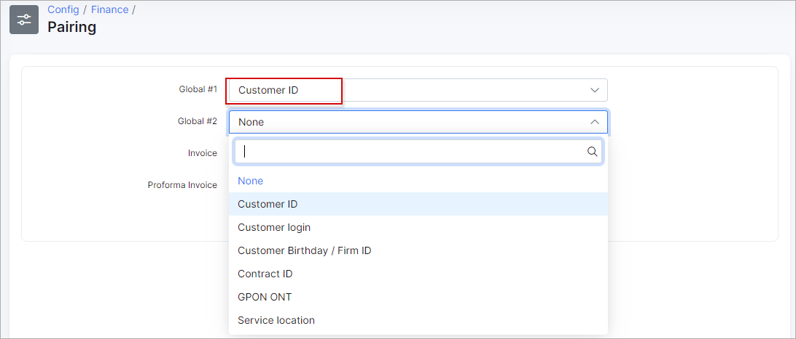

Pairing
=============

Before processing Bank statements, it is necessary to define pairing parameters first. The bank statement processing feature allows you reconcile payments receivable with invoices issued by pairing them, so it can proceed multiple payments.

To configure Paring click on `Config → Finance → Pairing`.

Here you will define parameters to pair Bank statement with Invoice or Proforma Invoice: Global #1 or # 2 parameters with Invoices or Proforma Invoices parameters.

As Global parameters # 1 and # 2  for pairing you can choose:

* None
* Customer ID
* Customer login
* Customer Birthday\ Firm ID

In our example we selected Customer ID as a Global # 1 parameter:

As Invoice parameter for pairing you can choose:

* None
* Invoice number
* Invoice ID

In our example we chose Invoice number:

You can choose the following Proforma Invoice parameters:

* None
* Proforma Invoice number
* Proforma Invoice ID

After defining Pairing parameters you can process bank statements. More information about bank statement processing can be found in the following tutorial page -  [Bank statement processing](finance/bank_statement_processing/bank_statement_processing.md).
