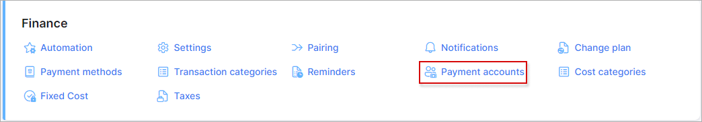
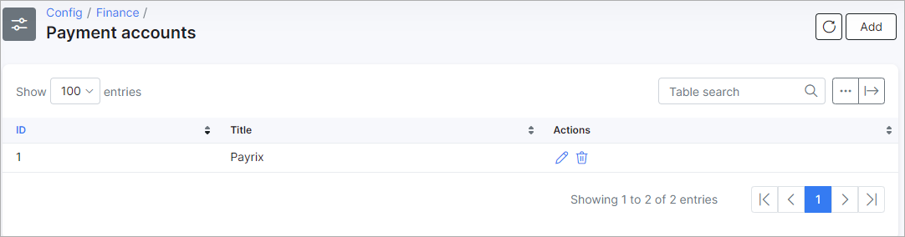
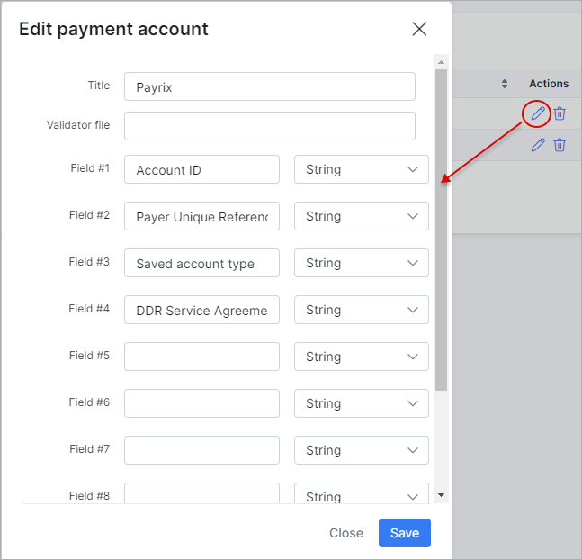
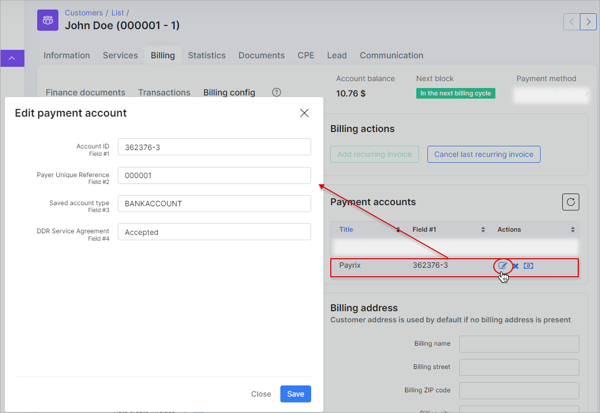

Payment accounts
====

To set up sending Payment accounts navigate to `Config → Finance → Payment accounts`.

The list of all payment accounts which customers are able to use is displayed here.

For example I have installed the [GoCardless addon](payment_systems/gocardless/gocardless.md) and my customers will be able to pay their invoices with GoCardless directly from Splynx, the new payment account will be created automatically. Please do not change payment accounts that have been added automatically.

After the GoCardless addon installation, a new payment account was created, let's check what fields this account contains:

If you intend to add a payment account from the admin panel, you will have to specify all these fields for the customer:

