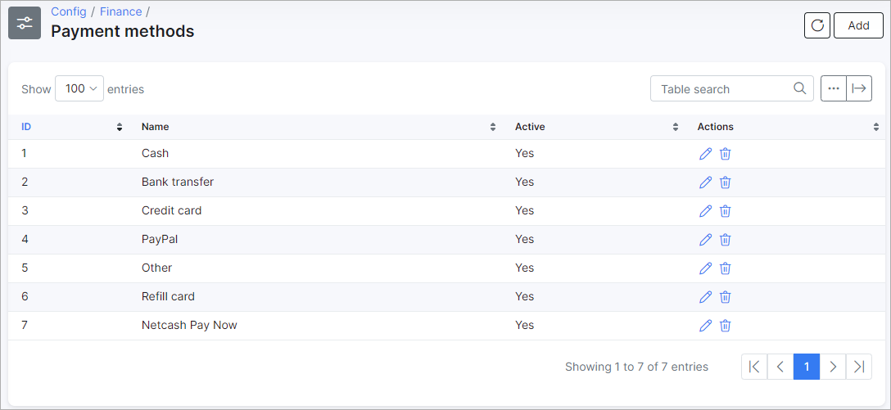

Payment methods
=============

To check your *Payment methods*, navigate to `Config → Finance → Payment Methods`.

Some payment methods are set by default. When you install a new payment module (e.g. SageOne, Netcash, Stripe, etc.), it will automatically appear in the list.  

You can add a new Payment method manually by clicking the `Add` button at the top right corner of the page.  The window will appear where you need to type the name of the payment method and enable the option *"Active"*.

After adding a new payment method, it will appear in customer's *Billing config*.

It is possible to edit <icon class="image-icon"></icon> or delete <icon class="image-icon"></icon> payment methods by clicking on the icons in the Actions column of the table.

