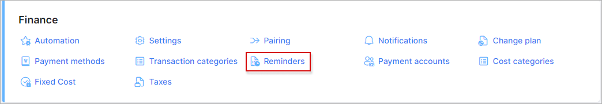
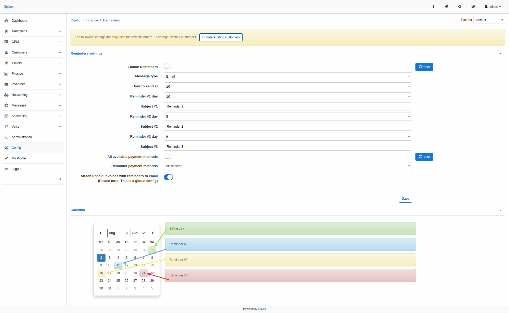
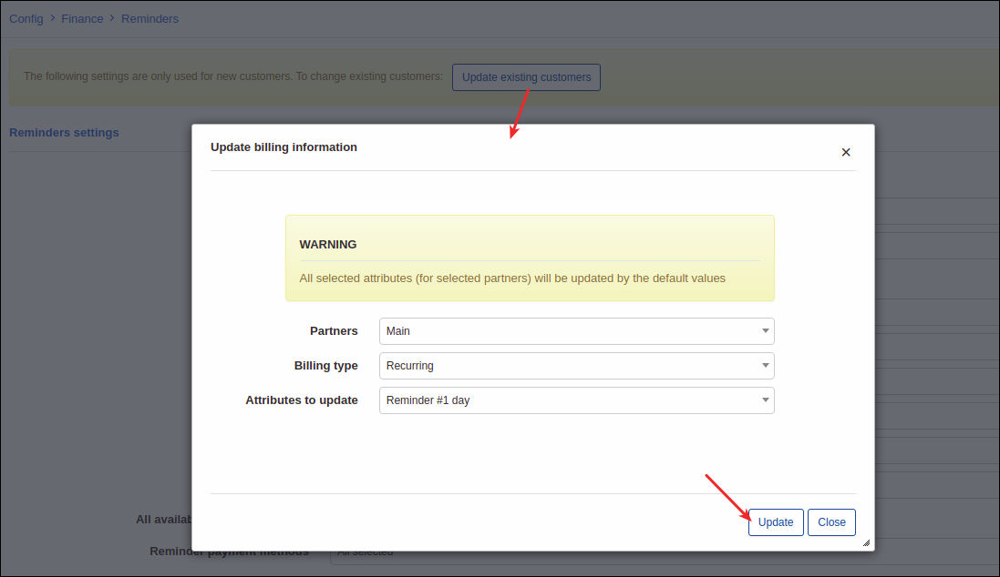
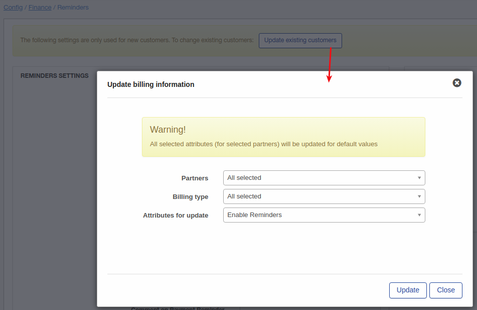

Reminders
=============

Payment Reminders are the same as Prepaid Notifications. The only difference is that Payment Reminders are used in Recurring billing and Prepaid Notifications in Prepaid Billing. Payment reminders are email, SMS or email&SMS prompts sent to customers to make them pay for their due or overdue invoices.

To set up sending Payment Reminders navigate to `Config → Finance → Reminders`.

You can select the Partner to work with before setting Reminders at the top-right corner of the page:

The following Reminders settings can be configured here:

* **Enable Reminders** - enables or disables automatic sending of reminders;
* **Message type** - choose the message type for sending reminders: Email, SMS, Email+SMS.
* **Hour of sending** - choose a time for sending reminders;
* **Reminder #1 day** - select in how many days you'd like the First Reminder to be sent;
* **Subject #1** - type a subject for the 1st Reminder;
* **Reminder #2 day** - select in how many days you'd like the Second Reminder to be sent;
* **Subject #2** - type a subject for 2nd Reminder;
* **Reminder #3 day** - select in how many days you'd like the Third Reminder to be sent;
* **Subject #3** - type a subject for 3rd Reminder;
* **Payment for reminder #3** - we do not recommend using this option, please keep it disabled;
* **Reminder payment methods** - select payment methods on which to send notifications;
* **Amount on payment reminder** - select amount on payment reminder;
* **Comment on payment reminder** - specify a comment on the payment reminder;
* **Attach unpaid invoices with reminders to email** - enable this option to attach unpaid invoices to the email.

All 3 dates selected for sending of reminders will be displayed in the "Calendar" next to "Reminders settings". In our example we chose 10 days for the Reminder #1, 5 days for the Reminder #2 and 5 days for the Reminder #3. That means reminders will be sent on 11th, 16th and 21th of of month accordingly.

These settings are global and to update existing customers with these settings you can use the "Update existing customers" button. For example I'd like to update the day for reminder #1, for customers in partner "Person" and recurring billing type, the update will look as follows:

Another example is an update of the "Enable reminders" option for all Splynx customers. Let's imagine that it was disabled for all customers, we enabled it in the config and the next step is to update of customers:

