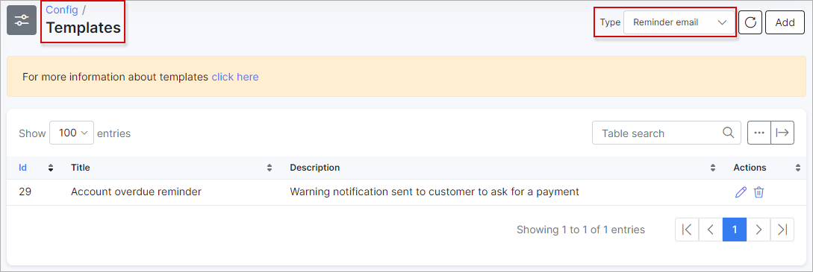

Reminders
=============

*Payment Reminders* are the same as *Prepaid Notifications*. The only difference is that *Payment Reminders* are used in *Recurring billing* and *Prepaid Notifications* in *Prepaid Billing*. *Payment reminders* include: email, SMS or a combination of email + SMS that are sent to customers to make them pay for their due or overdue invoices.

To set up sending *Payment Reminders* navigate to `Config → Finance → Reminders`.


In case in Splynx system is used the multiple [partners](administration/main/partners/partners.md) scheme, you can divide *Reminders* configuration between them.
You can select the *Partner* to work with before setting Reminders at the top-right corner of the page:


**Note:** The fields marked with `*` sign have the different values from original ones (original values are related to **Default** partner).

The following **Reminders settings** can be configured here:

* **Enable Reminders** - enables or disables automatic sending of reminders;
* **Message type** - choose the message type for sending reminders: Email, SMS, Email+SMS;
* **Hour to send at** - choose a time for sending reminders;
* **Reminder #1 day** - select in how many days you'd like the First Reminder to be sent;
* **Subject #1** - type a subject for the 1st Reminder;
* **Reminder #2 day** - select in how many days you'd like the Second Reminder to be sent;
* **Subject #2** - type a subject for 2nd Reminder;
* **Reminder #3 day** - select in how many days you'd like the Third Reminder to be sent;
* **Subject #3** - type a subject for 3rd Reminder;
* **All available payment methods** - the toggler allows to choose all [payment methods](configuration/finance/payment_methods/payment_methods.md) in Splynx for which the reminders will be used;
* **Reminder payment methods** - in case `All available payment methods` option is disabled, we can choose the particular payment method (-s) in drop-down list on which to send notifications;
* **Attach unpaid invoices with reminders to email** - enable this option to attach unpaid invoices to the email.

**Example:**

Let's choose 9 days for the Reminder #1, 5 days for the Reminder #2 and 5 days for the Reminder #3. That means reminders will be sent on 10th, 15th and 20th of of month accordingly. All 3 dates selected for sending of reminders will be displayed in the **Calendar** next to **Reminders settings**.

These settings are global and to update existing customers with these settings you can use the `Update existing customers` button. For example, I'd like to **update the day for reminder #1**, for customers in partner *Main* and recurring billing type, the update will look as follows:


Another example is an update of the **Enable reminders** option for all Splynx customers. Let's imagine that it was disabled for all customers, we enabled it in the config and the next step is to update this setting for all existing customers:


### Updated reminder template

Since Splynx 3.1 version we updated logic for reminders and because of this some old reminder templates might work wrong. We recommend to use next reminder template:

```

Dear {{ customer.name }},
{# Text for reminder 1#}

  
    
      
        
        
      
    
  
you received a new invoice lately. Outstanding balance is: {{ App.formatMoney(customer_billing.deposit * -1 ) }} Please make sure to pay your invoice soon.


{# Text for reminder 2 #}

  
    
      
        
        
      
    
  
your account is overdue with {{ App.formatMoney(customer_billing.deposit * -1 ) }}. Please make a immediate payment to avoid automatic suspension of your account.


{# Text for reminder 3 #}

{{ App.formatMoney(customer_billing.deposit * -1 ) }} overdue for longer than we allow. Please make a immediate payment to avoid automatic blacklisting.


```

This reminder can be copied into template "Account overdue reminder":



You can find template under Config/Templates and select type "Reminder email" or "Reminder SMS".
