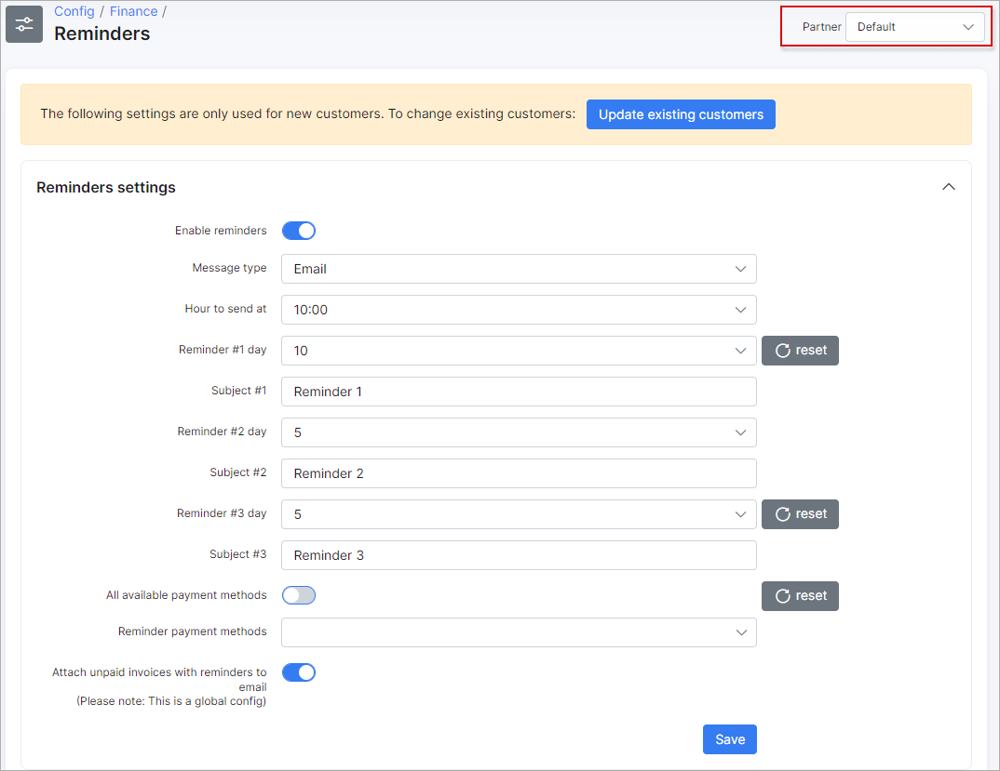

Reminders
=============

*Payment Reminders* are the same as *Prepaid Notifications*. The only difference is that *Payment Reminders* are used in *Recurring billing* and *Prepaid Notifications* in *Prepaid Billing*. *Payment reminders* include: email, SMS or a combination of email + SMS that are sent to customers to make them pay for their due or overdue invoices.

To set up sending *Payment Reminders* navigate to `Config → Finance → Reminders`.


If the multiple [partners](administration/main/partners/partners.md) scheme is used in the Splynx system, you can divide *Reminders* configuration between them.
You can select the *Partner* to work with (before setting Reminders) at the top right corner of the page:



<icon class="image-icon"></icon> The fields marked with `*` sign have different values from original ones (original values are related to **Default** partner).

The following **Reminders settings** can be configured here:

* **Enable reminders** - enables or disables automatic sending of reminders;
* **Message type** - choose the message type for sending reminders: Email, SMS, Email+SMS;
* **Hour to send at** - choose a time for sending reminders;
* **Reminder #1 day** - select in how many days you'd like the First Reminder to be sent;
* **Subject #1** - type a subject for the 1st Reminder;
* **Reminder #2 day** - select in how many days you'd like the Second Reminder to be sent;
* **Subject #2** - type a subject for the 2nd Reminder;
* **Reminder #3 day** - select in how many days you'd like the Third Reminder to be sent;
* **Subject #3** - type a subject for the 3rd Reminder;
* **All available payment methods** - the toggle allows to choose all [payment methods](configuration/finance/payment_methods/payment_methods.md) in Splynx for which the reminders will be used;
* **Reminder payment methods** - in case `All available payment methods` option is disabled, we can choose the particular payment method(-s) in the drop-down list on which to send notifications;
* **Attach unpaid invoices with reminders to email** - enable this option to attach unpaid invoices to the email.

<!-- **Examples:**

- `Static days` toggle is `disabled`: we choose 9 days for the Reminder #1, 5 days for the Reminder #2 and 5 days for the Reminder #3. That means reminders will be sent on 10th, 15th and 20th of of month accordingly.

- `Static days` toggle is `enabled`: we choose - 3 days for the Reminder #1, 5 days for the Reminder #2 and 7 days for the Reminder #3. It means that reminders will be sent on the defined dates of the current month (3d, 7th and 10th of August). The admin cannot select a value for a reminder higher than 31 days, but in case the next month has fewer days than the current selected value, the reminder will be sent on the last day of the new month. The same values for different reminders cannot be selected as well. Also, admin should select days for reminders in the correct ascending order: the day number for the first reminder cannot be greater than the day for the second reminder etc.
If you enable `Static days` and press `Save` button, the days' values for *Reminder #1*, *Reminder #2* and *Reminder #3*  will be automatically replaced with the system default ones (where Reminder #1 = **3**; Reminder #2 = **5**; Reminder #3 = **7**). The default values will also be set in the **Reminders settings** for all customers in Splynx. After that you can change these values to your own. -->


All 3 dates selected for sending of reminders will be displayed in the **Calendar** next to **Reminders settings**.


These settings are global and to update existing customers with these settings you can use the `Update existing customers` button.

For instance, we need to **update the day for reminder #1**, for customers in partner *Main* and Recurring billing type; the update will look as follows:


Another example is an update of the **Enable reminders** option for all Splynx customers. Let's imagine that it was disabled for all customers, we enabled it in the config and the next step is to update this setting for all existing customers:


### Updated reminder template

Since Splynx 3.1 version we updated logic for reminders and that's why some old reminder templates might work wrong. We recommend to use next reminder template:

```

 
 
 
{# REMINDER 1 TEXT #} 
REMINDER 1 TEXT 
 
{# REMINDER 2 TEXT #} 
REMINDER 2 TEXT 
 
{# REMINDER 3 TEXT #} 
REMINDER 3 TEXT 
 
=== IGNORE NOTIFICATION === 


```

This reminder can be copied into the template `Account overdue reminder`:


You can find the template under `Config → System → Templates` and select type `Reminder email` or `Reminder SMS`.
