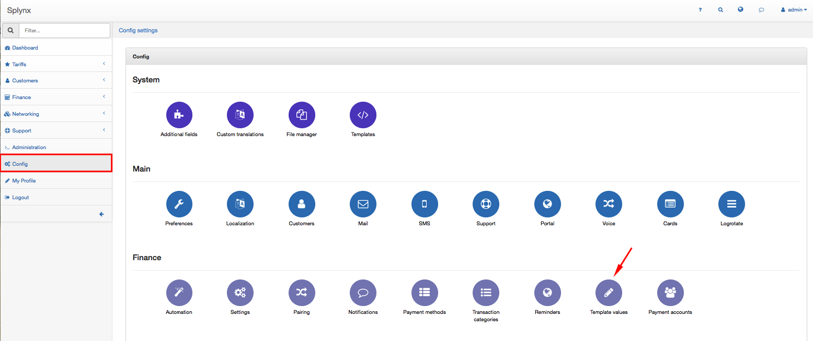
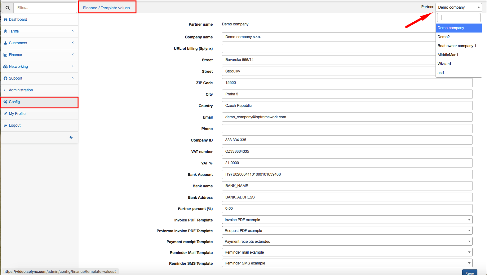
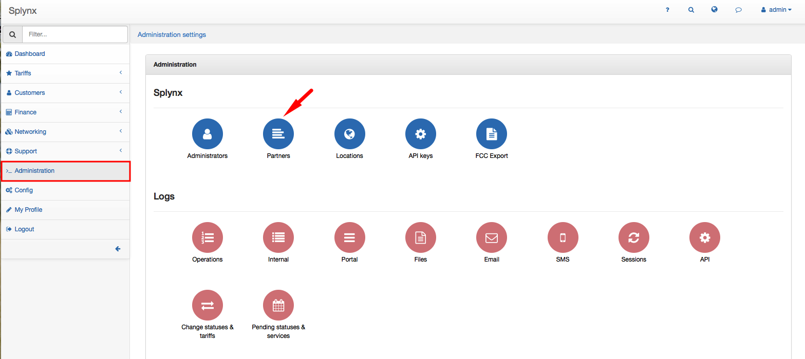

Template values
=============

You can set Template values for each Partner in `Configuration → Finance → Template Values`.

 

 At the top-right corner of the "Template values" screen you will choose a Partner:

 

 As a reminder, you can **add** or **edit partner** in Splynx in `Administration → Partners`.

More information about creating or editing a new partner you can find on our tutorial page - [Partners](administration/main/partners/partners.md).

You can define the following Template values for each Partner:

* **Company name** - write the name of the company
* **URL of billing (Splynx)** - insert URL of Splynx billing system if needed
* **Street, ZIP Code, City, Country** - fill in the partner's address
* **Email** - you can provide and email of the partner
* **Phone** - provide phone number of the partner
* **Company ID** - you can provide the partner's company ID if needed
* **VAT number** - you can write VAT number of the partner's company
* **VAT %** - you can write a VAT percentage
* **Bank Account, Bank name, Bank Address** - you can provide partner's bank account details, such as Bank account, Bank name and address
* **Partner percent (%)** - here you can define a commission for the partner from each payment made by customers for their services. More information about commission for the Partner can be found here - [Partners](administration/main/partners/partners.md).
.
* **Invoice PDF Template** - choose the template for Invoice PDF for the partner
* **Proforma Invoice PDF Template** - choose the template for Proforma Invoice PDF
* **Payment receipt Template** - choose the template for the Payment receipt
* **Reminder Mail Template** - choose the template of email reminder
* **Reminder SMS Template** - choose the template of SMS reminder

Information about configuring Templates can be found in our tutorial page - [Templates](configuration/system/templates/templates.md)
