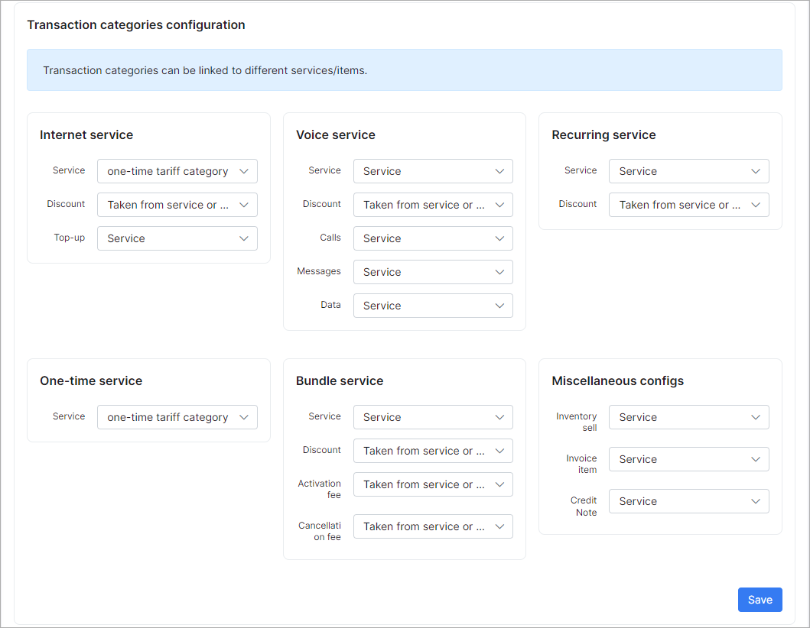

Transaction categories
=============

To check all Transaction categories in Splynx navigate to `Config → Finance → Transaction categories`.

#### Transaction categories

Transaction categories listed here are set by default:

We've added categories 6,7,8 and they can be removed. Default categories 1-5 can be only edited.

You can add a new Transaction category manually by clicking on the *Add* icon at the top-right corner of the page. You can export or select fields to display by clicking on the icons at the bottom left of the table.

#### Transaction categories configuration

Mapping settings between services(internet, voice, custom, bundle or one-time), inventory and transaction categories can be configured here. If all services have to be configured with this mapping you should select transaction category = "default for service type" under each tariff:

Then you will be able to track the amount of money for each transaction category in Administration/Reports/Transaction categories report:

#### Transaction categories configuration for tariff plans

Mapping configuration for tariff plans can be enabled here, if something was configured in the previous step in the "Transaction categories configuration".

If these are items enabled, tariffs will use the configuration for transaction categories from this menu, if disabled - directly from tariff plan settings.

Now with the created and configured transaction categories we can use them in billing:

