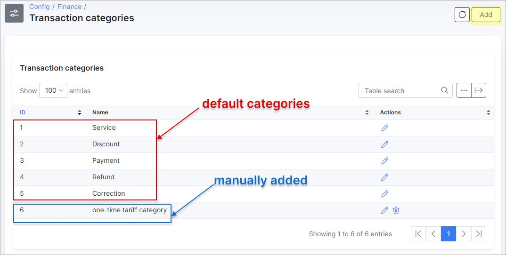

Transaction categories
=============

To check all Transaction categories in Splynx click on `Config → Finance → Transaction categories`.

Transaction categories listed here are set by default:

You can add a new Transaction category manually by clicking on Add icon at the top-right corner of the screen:

You can also correct the name of the Transaction category or delete it by clicking on icon <icon class="image-icon"></icon>  or <icon class="image-icon"></icon> in Actions column of the table:

 On the list of particular customer's transactions in `Customers → View →Billing →Transactions` the category of every transaction made by this customer will be seen:

 

 If you will create any new transaction manually for the customer you can also choose its category:

