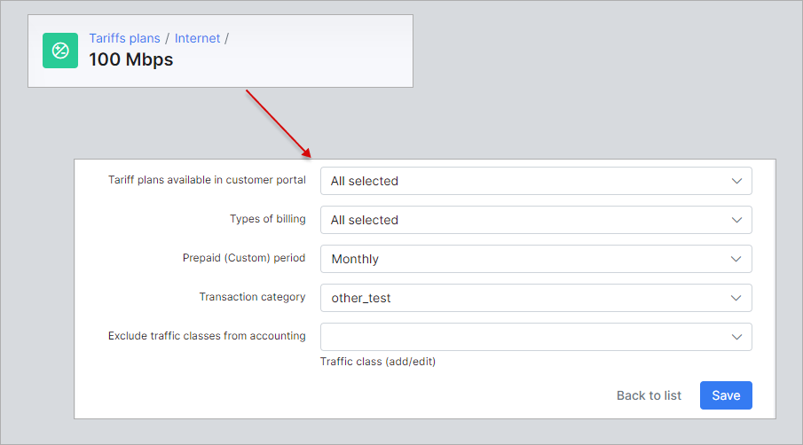

Transaction categories
=============

To check all transaction categories in Splynx navigate to `Config → Finance → Transaction categories`.

#### Transaction categories

The transaction categories such as **Service**, **Discount**, **Payment**, **Refund** and **Correction** are set by default in Splynx.

You can add a new transaction category manually by clicking on the `Add` button at the top right corner of the page.

We manually added a category 6, and it can be removed only if this category is not used within Splynx, e.g. in transactions or CAP plans.

The default categories cannot be deleted, you can only change their names.

#### Transaction categories configuration

The global mapping settings between services (internet, voice, recurring, bundle or one-time), inventory, invoice and credit note categories can be configured here.

**Example**

If we choose `other_test` value instead of default `Service` one for Internet service and charge the customer, their new transaction will be categorized as `other_test` category:

#### Transaction categories configuration for tariff plans

The mapping configuration for tariff plans can be enabled here. If these items are enabled, the additional field `Transaction category` will be activated in each tariff configuration window. By default, the `Default for service type` value is used there, in this case the global settings will be followed.

But if you choose any other transaction category in tariff configuration window, the global settings for this particular tariff plan will be ignored and the chosen category will be used instead.

#### Report

To track the amount of money for each transaction category, navigate to `Administration → Reports → Transaction categories`.

For more information, see [Transaction Categories Report](administration/reports/transactions_categories/transactions_categories.md).
