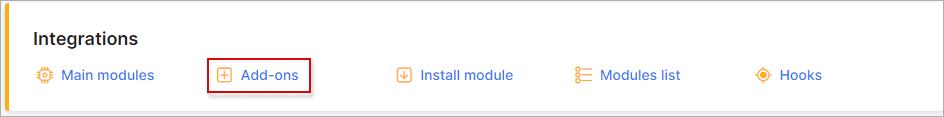
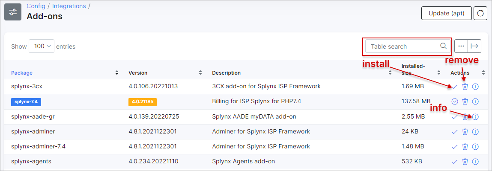
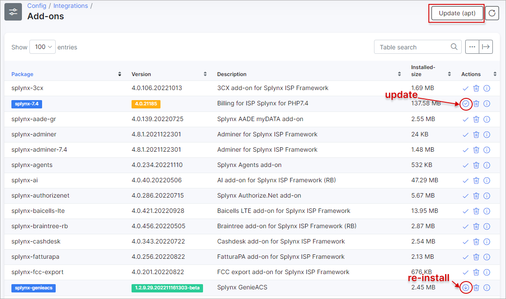

Add-ons
=====

In this section, we can install add-ons and integrating software already supported and provided by Splynx, to your Splynx server.

This is the easiest method of installing any add-on or integrating software on Splynx.

To install an add-on, navigate to `Config → Integrations → Add-ons`:

Once here, you will be provided with a list of add-ons which you can install, reinstall or delete. You can also click on the `i` icon to retrieve information on the add-on.

You can either locate the add-on you wish to install manually or simply use the search bar provided to search for the add-on by the specific text.

 The list will also display add-ons which you have already installed by highlighting the "Package" name in blue. Also, add-ons with a "Version" number highlighted in yellow, indicates that an update is available for the add-on. If the version is highlighted in green, this means that the add-on is up-to-date.

 Updates can be installed by clicking on the install icon for the add-on marked in yellow or via the `Update(apt)` button that search for all updates:

 
