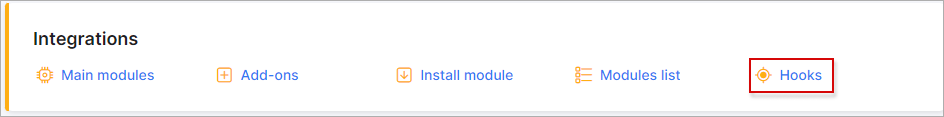
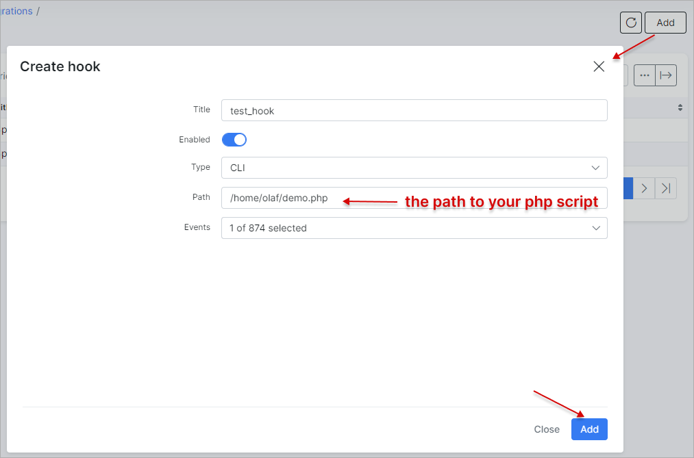
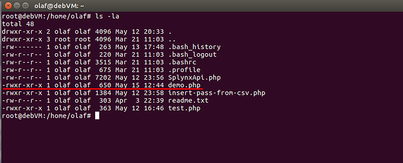
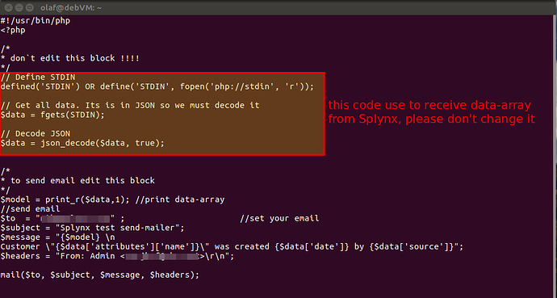
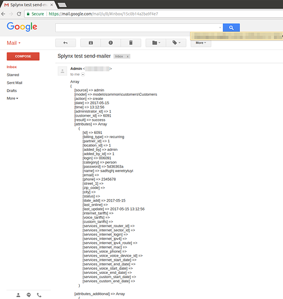
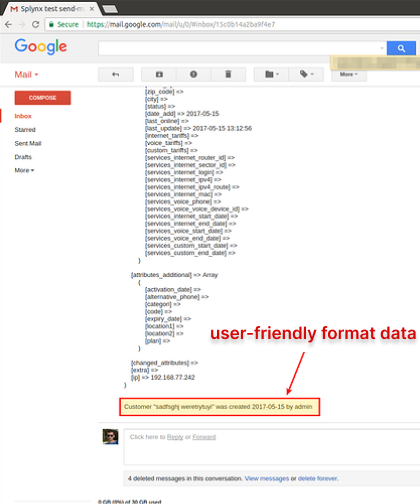
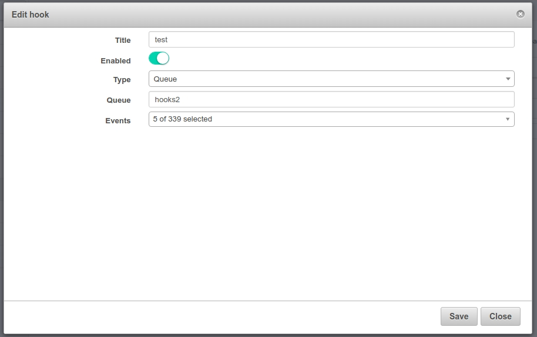

Hooks
=============

### Cli

Hook is a method of augmenting or altering the behavior of a page or application with custom callbacks. These callbacks may be maintained, modified, and managed by third-party users and developers who may not necessarily be affiliated with the originating application (Splynx). For example, we illustrate how to use hooks and send emails.

To send notifications on a particular action from Splynx, you can use hooks (`Config → Integrations → Hooks`).



First of all, you have to know how hooks work. "Hooks" are listening to an event you've selected, and if the event is executed, it runs a script you wrote in the "path"-field. By the way, a hook can send data-array that calls this event. Let's create a new hook:



Before creating a hook you have to put a php-script into the home-folder, and give it permissions 755:
```
chmod 755 script-file.php
```


Thereafter, a simple script should be created - to send an email notification. Of course, you can use your own script to execute another action.



```PHP
#!/usr/bin/php

<?php

/* * don`t edit this block !!!! */
// Define STDIN
defined('STDIN') OR define('STDIN', fopen('php://stdin', 'r'));

// Get all data. Its is in JSON so we must decode it
$data = fgets(STDIN);

// Decode JSON
$data = json_decode($data, true);


/* * to send email edit this block */
$model = print_r($data,1); //print data-array
//send email
$to  = "mail_box_to@semple.com" ;                       //set your email
$subject = "Splynx test send-mailer";
$message = "{$model} \n Customer \"{$data['attributes']['name']}\" was created {$data['date']} by {$data['source']}";
$headers = "From: Admin <mail_box_from@semple.com>\r\n";

mail($to, $subject, $message, $headers);
```

So, when a new customer is created, we will receive an email:



Attention!!!
To send emails, we used the mail-server : Sendmail, and by default, it sends emails in the local-network only. Therefor, if you want to send an email to external addresses, you have to reconfigure sendmail.
Run the command to achieve this
```
sudo dpkg-reconfigure exim4-config
```
The following manual can be used as a guide - https://www.digitalocean.com/community/tutorials/how-to-install-the-send-only-mail-server-exim-on-ubuntu-12-04

---
### Custom named queues
Attention!!! beginning from Splynx v 2.0
Starting from version 2.0, you can use custom named queues. To achieve this select the hook type "Queue" and enter your queue name.



The following PHP script (based on [BunnyPHP](https://github.com/jakubkulhan/bunny)) can be used as an example to work with messages from custom named queues:
```
<?php

use Bunny\Channel;
use Bunny\Async\Client;
use Bunny\Message;
use React\EventLoop\Factory;

require '../vendor/autoload.php';

$connectOptions = [
 'host' => '127.0.0.1',
 'port' => 5672,
 'vhost' => '/',
 'user' => 'guest',
 'password' => 'guest',
];

$loop = Factory::create();
(new Client($loop))->connect()->then(function (Client $client) {
 return $client->channel();
})->then(function (Channel $channel) {
 return $channel->queueDeclare('hooks2', false, true, false, false)->then(function () use ($channel) {
 return $channel;
 });
})->then(function (Channel $channel) {
 echo ' [*] Waiting for messages. To exit press CTRL+C', "\n";
 $channel->consume(
 function (Message $message, Channel $channel, Client $client) {
 echo " [x] Received ", $message->content, "\n";
 },
 'hooks2'
 );
});
$loop->run();
```
**Attention**: you must use the same parameters when declaring a queue as in the example because this parameters uses Splynx when adding a message to RabbitMQ!

You will get a string like this: `{"type":"","call":"","data":{"source":"admin","model":"models\\admin\\administration\\Locations","action":"get_list","date":"2017-09-20","time":"14:38:12","administrator_id":"1","customer_id":null,"result":"success","attributes":{"id":null,"name":null},"attributes_additional":[],"changed_attributes":null,"extra":null,"errors":null,"ip":"192.168.77.233"}}`

Use function `json_decode` to decode it and use received data for your purposes.

---
### Webhooks

Webhooks allow you to build external Apps which subscribe to certain events on the Splynx system. When one of those events are triggered, we'll send a HTTP POST payload to the webhook's configured URL.

#### Events

When configuring a webhook, you can choose which events you would like to receive payloads for.

#### Handle webhook events

To validate an event you need to check the header `X-Splynx-Signature`, which contains the event signature. Signatures are generated from the response body string using the `sha1` hash function and the secret as the `HMAC key`.

#### Example PHP webhook handler

```
<?php

define('REQUEST_TYPE_PING', 'ping');
define('REQUEST_TYPE_EVENT', 'event');
define('CONTENT_TYPE_JSON', 'application/json');
define('CONTENT_TYPE_FORM_URLENCODED', 'application/x-www-form-urlencoded');

$headers = getHeaders();
$input = file_get_contents('php://input');
$contentType = isset($headers['Content-Type']) ? $headers['Content-Type'] : '';

// Parse payload data
if ($contentType == CONTENT_TYPE_JSON) {
    $postData = json_decode($input, true);
} else {
    parse_str($input, $postData);
}

$requestType = isset($postData['type']) ? $postData['type'] : null;

// Process ping request
if ($requestType === REQUEST_TYPE_PING) {
    http_response_code(200);
    exit('ok');
}

// Validate request type
if ($requestType !== REQUEST_TYPE_EVENT) {
    http_response_code(400);
    exit('Invalid request type!');
}

// Calculate signature from payload and secret
$secret = 'your secret';
$calculatedSignature = hash_hmac('sha1', $input, $secret);

// Signature from HTTP request header
$inputSignature = isset($headers['X-Splynx-Signature']) ? $headers['X-Splynx-Signature'] : '';

// Compare signatures
if (hash_equals($inputSignature, $calculatedSignature)) {
    http_response_code(200);
    echo 'ok';

    // Success, you can process event as you want
    // ...
} else {
    // Invalid signature, return from code
    http_response_code(401);
    exit('Unauthorized!');
}

// Specific PHP function for safe getting HTTP headers
function getHeaders()
{
    $headers = [];

    if (function_exists('getallheaders')) {
        $headers = getallheaders();
    } elseif (function_exists('http_get_request_headers')) {
        $headers = http_get_request_headers();
    } else {
        foreach ($_SERVER as $name => $value) {
            if (strncmp($name, 'HTTP_', 5) === 0) {
                $name = str_replace(' ', '-', ucwords(strtolower(str_replace('_', ' ', substr($name, 5)))));
                $headers[$name] = $value;
            }
        }
    }

    return $headers;
}
```
