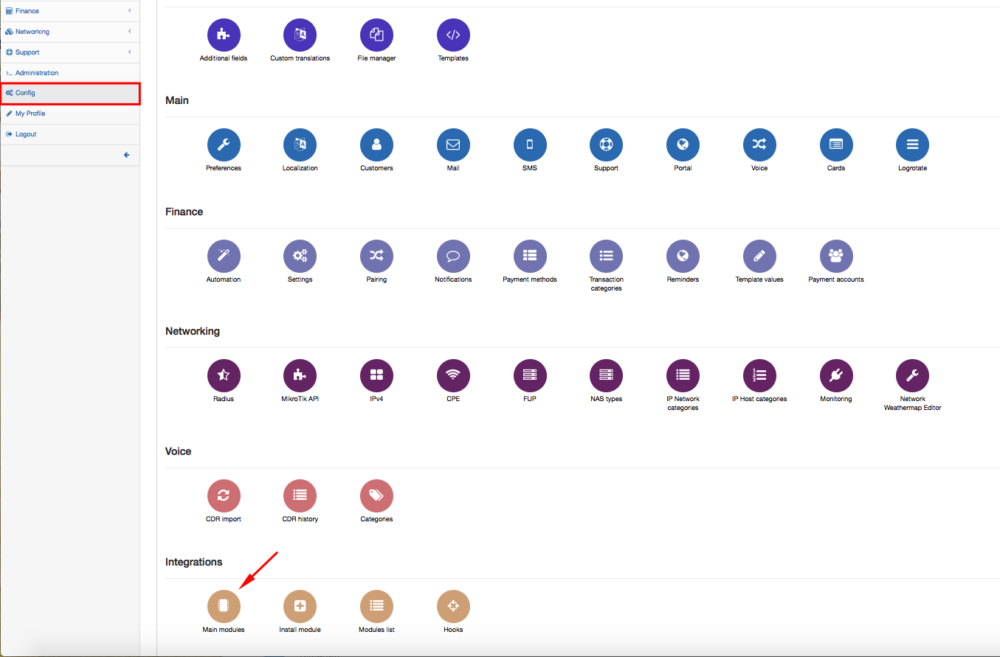
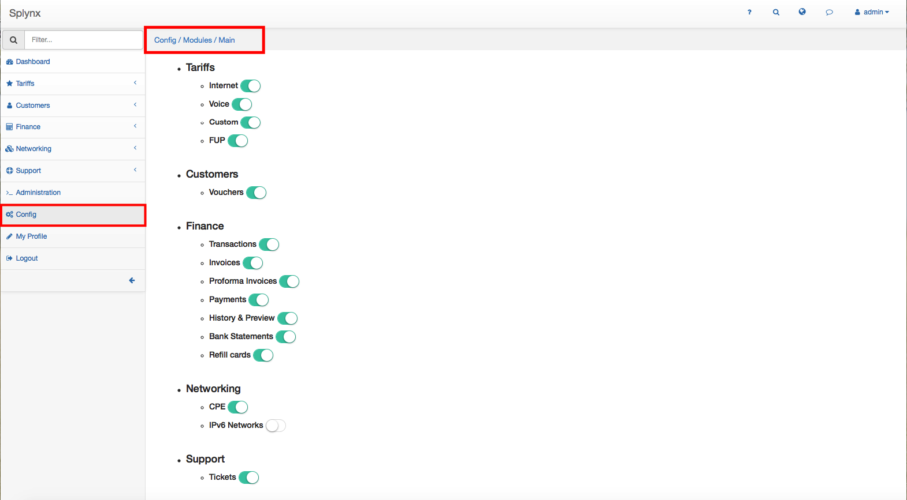
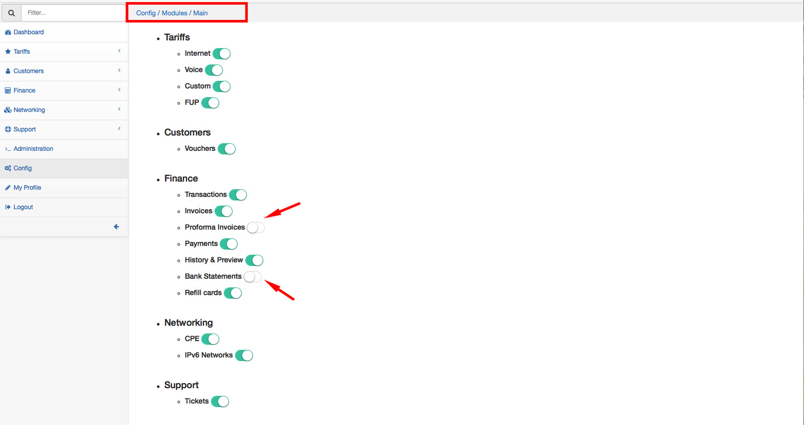

Main modules
=============

To configure Main Modules you'd like to use in Splynx go to `Configuration → Integrations → Main Modules`.

These are Main Modules of Splynx which can be enabled or disabled according your needs of system usage:

Tariffs
* Internet
* Voice
* Custom
* FUP

Customers
* Vouchers

Finance
* Transactions
* Invoices
* Proforma Invoices
* Payments
* History & Preview
* Bank Statements
* Refill cards

Networking
* CPE
* IPv6 Networks

Support
* Tickets

For example, you will not use *Proforma Invoice Module* and *Bank statement* Module in Finance section. Disable these modules here, refresh the page and they will automatically disappear from the Splynx Side Menu:

