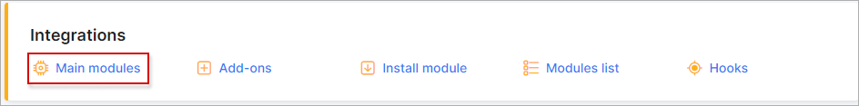
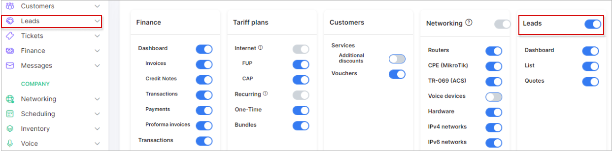

Main modules
=============

`Configuration→Integrations→Main Modules`.

In section, Splynx modules which are not necessary or not in use, can be disabled or enabled.

### Be very attentive with these settings

Simply enable or disable each module as desired or required.

For example: We have enabled the CRM module

It is visible on the navigation pane. We will not use the CRM module on our system, therefore we can disable it:

As you can see the CRM module disappeared from our navigation pane.
