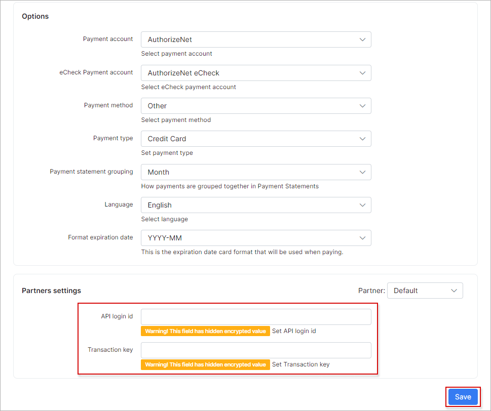

Modules list
=====

In this section, you can configure add-ons that were previously installed.

For **example**, we have installed the *Authorize.NET* add-on.

To configure these add-ons, navigate to `Config → Integrations → Modules list`:

In this window, you can edit the add-on module configuration, remove the module item or configure the add-on entry points (only if the add-on has the entry points).

Let's edit the [AuthorizeNet](payment_systems/authorize/authorize.md) add-on config.

If you are going to use the entry points on the [Customer portal](customer_portal/customer_portal.md), make sure that **Entry points status for portal** option is `enabled`:

<icon class="image-icon"></icon> Please, do not change the **API settings** if you are not sure of what it is and how it works. After making any changes, don't forget to click the `Save` button.

Now, let's check the add-on entry points for the customer portal. Go one step back, on `Config → Integrations → Modules list` page, find *AuthorizeNet* module item and click on `Edit entry points` <icon class="image-icon"></icon> icon:

<icon class="image-icon"></icon> It's recommended not to change any settings in this window, except for the ones that relate to enabling/disabling entry points.

When the portal entry points are enabled, let's check how they look like:

The customers can now pay for (proforma) invoices directly from their portal.
