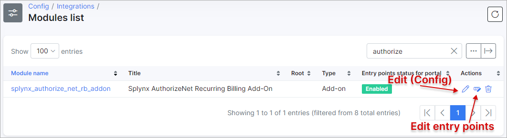
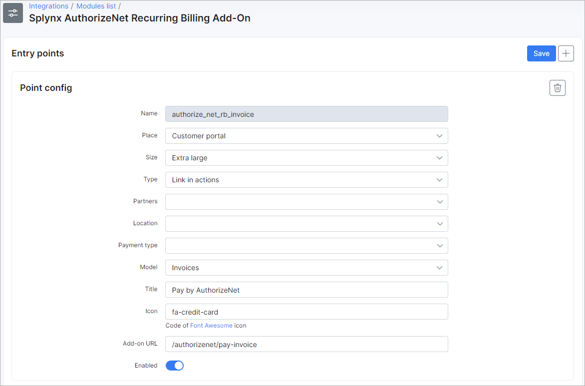

Modules list
=====

In this section you can configure add-ons that were previously installed.

For **example**, we have installed the *Authorize.NET* add-on.

To configure these add-ons navigate to `Config → Integrations → Modules list`:

In this window, you can edit the add-on module configuration, remove the module item or configure the add-on the entry points (only if the add-on has the entry points).

Let's edit the [AuthorizeNet](payment_systems/authorize/authorize.md) add-on config:

If you are going to use the entry points on the customer [portal](customer_portal/customer_portal.md), make sure that **Entry points status for portal** option is `enabled`

**NOTE:** Please, do not change the **API settings** if you are not sure of what it is and how it works. After making any changes, don't forget to click **Save** button.

Now, let's check the add-on entry points for the customer portal. Go one step back, on `Config → Integrations → Modules list` page, find *AuthorizeNet* module item and click on `Edit entry points` icon:

**NOTE:** It's recommended not to change any settings in this window, except for the ones that relate to enabling/disabling entry points.

When the portal entry points are enabled, let's check how they look like:

The customers can now pay for (proforma) invoices directly from their portal.

------------

[Shortcuts](dashboard/dashboard.md) (available in Splynx v4.0), in addition to quick actions feature, allows you to pin the action items on the panel to access/configure a specific installed add-on in Splynx.

To do this, add the new entry point for the chosen add-on and use `Dashboards shortcuts` value for the **Root** field there.

