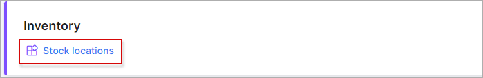
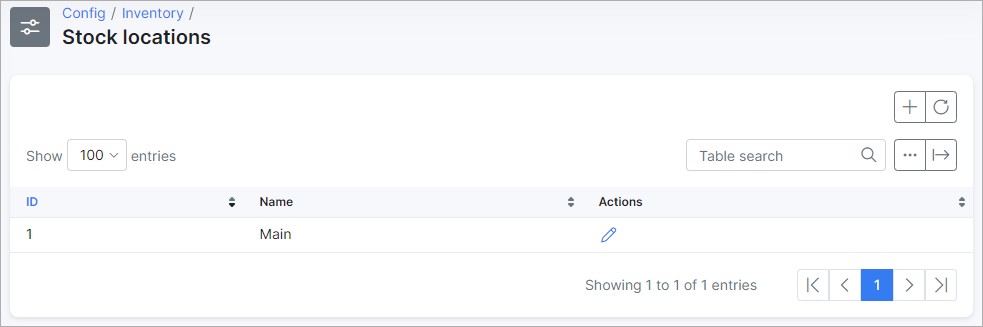
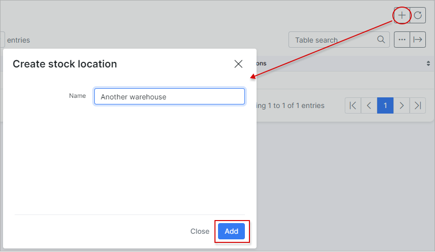
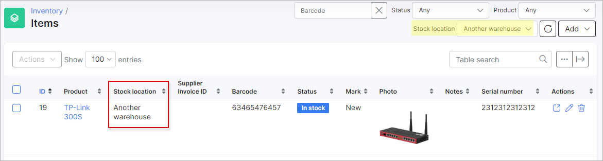

Stock locations
=============
We've developed stock locations to add your warehouses where equipment (inventory items) is stored.

*Config → Inventory → Stock locations:*

This section is an easy-to-use list of available warehouses.

"Main" is a default location and it cannot be removed, however it can be renamed.

To add a new stock location, simply click on the "+" button and enter the location name:

Stock locations are used to identify where inventory items are stored.

Navigate to [Inventory → Items](inventory/items/items.md):

Stock locations can be selected for each item in the inventory. Also, a whole list of items can be sorted by stock location, simply select the desired location in the "Stock location" drop-down list.
