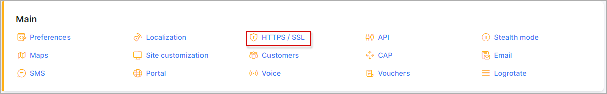
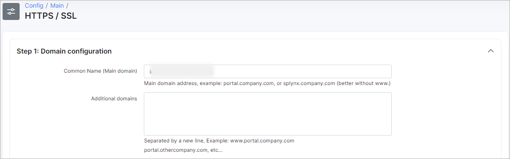
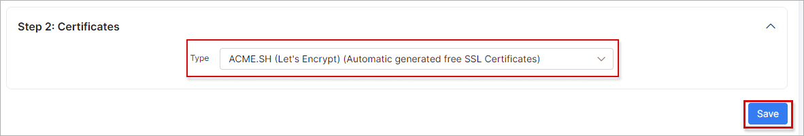
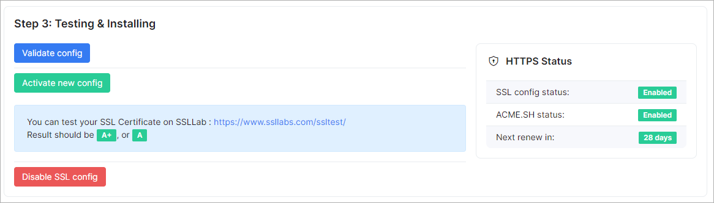
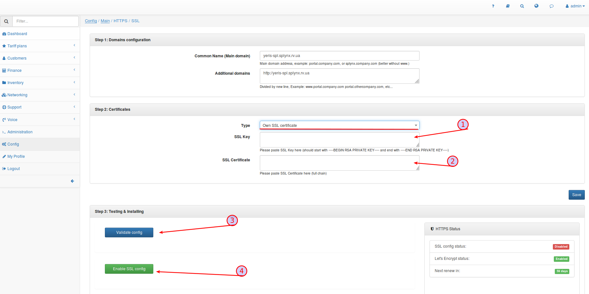
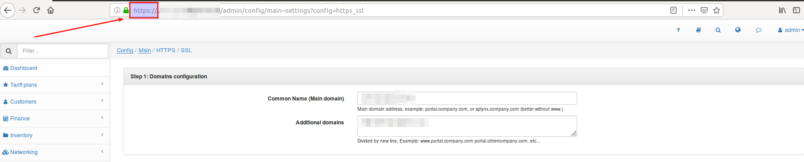
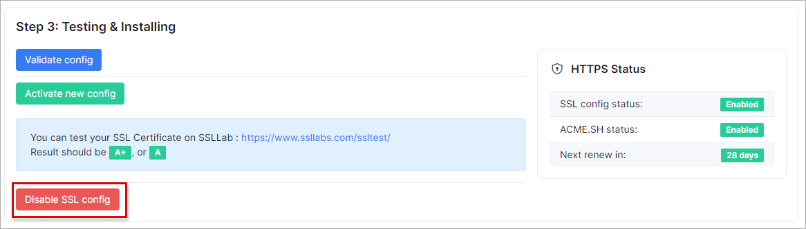

SSL Activation
===============

_SSL Activation_ - allows you to change your connection from "http" to "https" and vice versa.

SSL certification is important as it ensures that the data going from the user’s computer to the website stays secure and unreadable to any malicious intruders like hackers and identity thieves, as well as any other third parties.

Also, it is important to have SSL configured if you intend on using the Splynx mobile applications.

**_To change your connection from "http" to "https" you need to have a domain name._**

If you have a domain name and you want to change the connection, navigate to *Config -> Main -> HTTPS/SSL*:

There you have to set your _Common Name (Main domain)_ and _Additional domains_:

Now you have to choose if would like the system to encrypt automatically by generating a free SSL Certificates or you can choose to set this up manually:

If you choose the _"Let's encrypt (automatic generated free SSL Certificates)"_  option, click on _"Validate config"_ and it will finish the validation, then click on _"Enable SSL Config"_ to complete the process. After completing the process, please wait for a few minutes for the configuration to validate and apply.

If you choose the  _"Own SSL certificate"_ option, you have to manually set up your *SSL Key* and  *SSL Certificate*, then press _"Validate config"_ to finish the validation. Thereafter, click on _"Enable SSL Config"_, please wait for a few minutes for the configuration to validate and apply.

If you wish to return to "http", simply click on _"Disable SSL config"_ button and clear the "Cache" in your browser:

