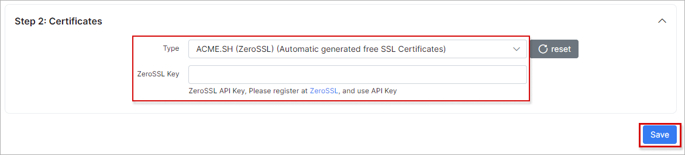
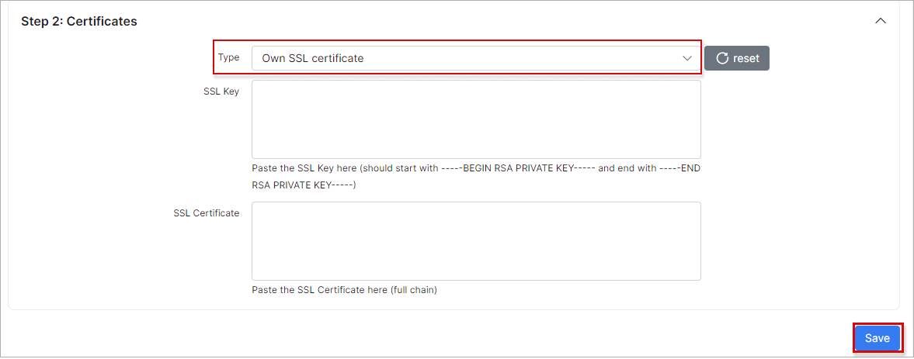

HTTPS/SSL
===============

*SSL Activation* allows you to change your connection from "http" to "https" and vice versa.

SSL certification is important as it ensures that the data going from the user’s computer to the website stays secure and unreadable to any malicious intruders like hackers and identity thieves, as well as any other third parties.

Also, it is important to have SSL configured if you intend on using the Splynx mobile applications.

***To change your connection from "http" to "https" you need to have a domain name.***

If you have a domain name and you want to change the connection, navigate to *Config → Main → HTTPS/SSL*:

## Step 1: Domain configuration

There you have to set your *Common Name (Main domain)* and *Additional domains*:

## Step 2: Certificates

Now you have to choose if you would like the system to encrypt automatically by generating a free SSL Certificates or you can choose to set this up manually:

## Step 3: Testing & Installing

If you choose the *"Let's Encrypt"* or *"ZeroSSL"* option, click on `Validate config` and it will finish the validation, then click on `Activate new config` to complete the process. After completing the process, please wait for a few minutes for the configuration to validate and apply.

If you choose the  _"Own SSL certificate"_ option, you have to manually set up your *SSL Key* and  *SSL Certificate*, then press `Validate config` to finish the validation. Thereafter, click on `Activate new config`, please wait for a few minutes for the configuration to validate and apply.

If you wish to return to "http", simply click on `Disable SSL config` button and clear the "Cache" in your browser:

