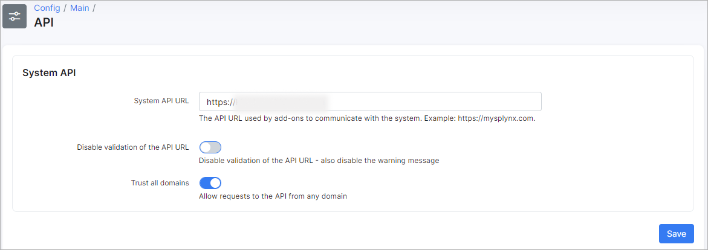
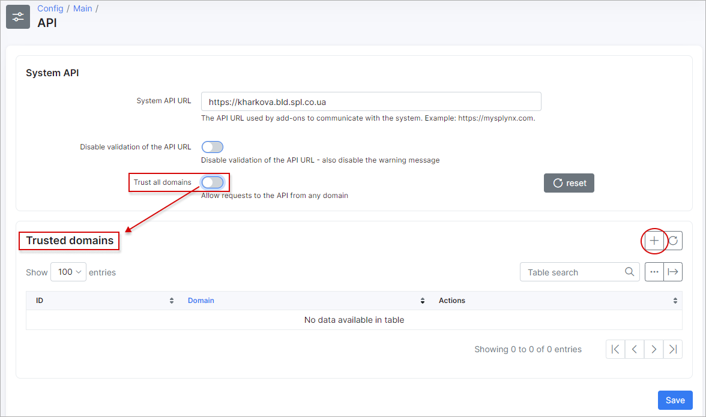
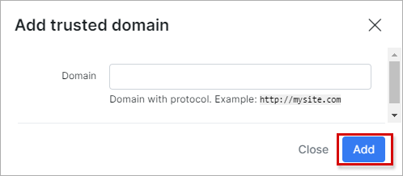

API config
============
In this section, we can configure system API parameters.

* **System API URL** - API URL with protocol. Add-ons will use this URL to communicate with the system. **Must be the same as your Splynx URL**;

* **Disable validation of the API URL** - enables/disables validation of the API URL. If you are getting an error messages about the API on the dashboard, and can't fix it, enabling this option will stop the system from showing those messages;

* **Trust all domains** - allow API requests to this Splynx server from any domain. If disabled -  list of domains to trust will appear:

