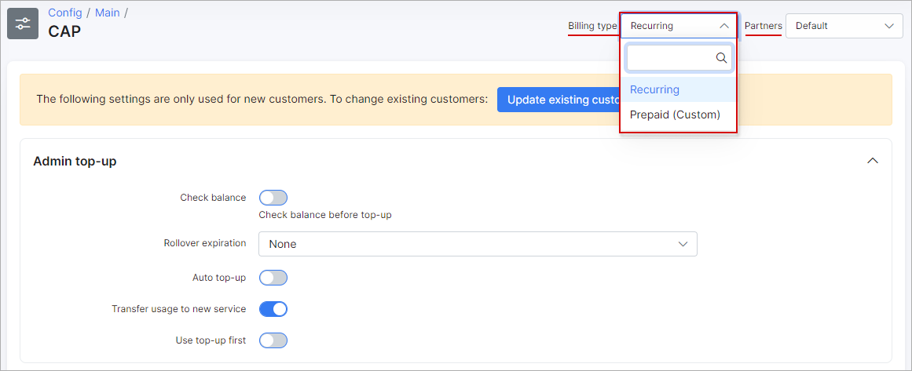

CAP
=======
In this section, CAP parameters for different types of billing can be configured.

At the right top corner of the page you can select the billing type, and partner of which you want to apply the changes to.

## Admin TOP-UP
* **Check deposit** - enables/disables checking of customer's deposit before top-up's;
* **Rollover expiration** - amount of months to rollover data (for example tariff plan configure to rollover unused data to next month. This option will configure validity of this data);
* **Auto top-up** - enables/disables auto top-up's;
* **Transfer usage to new service** - enables/disables transferring of data to the new service(in case of service plan change);
* **Use CAP first** - enables/disables using of top-up data first(if customer is using normal data amount, and then made a top-up, top-up data will be used first and then normal CAP configured under internet plan).

## Auto top-up:
* **Issue invoice with auto top-up** - Enables/disables issuing invoices after auto top-up's.

## Top-up limitations
* **Limitation type** - select the type of top-up's to apply limits to;
* **Max number of top-ups per month** - specify the maximum amount of top-ups allowed per month for service(not for customer);
