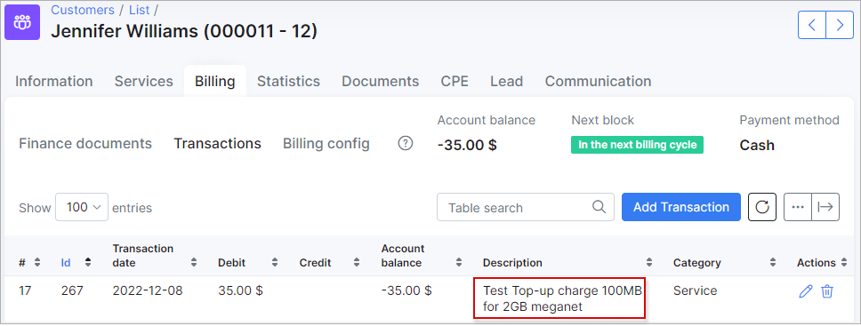

CAP
=======
In this section, the **CAP** settings for different types of billing can be configured.

At the right top corner of the page you can select the **Billing type** and **Partner** of which you want to apply the changes to.

## Admin top-up:

* **Check balance** - enables/disables checking of customer's account balance before top-up;
* **Rollover expiration** - amount of months to rollover data (e.g. a tariff plan is configured to rollover unused data to next month. This option will configure validity of this data);
* **Auto top-up** - enables/disables auto top-up;
* **Transfer usage to new service** - enables/disables transferring of data to the new service in case of service plan change;
* **Use top-up first** - enables/disables using of top-up data first (if customer is using normal data amount and then, made a top-up, top-up data will be used first and then normal CAP configured under internet plan).

## Auto top-up:

* **Issue invoice with auto Top-up** - enables/disables issuing invoices after auto top-up.

## Top-up limitations:

* **Limitation type** - select the type of top-ups to apply limits to;
* **Max number of top-ups per month** - specify the maximum amount of top-ups allowed per month for service (not for customer).

## Top-Ups description templates:

The descriptions in Top-Up transactions and invoices can be customized here. This is useful when a customer has several Top-up plans withing the same tariff plan and these Top-ups are applied by the customer, administrator or system, making it unclear for which service the top-up was added.

**Available parameters:**

- `{{size}}` - top-up traffic amount;
- `{{service}}` - target service. All properties of service also available;
- `{{customer}}` - related customer. All properties of customer also available.

By **default**, the following values are used:

* **Auto Top-Up description** - `Auto Top-Up {{size}} for {{service.description}}`;
* **Admin Top-Up description** - `Top-Up charge {{size}} for {{service.description}}`;
* **Portal Top-Up description** - `Portal Top-Up {{size}} for {{service.description}}`.

<b>Example</b>

