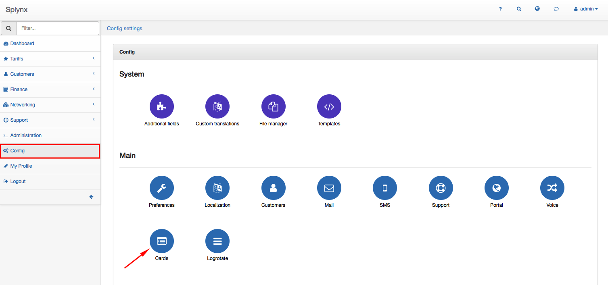
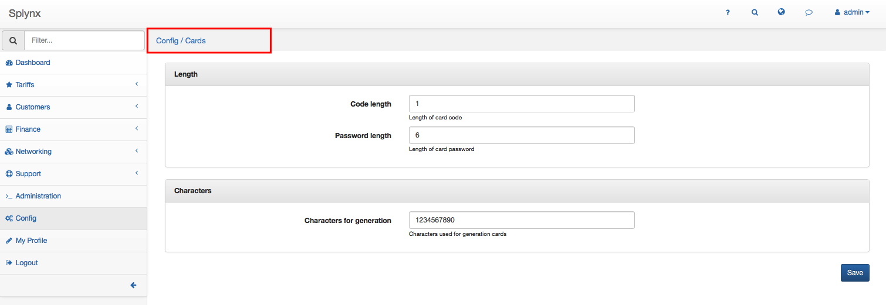

Cards
=====

To configure cards in Spynx click on `Config → Main → Cards`.

The following parameters can be set here:
##### Length  
* **Code length** - enter the length of card code
* **Password length** - enter the length of card password

##### Characters
* **Characters for generation** - enter here characters which will be used for cards generation (numbers, small/capital letters etc.).

