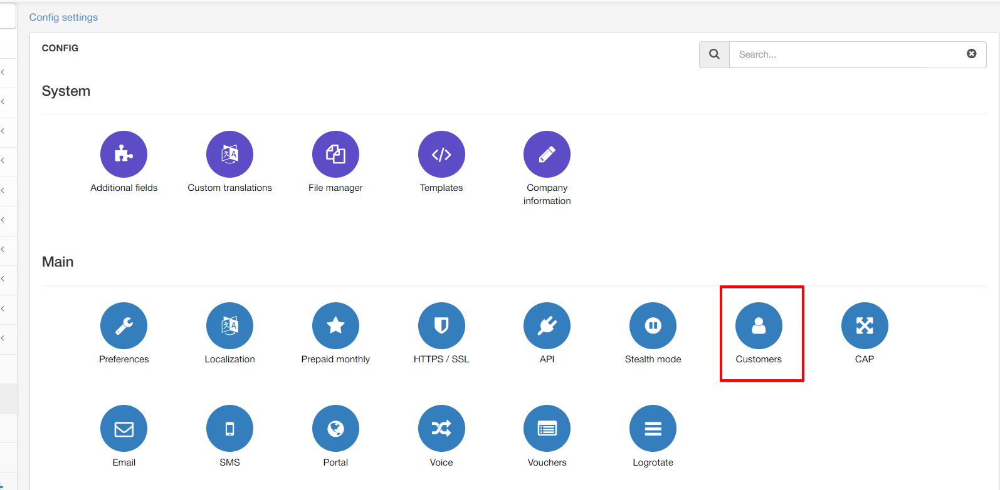
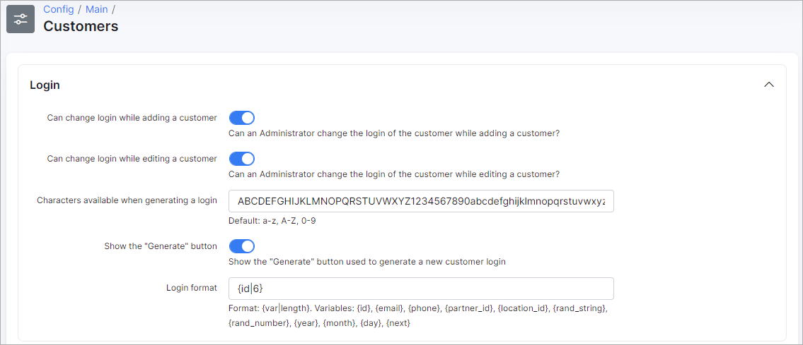
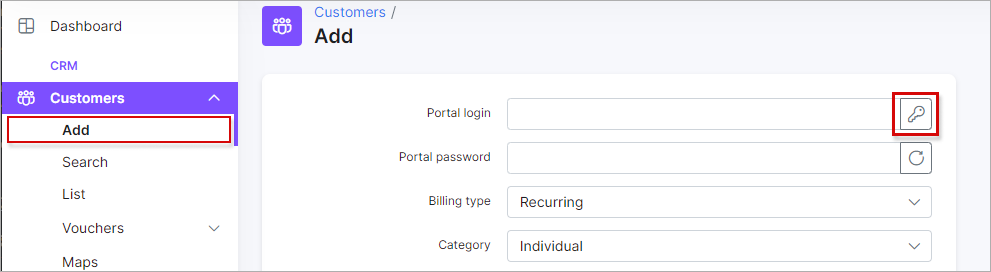
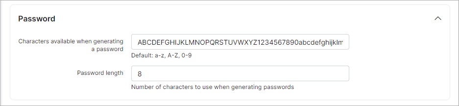
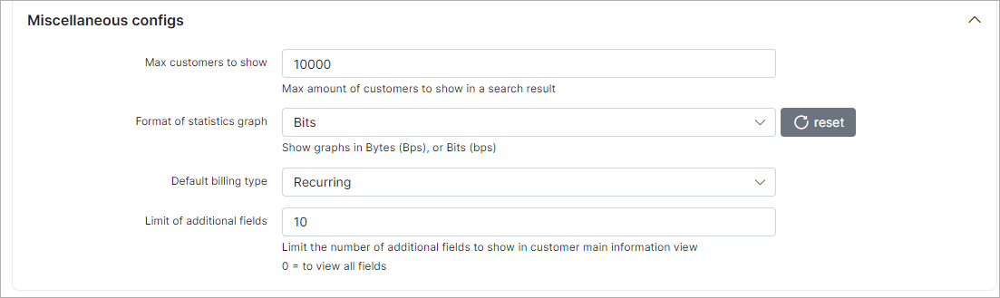
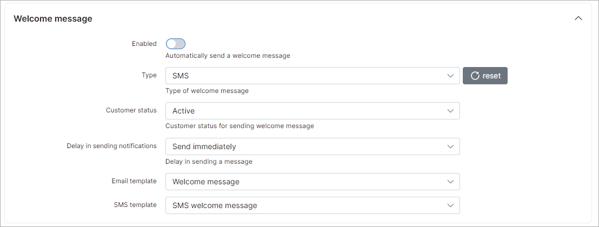

Customers
=========

Customer settings such as login settings, customers limits in search, statistics graphs settings can be configured in `Config→Main→Customers`.

The following parameters can be configured in this section:

#### Login

* **Can change login while adding a customer** - when this option is enabled it will be possible to change the login while adding a new customer. When this option disabled, login's will be  generated automatically when adding a new customer.

* **Can change login while editing a customer** - enables/disables the ability to change the login of a customer while editing the customers profile.  

* **Characters available when generating a login** - add characters which will be used for generating login's  (e.g. capital, small letters, numbers)

* **Show button "Generate"** - Enables/disables the option to show the button for generating customer login's in `Customers → Add`.

  

* **Login pattern** - create a login pattern. Could be: {id}, {email}, {phone}, {partner_id}, {location_id}, {rand_string}, {rand_number}, {year}, {month}, {day}, {next}

## Password

* **Characters available when generating a password** - add characters which will be used for generating passwords  (e.g. capital, small letters, numbers)

* **Password length** - specify the number of characters to use when generating a password

## Miscellaneous Configs

* **Max customers to show** - specify the maximum amount of customers to show in the list when searching for customers

* **Format of statistics graph** - specify the desired format for the value presented in the statistics graphs of customers

* **Default billing type** - specify the default billing type of new customers created.

* **Limit to additional fields** - specify the limit to the number of additional fields to display in the customer page view. Leaving this field on 0 will display all additional fields.

#### Welcome message

* **Enabled** - enables/disables automatic sending of welcome messages to customers

* **Type** - select the type of message to send the welcome message (email, SMS or email + SMS)

* **Customer status** - select the status of customers to send welcome messages to

* **Delay in sending notifications** - specify the delay in sending the welcome messages

* **Subject** - type the subject of the welcome messages

* **Email template** -  select the template to use for email welcome messages

* **SMS template** -  select the template to use for the SMS welcome messages
