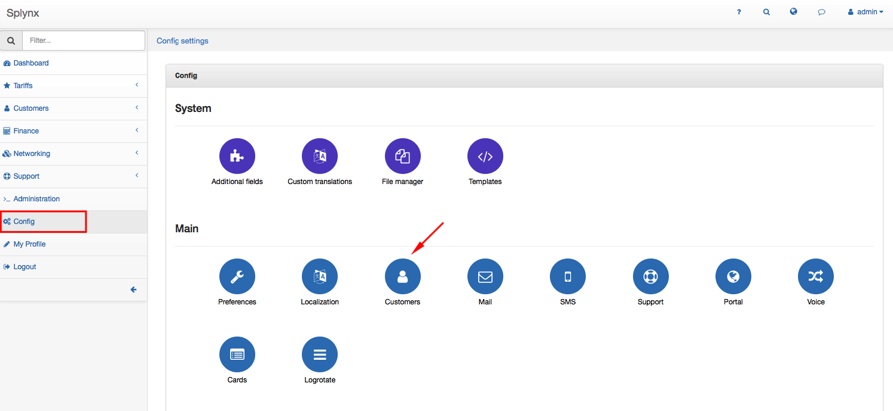
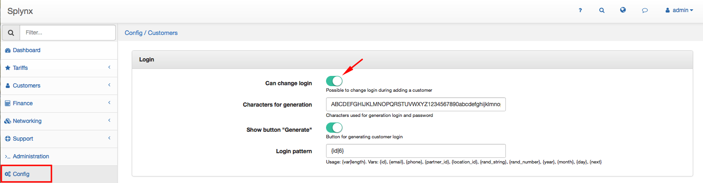
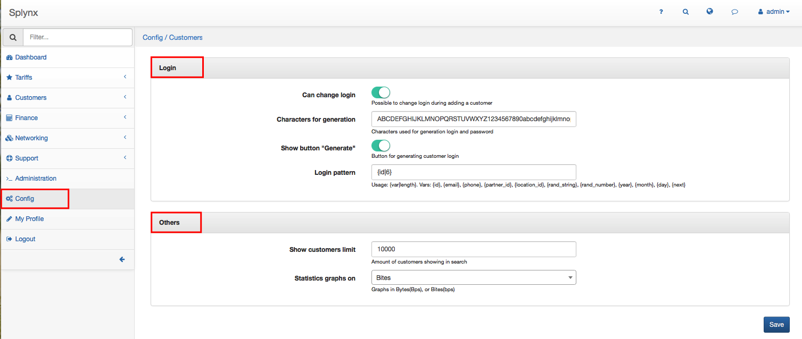

Customers
=========

Customer settings such as login settings, customers limit in search, statistics graphs settings can be configured in `Config →Main →Customers`.

The following parameters can be configured here:
#### Login
* **Can change login** - with enabled option will be possible to change login during adding a new customer. With option disabled login will be automatically generated when you'll be adding a new customer.

  
  

* **Characters for generation** - add characters which will be used for login and password generation (e.g. capital, small letters, numbers)
* **Show button "Generate"** - Enabled option will show button  for generating customer login in `Customers → Add`.

  

* **Login pattern** - create login pattern. Could be vars: {id}, {email}, {phone}, {partner_id}, {location_id}, {rand_string}, {rand_number}, {year}, {month}, {day}, {next}

#### Others

* **Show customers limit** - enter amount of customers which will be shown in search
* **Statistics graphs in** - choose graphs in Bytes(Bps) or Bits(bps)

