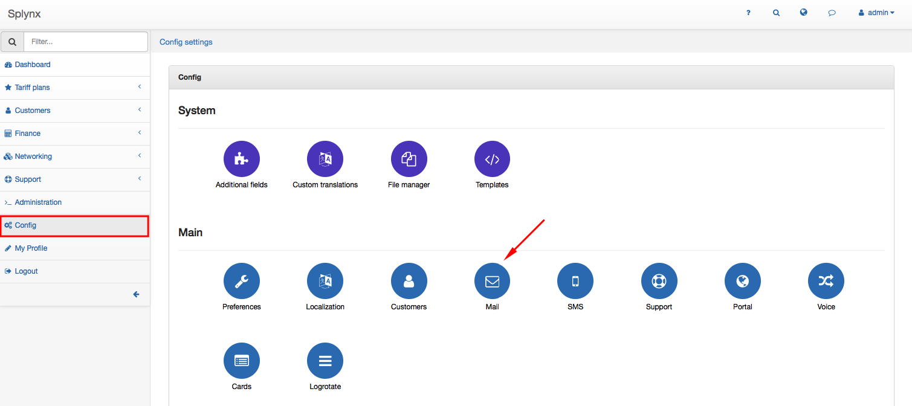
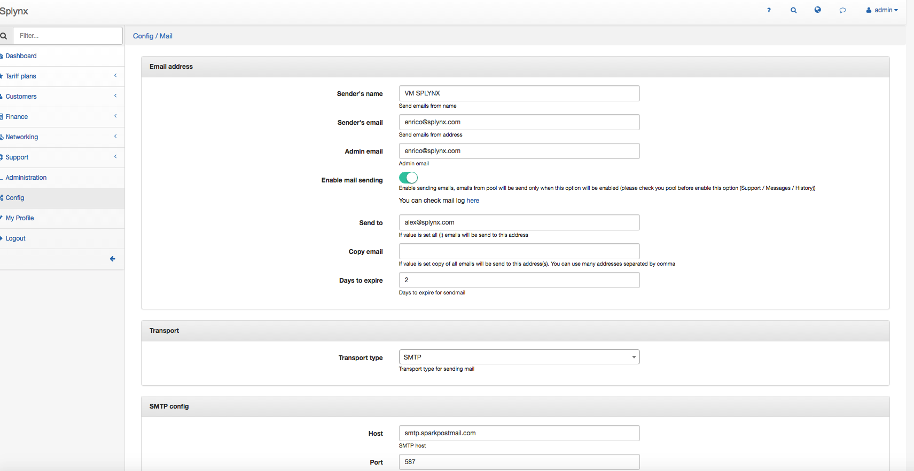
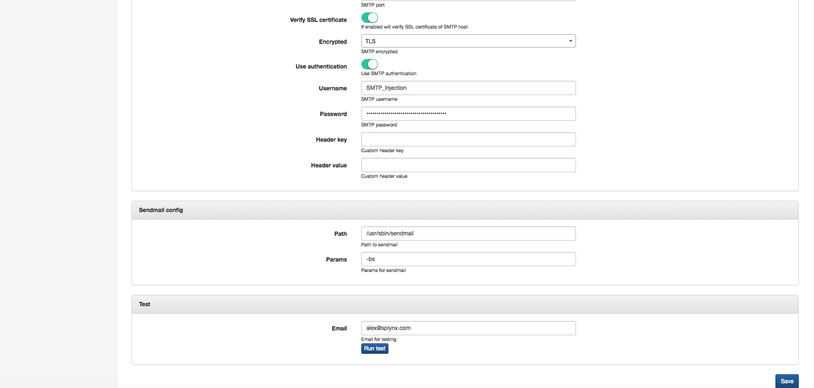

Email config
============

To configure email sending click on `Config → Main → Mail`.

You should set the mail parameters:

### Email address
* **Sender's name** - name of the sender
* **Sender's email** - email of the sender
* **Admin email** - email of the administrator
* **Enable mail sending** - select on when is desirable to send email from pool
* **Send to** - If value is set all (!) emails will be send to this address
* **Copy email** - If value is set copy of all emails will be send to this address(s). You can use many addresses separated by comma
* **Days to expire** - how many days the server will try to send the email  

### Transport
* **Transport type** - select sending protocol  

### SMTP config
* **Host** - SMTP server name
* **Port** - SMTP port
* **Verify SSL certificate** - you can select in on or off with
* **Encrypted** - select encrypted protocol
* **Use authentication** - you can use SMTP authentication on or off with
* **Username** - your username
* **Password** - your password
* **Header key** - custom header key
* **Header value** - custom header value  

### Sendmail config
* **Path** - Path to sendmail
* **Params** - Params for sendmail  

### Test
* **Email**  - Enter email for testing if necessary.

We strongly advice to use an Email Delivery Service such as https://www.sparkpost.com/  

### Google mail Example
To use your Google mail account for email sending fill these fields:

Parameter|Value
---|---
**Sender's email** | your email (email@gmail.com)
**Transport type** | SMTP
**Host** | smtp.gmail.com
**Port** | 465
**Verify SSL certificate** | enabled
**Encrypted** | SSL
**Use authentication** | enabled
**Username** | your username. Full email (email@gmail.com)
**Password** | your password. Google account password

Please note:  
1. You should allow less secure apps to use your Google account (https://support.google.com/accounts/answer/6010255)
2. Google limits number of letters per day (https://support.google.com/a/answer/166852?hl=en)
3. Sometimes Google do not allow to send letters due to security reasons. In this case you should enter into account via browser and confirm that it was you (trying to send email recently)