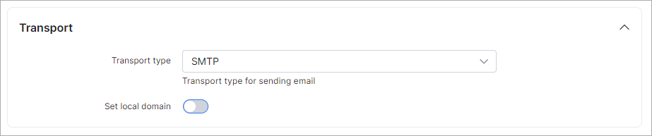

Email sending configuration
============

To configure email sending navigate to `Config → Main → Email`.

For each partner can be configured separate email account for sending mails.

## Email address
* **Sender's name** - name of the sender;
* **Sender's email** - email of the sender;
* **Admin email** - email of the administrator;
* **Enable email sending** - enable/disable email sending;
* **Send to** - If set emails will be send ONLY to this address;
* **Copy email** - If set copy of all emails will be send to this address(s). You can use many addresses separated by comma;
* **Days to expire** - number of days when sent email will expire. Server will try to send email this amount of days, then mark as "Error" and skip.  

**Email logs can be found under [`Administration - Logs - Email`](../../../administration/logs/email/email.md) or under `Support - Messages - History`**

## Transport
* **Transport type** - select method of sending. Available options SMTP or sendmail.  

## SMTP config
* **Host** - SMTP server name;
* **Port** - SMTP port;
* **Verify SSL certificate** - If enabled system will verify SSL certificate of SMTP host;
* **Encrypted** - select SMTP encryption method;
* **Use authentication** - enable/disable SMTP authentication;
* **Username** - your email address for sending mails;
* **Password** - your password to mail account;
* **Header key** - custom header key(can be used when additional authentication needed);
* **Header value** - custom header value(can be used when additional authentication needed);
* **Additional header(s)** - additional header(can be used when additional authentication needed).  

## Sendmail configuration
* **Path** - Path to sendmail;
* **Params** - Params for sendmail.

Sendmail configuration example: https://stackoverflow.com/questions/10359437/sendmail-how-to-configure-sendmail-on-ubuntu or https://kenfavors.com/code/how-to-install-and-configure-sendmail-on-ubuntu/

When sending emails configured it's time to test how it works. Specify your email address to receive test email and click on "Run test", in few minutes email should be received if no errors or successful response after running test.

## Test
* **Email**  - email for receiving test message.

We strongly advice to use an Email Delivery Service such as https://www.sparkpost.com/  

## Google mail Example
To use your Google mail account for email sending fill these fields:

Parameter|Value
---|---
**Sender's email** | your email (email@gmail.com)
**Transport type** | SMTP
**Host** | smtp.gmail.com
**Port** | 465
**Verify SSL certificate** | enabled
**Encrypted** | SSL
**Use authentication** | enabled
**Username** | your username. Full email (email@gmail.com)
**Password** | your password. Google account password

Please note:  
1. You should allow less secure apps to use your Google account (https://support.google.com/accounts/answer/6010255);
2. Google limits number of letters per day (https://support.google.com/a/answer/166852?hl=en);
3. Sometimes Google does not allow to send letters due to security reasons. In this case you should enter into account via browser and confirm that it was you (trying to send email recently).
