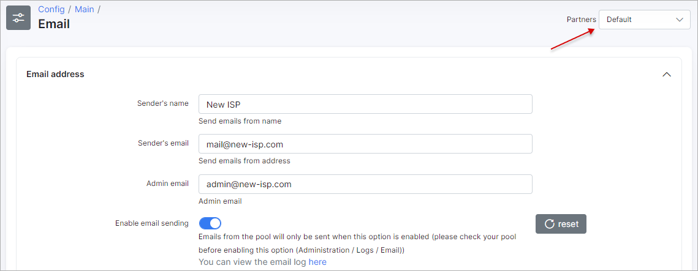
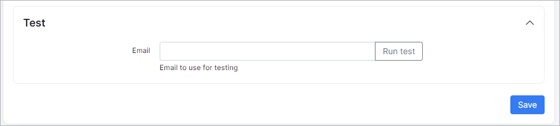

Email sending configuration
============

To configure email sending navigate to `Config → Main → Email`.

Separate email accounts can be configured for each partner for sending emails.

## Email address
* **Sender's name** - name of the sender;
* **Sender's email** - email address of the sender;
* **Admin email** - email address of the administrator;
* **Enable email sending** - enables/disables email sending;
* **Send to** - If enabled, emails will ONLY be sent to this address;
* **Copy email** - If enabled, a copy of all emails will be sent to this address(s). You can use multiple addresses separated by comma;
* **Days to expire** - specify the number of days for sent emails to expire. The server will try to send emails fo9r this amount of days, then it will mark these emails status as "Error" and it will be skipped.  

**Email logs can be found under [`Administration - Logs - Email`](administration/logs/email/email.md) or under `Support - Messages - History`**

## Transport
* **Transport type** - select the method of sending. Available options are SMTP or sendmail.  

## SMTP config
* **Host** - specify the SMTP server name;
* **Port** - specify the SMTP port;
* **Verify SSL certificate** - If enabled, the system will verify the SSL certificate of the SMTP host;
* **Encrypted** - select the SMTP encryption method;
* **Use authentication** - enables/disables SMTP authentication;
* **Username** - your email address for sending mails;
* **Password** - your password to the email account;
* **Header key** - custom header key(can be used when additional authentication needed);
* **Header value** - custom header value(can be used when additional authentication needed);
* **Additional header(s)** - additional header(can be used when additional authentication needed).  

## Sendmail configuration
* **Path** - specify the Path to sendmail;
* **Params** - specify the parameters for sendmail.

Pleas follow this link for a Sendmail configuration example: https://stackoverflow.com/questions/10359437/sendmail-how-to-configure-sendmail-on-ubuntu or https://kenfavors.com/code/how-to-install-and-configure-sendmail-on-ubuntu/

When sending emails has been configured, we can test to double check if it works. Specify your email address to receive the test email and click on the "Run test" button, an email should be received within a few minutes if there are no errors and  successful response was received after running test.

## Test
* **Email**  - email for receiving test message.

We strongly advise to use an Email Delivery Service such as https://www.sparkpost.com/  

## Google mail Example
To use your Google mail account for email sending, please fill in the following fields:

Parameter|Value
---|---
**Sender's email** | your email (email@gmail.com)
**Transport type** | SMTP
**Host** | smtp.gmail.com
**Port** | 465
**Verify SSL certificate** | enabled
**Encrypted** | SSL
**Use authentication** | enabled
**Username** | your username. Full email (email@gmail.com)
**Password** | your password. Google account password

Please note, the following changes need to be made to your Google account to use your Google email to send emails via the Splynx server:  
1. You should allow less secure apps to use your Google account (https://support.google.com/accounts/answer/6010255);
2. Google limits number of letters per day (https://support.google.com/a/answer/166852?hl=en);
3. Sometimes Google does not allow sending letters due to security reasons. In this case you should enter into account via browser and confirm that it was you (trying to send email recently).
