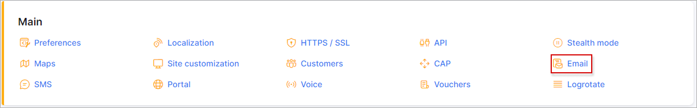

Email sending configuration
============

To configure the email sending navigate to `Config → Main → Email`.

Separate email accounts can be configured for each partner:

## Email address
* **Sender's name** - name of the sender;
* **Sender's email** - email address of the sender. This email address will be used if the option `Use system SMTP` in *SMTP settings* of [My Profile](my_profile/imap/imap.md) is enabled;
* **Admin email** - email address of the administrator;
* **Enable email sending** - enables/disables email sending (SMTP);
* **Send to** - if enabled, emails will ONLY be sent to this address;
* **Copy email** - if enabled, a copy of all emails will be sent to this address(-s). You can use multiple addresses separated by comma;
* **Days until expiration** - specify the number of days for the sent emails to expire. The server will try to send emails for this amount of days, then it will mark these emails status as "Error" and it will be skipped;
* **Emails limit per hour** - set how many emails can be sent per hour.

**Email logs can be found under [`Administration → Logs → Email`](administration/logs/email/email.md) or under `Messages → Mass sending → History`**.

## Transport

* **Transport type** - select the method of sending. Available options are `SMTP` or `Sendmail`.
* **Set local domain** - enable this option to set the local domain.

## SMTP config

* **Host** - specify the SMTP server name;
* **Port** - specify the SMTP port;
* **Verify SSL certificate** - if enabled, the system will verify the SSL certificate of the SMTP host;
* **Encrypted** - select the SMTP encryption method;
* **Use authentication** - enables/disables SMTP authentication;
* **Username** - your email address for sending mails;
* **Password** - your [APP password](https://support.google.com/accounts/answer/185833?hl=en);
* **Header key** - custom header key (can be used when additional authentication needed);
* **Header value** - custom header value (can be used when additional authentication needed);
* **Additional header(s)** - additional header (can be used when additional authentication needed).  

## Sendmail configuration

* **Path** - specify the path to `Sendmail`, e.g. `/usr/sbin/sendmail`;
* **Parameters** - specify the parameters for `Sendmail`, e.g. `-bs`.

Pleas follow these links for a Sendmail configuration examples:
- https://stackoverflow.com/questions/10359437/sendmail-how-to-configure-sendmail-on-ubuntu
- https://kenfavors.com/code/how-to-install-and-configure-sendmail-on-ubuntu/

## Test

When sending emails has been configured, we can double check if it works. Specify your email address to receive the test email and click on the `Run test` button. An email should be received within a few minutes if there are no errors and successful response was received after running the test.

* **Email**  - email for receiving a test message.

We strongly recommend to use an Email Delivery Service such as https://www.sparkpost.com/  

## Google mail Example
To use your Google mail account for email sending, please fill in the following fields:

Parameter|Value
---|---
**Sender's email** | your email (email@gmail.com)
**Transport type** | SMTP
**Host** | smtp.gmail.com
**Port** | 465
**Verify SSL certificate** | enabled
**Encrypted** | SSL
**Use authentication** | enabled
**Username** | your username. Full email (email@gmail.com)
**Password** | your password. [APP password](https://support.google.com/accounts/answer/185833?hl=en)

<icon class="image-icon"></icon> The following changes need to be made in your Google account to use your Google email to send emails via the Splynx server:  
1. You should allow [less secure apps](https://support.google.com/accounts/answer/6010255) to use your Google account;
2. Google limits [number of letters per day](https://support.google.com/a/answer/166852?hl=en) ;
3. Sometimes Google does not allow sending letters due to security reasons. In this case you should login into your account via browser and confirm that it was you (trying to send email recently).
