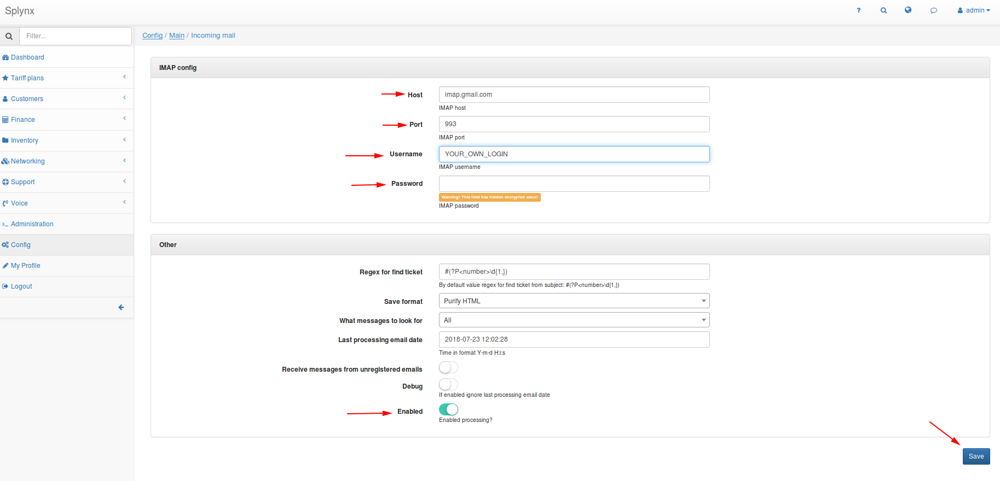

Incoming mail
============

Splynx can create the ticket by handling incoming mail.
This function allows the registered users to contact the support without access to the customer’s portal or accept a request from potential customers.

First, you need to specify where Splynx can take mail from.
Enter `Config → Main → Incoming mail`.
Fill in the fields: Host, Port, Username, Password for your account on the IMAP-server.
Host and Port get from your mail provider.

For a minimal configuration, it’s sufficient.




### Description of additional settings.

#### Regex for find ticket (uses pcre syntax):
If the subject of an email matches with regex and the specified ticket id exists then Splynx will add the body of the email in the existing ticket, with the subject of the letter being omitted.
Otherwise, a new ticket will be created.

Regex by default is
```
#(?P<number>\d{1,})
```
It means that any number after the hash symbol will be recognized as ticket id.
If there are several matches, the first one is used.

Link to templates(`Config→Templates→Tickets` type).
if you use templates to respond to a ticket, remember that the default templates add a ticket id to the subject of the message.
Therefore, changing the regular expression it is also important to add the necessary changes to the template.

#### Save format:
The Format in which the body of an email is stored in the database.

#### What messages to look for:

Process only unread emails or all.
By default, *“all”* that allows Splynx to process the message even if the mail was viewed by others.

#### Last processing email date:
Emails that arrived before the specified date are not processed.

#### Receive messages from unregistered emails:
If enabled, will create a ticket for each letter that came to the mailbox, the sender’s address is used as the login on the tickets.
If disabled, the letter is processed only if the sender’s mail address is specified in the customer’s profile.
Please note that in the processing of the first message mail is registered. Accordingly, after disabling this option, letters from such mailboxes will continue to arrive, even if the mailbox does not belong to any customer.
Beware of spammers.

#### Debug:
Once a minute, it processes all mail in the mailbox again.
It takes into account the value of the field "Last processing email date".
(Caution! Can create a lot of repeating tickets.)

#### Enabled:
Turn on the described functionally.
