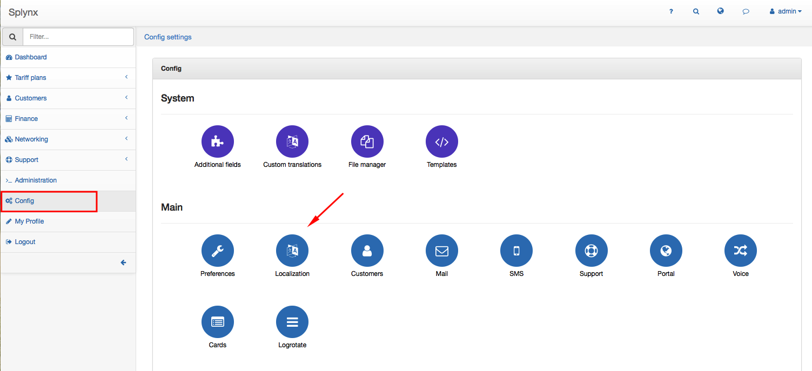
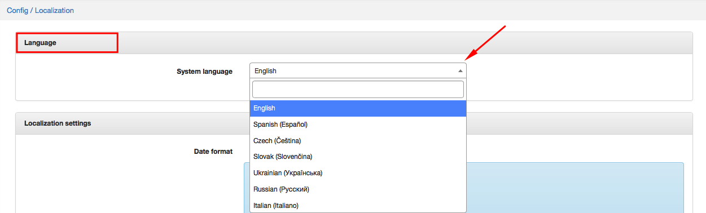
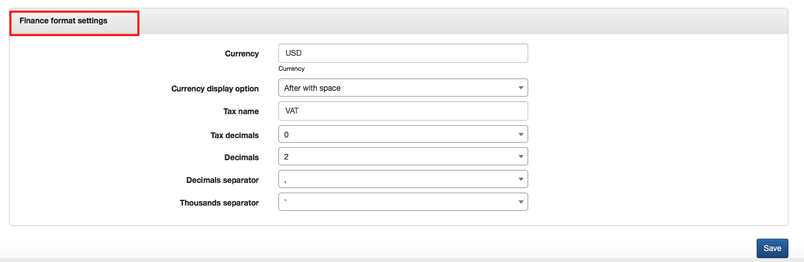

Localization
============

It is possible to configure Localization and Finance format settings in `Config→Main→Localization`.

The following parameters can be set here:

##### Language
* **System language** - select system language, after save it and refresh a page.

  

##### Localization settings
* **Date format** - choose a date format (MM-DD-YYYY, DD/MM/YYYY, YYYY/MM/DD etc.).
* **Time format** - choose time format (12 or 24 hours)
* **With seconds** - enable or disable option to show time format with seconds

##### Number format:
* **Decimals** - choose decimals for numbers if needed from 0 to 4
* **Decimals separator** - choose decimals separator (. , )
* **Thousands separator** - choose thousands separator if needed  (, . ')

##### Finance format settings
* **Currency** - write the preferred currency
* **Currency display option** - choose the currency display option (None, Before, Before with space, After with space)
* **Tax name** - write your country tax name
* **Tax decimals** - choose tax decimals if needed (0, 2, 4)
* **Decimals** - choose decimals if needed from 0 to 4
* **Decimals separator** - choose decimals separator (. , )
* **Thousands separator** - choose thousands separator if needed  (, . ')

