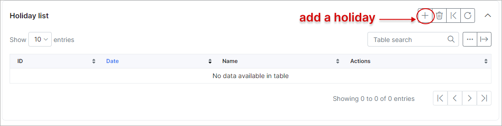
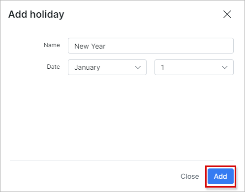
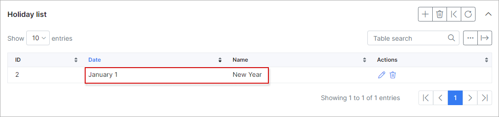

Localization
============

## Language

* **System language** - select the system language.

## Localization settings

* **Date format** - select the date format which will be used in the system;
* **Online time format** - select the online time format;
* **Time format** - select the type time format (12 or 24 hours);
* **With seconds** - enables/disables displaying of seconds;
* **Decimals** - specify the number of digits to display after the separator;
* **Decimals separator** - select a separator;
* **Thousands separator** - select a separator for thousands (if needed);
* **First day of the week** - select the first day of the week.

## Finance format settings

* **Currency** - select a preferred currency;
* **Currency symbol** - specify the currency symbol;
* **Currency display position** - specify where to display the currency symbol;
* **Tax name** - specify the tax name relevant to your country;
* **Tax decimals** - select tax decimals if needed (0, 2, 4);
* **Decimals** - select decimals if needed from 0 to 4;
* **Decimals (for Voice)** - select decimals for voice plans if needed
* **Decimals separator** - select a decimals separator (. , );
* **Thousands separator** - select a separator for thousands if needed  (, . ');
* **Finance rounding** - round each individual transaction or round the total amount in the end;
* **Invert account balance** - enable/disable displaying the inverted customer's account balance.

## Networking settings

* **Statistic usage unit** - select a unit to display network statistics in, MB or GB;
* **Decimals** - select the statistic usage decimals;
* **Decimals separator** - select a  usage statistics decimals separator;
* **Thousands separator** - select a usage statistics thousands separator.

## Holiday list

You can set up an individual holiday list in this section.

Then you will be able to consider the dates of these holidays in billing. Please read [Finance automation](configuration/finance/automation/automation.md) to learn more.

