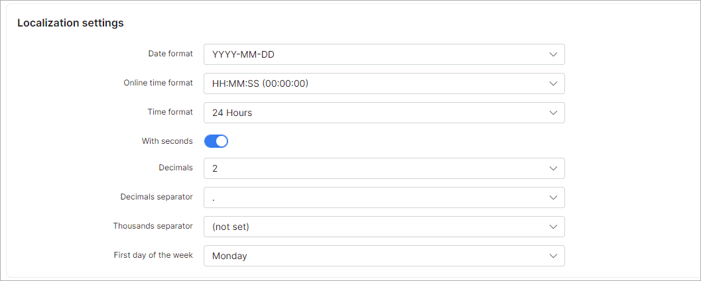

Localization
============

## Language

* **System language** - select system language.

## Localization settings

* **Date format** - select date format what will be used in system;
* **Online time format** - select online time format;
* **Time format** - select type format(12 or 24 hours);
* **With seconds** - enable/disable seconds displaying;
* **Decimals** - number of digits after separator;
* **Decimals separator** - select separator;
* **Thousands separator** - separator for thousands(if needed).

## Finance format settings

* **Currency** - select preferred currency;
* **Currency symbol** - currency symbol;
* **Currency display position** - where to display currency symbol;
* **Tax name** - your country tax name;
* **Tax decimals** - choose tax decimals if needed (0, 2, 4);
* **Decimals** - choose decimals if needed from 0 to 4;
* **Decimals separator** - choose decimals separator (. , );
* **Thousands separator** - choose thousands separator if needed  (, . ').

## Networking settings

* **Statistic usage unit** - select unit to display statistic in MB or GB;
* **Decimals** - statistic usage decimals;
* **Decimals separator** - statistic usage decimals separator;
* **Thousands separator** - statistic usage thousands separator.
