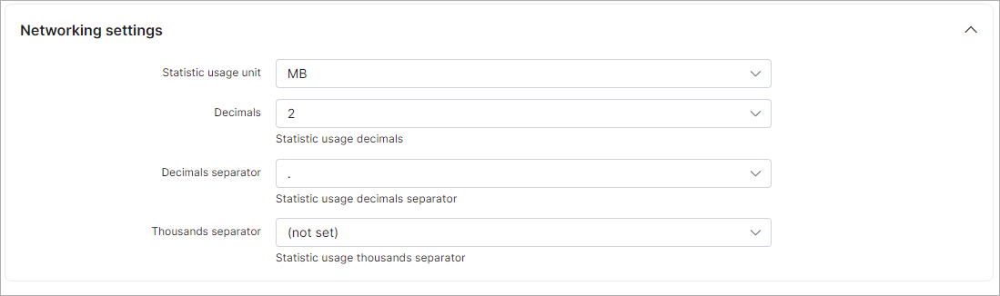

Localization
============

## Language

* **System language** - select the system language.

## Localization settings

* **Date format** - select the date format which will be used in system;
* **Online time format** - select the online time format;
* **Time format** - select the type time format(12 or 24 hours);
* **With seconds** - enables/disables displaying of seconds;
* **Decimals** - specify the number of digits to display after the separator;
* **Decimals separator** - select a separator;
* **Thousands separator** - select a separator for thousands (if needed);
* **First day of the week** - a day from which a week starts
*(e.g. in USA it's considered Sunday as the first day of the week, while the week begins with Saturday in much of the Middle East, and most of Europe has Monday as the first day of the week)*

## Finance format settings

* **Currency** - select a preferred currency;
* **Currency symbol** - specify the currency symbol;
* **Currency display option** - specify where to display the currency symbol;
* **Tax name** - specify the tax name relevant to your country;
* **Tax decimals** - select tax decimals if needed (0, 2, 4);
* **Decimals** - select decimals if needed from 0 to 4;
* **Decimals (for Voice)** - select decimals for voice plans if needed
* **Decimals separator** - select a decimals separator (. , );
* **Thousands separator** - select a separator for thousands if needed  (, . ').

## Networking settings

* **Statistic usage unit** - select a unit to display network statistics in, MB or GB;
* **Decimals** - select the statistic usage decimals;
* **Decimals separator** - select a  usage statistics decimals separator;
* **Thousands separator** - select a usage statistics thousands separator.

## Holidays list

In this section we can add the holidays of the specific country in order to process or not the *Billing Due* or *Deactivation period* of customers in these days. The setting to *Block customers at holidays* is located in `Config → Finance → Automation`.

To start work with holidays list there are the following control buttons <icon class="image-icon"></icon>
(from the left to the right)

* **Add Holiday** - the option to add manually the holiday name and select its date;
* **Delete all holidays** - the option to remove all holidays from the list;
* **Restore defaults holidays** - the option to restore holidays according to the country and its ISO for *Default* partner. To change the country you can in `Config → Company information`;
* **Refresh** - refresh the current holidays list.

Using the button <icon class="image-icon"></icon> below the table we can print or export the holidays list into the file

The button <icon class="image-icon"></icon> allows to show / hide columns and change its order in the table of holidays

