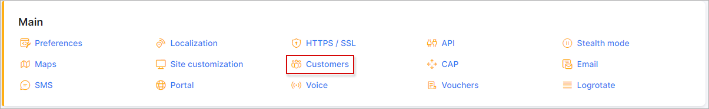
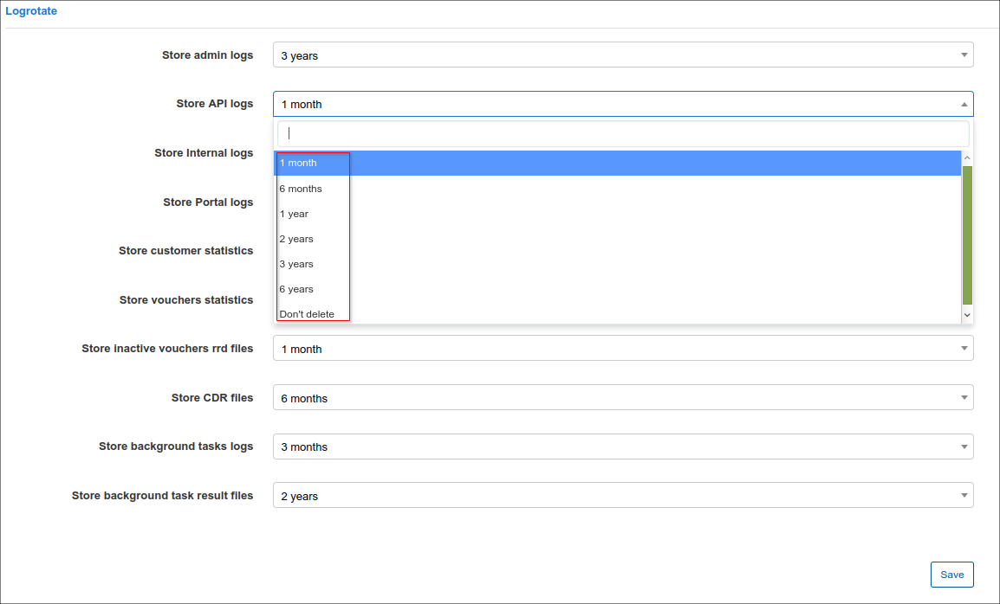

Logrotate
========

To configure Log rotation navigate to `Config → Main → Logrotate`.

Here you will be able to select a period of time for storing the following logs in Splynx:

##### Logrotate
* *Store admin logs*
* *Store API logs*
* *Store customer statistics*
* *Store cards statistics*

The period of time for storing logs can be 1 month, 6 months, 1 year, 2 years or 3 years. It is also possible to choose the option "Don't delete".

