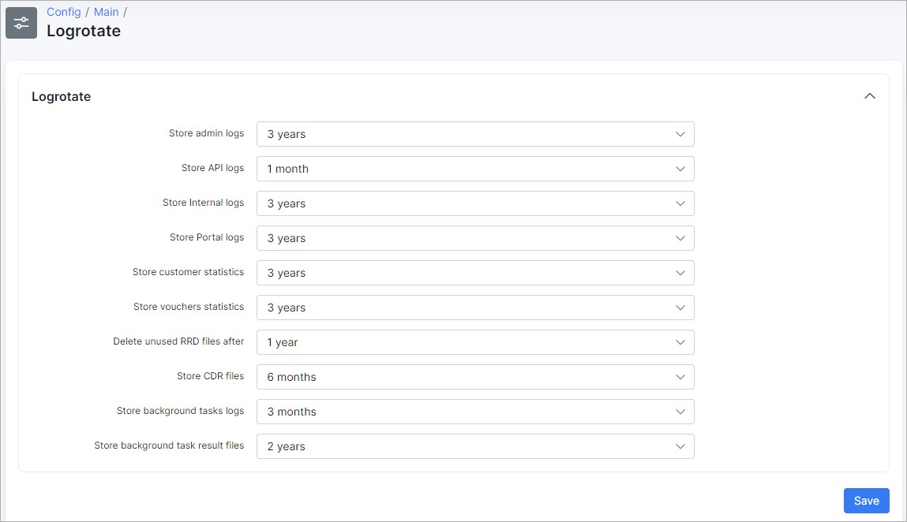

Logrotate
========

To configure Log rotation navigate to `Config → Main → Logrotate`.

Here you will be able to select a period of time for storing the following logs/files in Splynx:

##### Logrotate
* *Store admin logs*
* *Store API logs*
* *Store Internal logs*
* *Store Portal logs*
* *Store customer statistics*
* *Store vouchers statistics*
* *Delete unused RRD files after*
* *Store CDR files*
* *Store background tasks logs*
* *Store background task result files*

The period of time for storing logs can be 1 month, 6 months, 1 year, 2 years, 3 years or 6 years. It is also possible to choose the option "Don't delete".

