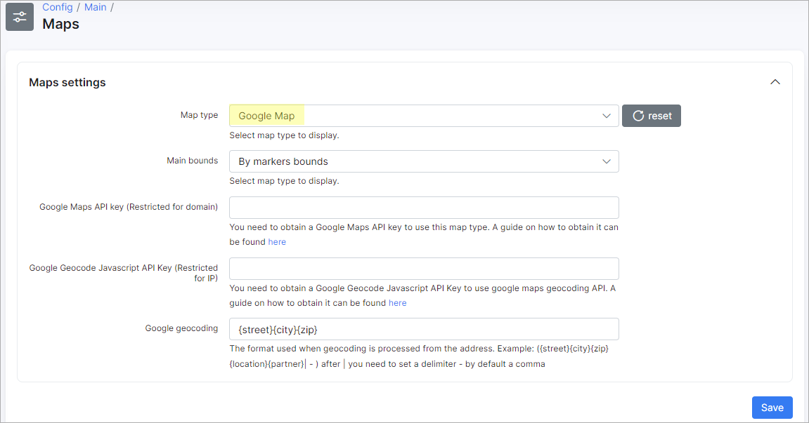

Maps
==================
Splynx supports using three different map engines withing the system: **Open Street**, **Google** and **Bing** maps. To configure *Maps* in Splynx navigate to `Config → Main → Maps`

By default, Splynx system uses **Open Street** map type.

Choosing **Open Street** type we can set up the following settings:

* **Main bounds** - the options are *By markers bounds* (*e.g. the map that starts in starts in Auckland, New Zealand and is restricted to New Zealand. The user can pan away from Auckland and explore other New Zealand cities, but the user cannot pan or zoom to beyond the constraints set on the map.*), *By country* (restricted to specific country only) and *By custom area* (it's possible to choose the necessary area on the map manually).

* **OpenStreet geocoding** - the format that is used when geocoding is processed from the address, e.g. `{street}{city}{zip}{location}{partner}|` - after `|` you need to set a delimiter - by default it's a comma.

------------

For **Google Map** type, it's required to obtain a [Google Maps API key](https://developers.google.com/maps/documentation/javascript/get-api-key) (restricted for domain) to use this map type and [Google Geocode Javascript API key](https://developers.google.com/maps/documentation/javascript/get-api-key) (restricted for IP) to use google maps geocoding API

------------

For **Bing Map** type, it's required to create a [Bing Maps API key](https://docs.microsoft.com/en-us/bingmaps/getting-started/bing-maps-dev-center-help/getting-a-bing-maps-key) to use this map type.

