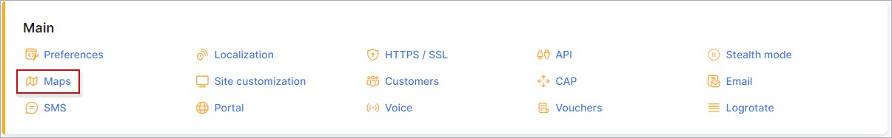
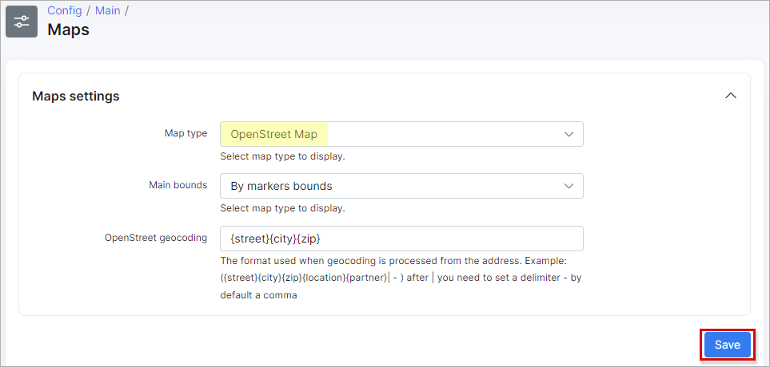
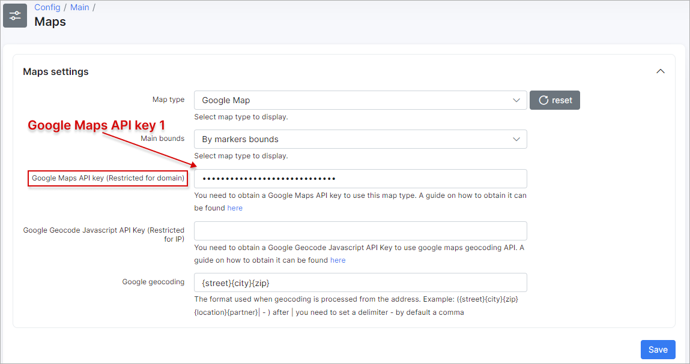
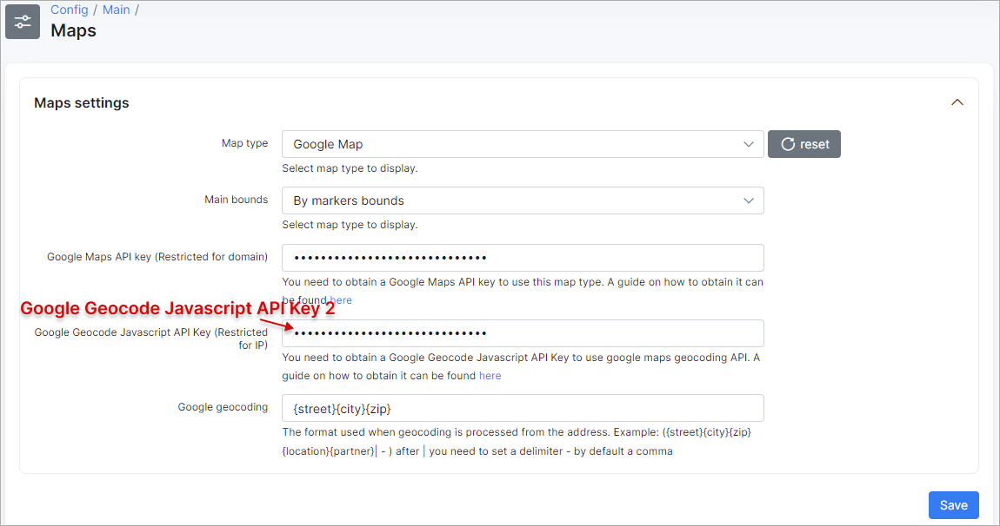
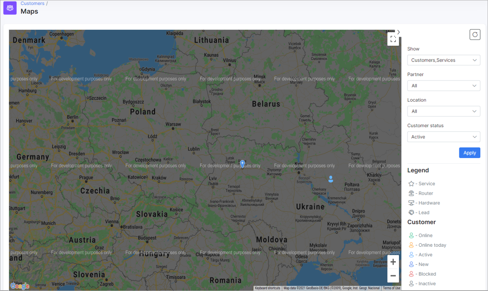
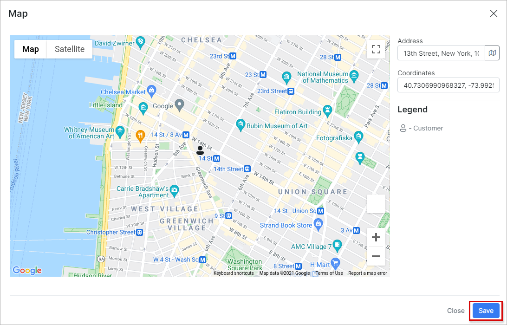
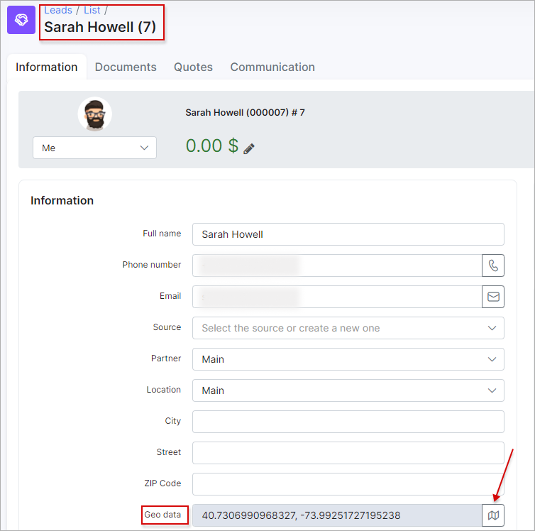
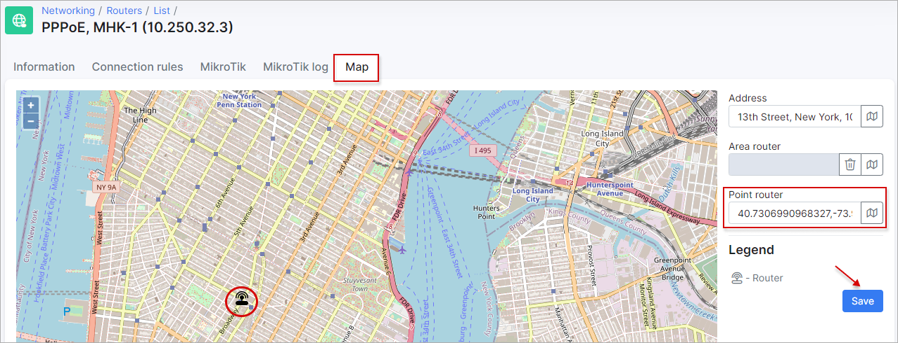
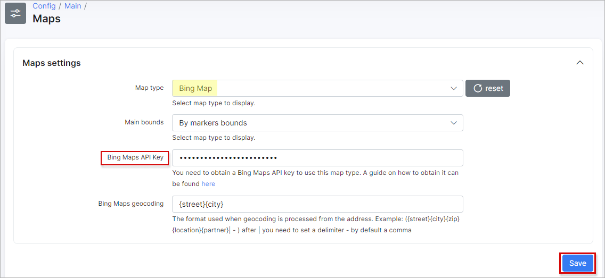

Maps
==================
Splynx supports using three different map engines withing the system: **Open Street**, **Google** and **Bing** maps. To configure *Maps* in Splynx, navigate to `Config → Main → Maps`. The maps are used to help you to find out where your customers, leads, routers and other objects are located.

**By default, Splynx system uses Open Street map type**.

Choosing **Open Street** type we can set up the following settings:

* **Main bounds** - the options are *By markers bounds* (*e.g. the map that starts in Auckland, New Zealand and is restricted to New Zealand. The user can pan away from Auckland and explore other New Zealand cities, but the user cannot pan or zoom to beyond the constraints set on the map.*), *By country* (restricted to specific country only) and *By custom area* (it's possible to choose the necessary area on the map manually).

* **OpenStreet geocoding** - the format that is used when geocoding is processed from the address, e.g. `{street}{city}{zip}{location}{partner}|` - after `|` you need to set a delimiter - by default it's a comma.

------------

As for **Google Map** type, it's required to obtain the **Google Maps API keys**.

<b>How to get the Google Maps API keys</b>

**IMPORTANT:**

* **Google Maps API key** (Restricted for domain) - ensures the operation of the map appearance in Splynx. The **Maps Embed API** is free to use, you can use this API without enabling billing.

* **Google Geocode Javascript API Key** (Restricted for IP) - provides the search according to the entered address, e.g. in customer's profile. To use this key it's required to [enable billing](https://console.cloud.google.com/projectselector/billing) for your Cloud project. Your account will not be charged if you stay within your [free quota](https://developers.google.com/maps/billing-credits);

* After you enable billing, there is no limit to the amount that you might be charged. To gain more control over your costs, you can [create a budget and set alerts](https://developers.google.com/maps/documentation/embed/cloud-setup#creating_budgets_and_setting_alerts). More information you can find in the [Billing](https://developers.google.com/maps/billing/gmp-billing) documentation and in the [FAQ](https://developers.google.com/maps/faq).

Video: How do I set up billing for my project

<iframe width="350" height="270" src="https://www.youtube.com/embed/uINleRduCWM" title="YouTube video player" frameborder="0" allow="accelerometer; autoplay; clipboard-write; encrypted-media; gyroscope; picture-in-picture" allowfullscreen></iframe>

Google Cloud offers a $300 free trial, and Google Maps Platform features a recurring $200 monthly credit. More information can be found at the following links:

* [Billing account credits](https://developers.google.com/maps/billing-credits).

------------

**Step #1: Set up the project**

Before you start using the Google Maps Platform APIs you need to set up your Google Cloud project in order to manage your API keys.

1. [Create a new Google Cloud project](https://console.cloud.google.com/projectcreate) in the Cloud Platform;

2. On the New Project page, fill in the required information, such as **Project name**, **Project ID** (accept the default or click EDIT to enter a customized ID), **Location** (select your own or choose *No organization*);

3. Click **Create** button.

More information can be found [here](https://developers.google.com/maps/documentation/embed/cloud-setup).

------------

**Step #2: Enable APIs**

To use *Google Maps Platform*, you must enable the APIs you plan to use with your project. If you are not sure which APIs to enable, try using the [API Picker](https://developers.google.com/maps/documentation/api-picker) or documentation - [link 1](https://developers.google.com/maps/documentation) and [link 2](https://developers.google.com/maps/apis-by-platform).

Navigate to [Google Maps Platform page](https://console.cloud.google.com/project/_/google/maps-apis/api-list) and **enable** the next APIs:

* [Maps Embed API](https://console.cloud.google.com/apis/library/maps-embed-backend.googleapis.com) - [overview](https://developers.google.com/maps/documentation/embed/get-started);

* [Maps JavaScript API](https://console.cloud.google.com/apis/library/maps-backend.googleapis.com) - [overview](https://developers.google.com/maps/documentation/javascript/overview);

* [Geocoding API](https://console.cloud.google.com/apis/library/geocoding-backend.googleapis.com) [overview](https://developers.google.com/maps/documentation/geocoding/overview).

Click [here](https://console.cloud.google.com/project/_/google/maps-apis/api-list) to view the APIs you have enabled. If the button says *ENABLE*, click the button to enable the API, it it says *MANAGE*, the API is already enabled and you don't need to do anything further.

------------

**Step #3: Get an API keys**

The [API key](https://cloud.google.com/docs/authentication/api-keys) is a unique identifier that authenticates requests associated with your project.

To create the **Google Maps API key** (Restricted for domain):

1. Go to the **Google Maps Platform** > [Credentials page](https://console.cloud.google.com/project/_/google/maps-apis/credentials);

2. On the **Credentials** page, click **Create credentials** > **API key**;

3. Click **Close**. The new API key is listed on the **Credentials** page under **API keys**;

4. Click on **Edit API key**, on new page change the **Name**, set **Application restrictions** to `HTTP referrers (web sites)` and in **Website restrictions** section add your Splynx domain address.

Examples of adding the HTTP restrictions

[More examples](https://cloud.google.com/docs/authentication/api-keys#adding_http_restrictions)

Click **Save** at the bottom of the page;

5. Copy and paste your *Google Maps API key 1* to the corresponding field in Splynx.

To create the **Google Geocode Javascript API Key** (Restricted for IP):

1. Go to the **Google Maps Platform** > [Credentials page](https://console.cloud.google.com/project/_/google/maps-apis/credentials);

2. On the **Credentials** page, click **Create credentials** > **API key**;

3. Click **Close**. The new API key is listed on the **Credentials** page under **API keys**;

4. Click on **Edit API key**, on new page change the **Name**, set **Application restrictions** to `IP addresses (web servers, cron jobs, etc.)` and in **Website restrictions** section add your Splynx public IP address;

Click **Save** at the bottom of the page;

5. Copy and paste your *Google Geocode Javascript API Key 2* to the corresponding field in Splynx and press **Save**.

Video: How to generate and restrict API keys

<iframe width="350" height="270" src="https://www.youtube.com/embed/2_HZObVbe-g" title="YouTube video player" frameborder="0" allow="accelerometer; autoplay; clipboard-write; encrypted-media; gyroscope; picture-in-picture" allowfullscreen></iframe>

------------

To shutdown the project use this [link](https://console.cloud.google.com/iam-admin/projects).

------------

To view your map navigate to `Customers → Maps`.

The watermark `For development purposes only` on the map means that **billing** wasn't enabled for the current project. You have to associate a credit card so that you can get billed if your site has requests that exceed the [$200 credit they give you monthly for free](https://mapsplatform.google.com/pricing/).

You can also apply filters to the map to display only the items you want to view. The customer pointers have different colors, this depends on the customer status (new, active, online, blocked, inactive). On the map, you can click on any pointer to see additional information.

To edit customer GPS coordinates, navigate to customer profile, **Information** tab, find the **Geo data** field, click on the <icon class="image-icon"></icon> icon, in a new window, fill in the field **Address** and press the <icon class="image-icon"></icon> icon again to find the GPS coordinates.

If the customer has the saved address (Street, ZIP code, City), the GPS coordinates will be found automatically. Also, you can click on the map to add a pointer manually or drag and drop the pointer to move it as well. After editing the pointer location press `Save` button.

You can set the GPS coordinates to the **leads**, **routers**, **services** and other **hardware** in the same way:

------------

For **Bing Map** type, it's required to create a [Bing Maps API key](https://docs.microsoft.com/en-us/bingmaps/getting-started/bing-maps-dev-center-help/getting-a-bing-maps-key) to use this map.

