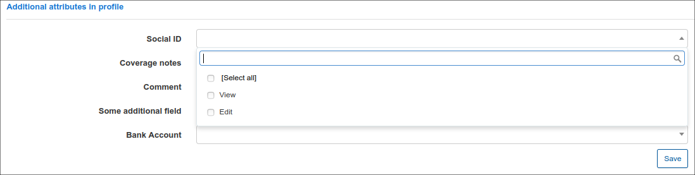
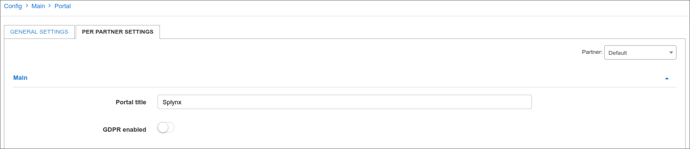
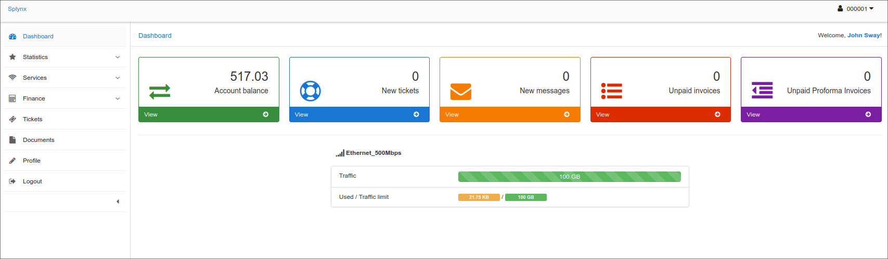
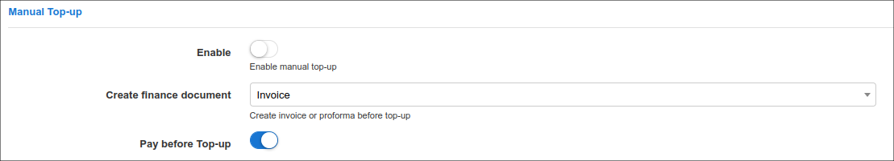

Portal
======

To configure parameters of the **Customer Portal** navigate to `Config → Main → Portal`:

The **Customer Portal** configuration includes the following **sections**:

## **General Settings**

### Main
This section includes customer's authentication way, password reset methods and language settings.

**Parameter descriptions**:

* **Languages** - select the languages available on the Customer Portal;
* **Authentication field** - select the method of customer's authentication, the next options are available: Email or Login;
* **Reset password** -  enable or disable the option of resetting the password on the Customer Portal;
* **Type of resetting password** - select the method of resetting passwords, options are: SMS or Email;
* **Template for email message** - select the template of the email for resetting the password;
* **Text for SMS message** - type the text for the SMS messages for resetting the password;
* **Characters for generate email check code** - specify the characters available to generate an email code;
* **Email check code length** - specify the number of characters to use when generating an email code;
* **Characters for generate SMS check code** - specify the characters available to generate a SMS code;
* **SMS check code length** - specify the number of characters to use when generating an SMS code.

## Customer Mobile app

In this section, we can configure elements of the customer mobile app.

Parameter descriptions:

* **Enabled** - enables/disables the displaying of the mobile app download links on the Customer Portal login page;
* **Google Play App ID** - specify the Google play app ID, should be `com.splynx.portal`;
* **App Store App ID** - specify the AppStore App ID, should be `id1462886761`.

### Additional attributes in profile

In this section we can specify the permission to each field in Additional information section of customer's profile.

The following permissions can be set: **View**, **Edit** or **both** of them. After the necessary permission is set, the field will be visible in the **My profile** section of the Customer Portal.

Items that you have chosen to view only on a customer account will have dimmed background field, and items for which you have granted edit rights to customer will be displayed with white background field.

For example, you want to add the **Home phone number** field to the Customer Portal and give the customer the right to edit their number. In this case, once you select **Edit**, the customer will be able to see this attribute in their profile on the portal and change it.

Information about configuring Additional fields in Splynx can be found here - [Additional fields](configuration/system/additional_fields/additional_fields.md).

---

## **Per Partner Settings**

### Main

* **Portal title** - specify a title for the Portal;
* **GDPR enabled** - enables/disables GDPR practices on the portal.

In case in Splynx system is used the multiple [partners](administration/main/partners/partners.md) scheme, you can divide configurations between partners. Create a new partner in Splynx, on this tab select the necessary partner and set the required settings.

**NOTE:**

The fields marked with `*` sign have the different values from original ones (original values are related to **Default** partner).

### Menu
This is the configuration of the main modules that will be displayed on the Customer Portal.

You can choose whether or not to display certain modules by checking or unchecking each item.

You can choose from the following modules or select all of them:

- Statistics
- Services
- Finance
- Messages
- Tickets
- Documents
- Profile
- About
- News

### Dashboard
This is the configuration of the items that will be displayed on the customer's Dashboard page.
Here you can enable the option **Show portal news** and the last three portal news will be displayed. The options **Show FUP/CAP active services** and **Live Bandwidth Usage** are also available here.

**Parameter descriptions**:

* **Show FUP/CAP active services** - enables/disables the displaying of FUP/CAP statistics of active services on the Dashboard page;
* **Items** - select the items to be displayed on the dashboard.

You can choose from the following items or select all of them:

- Balance
- New Tickets
- New Messages
- Unpaid Invoices
- Unpaid Proforma Invoices

* **Show portal news** - enables/disables the display of the three most recent news articles on the dashboard;
* **Show Live Bandwidth Usage** - enables/disables real-time display of bandwidth usage on the dashboard.

Below is an example of the overall view of the customer portal with all the elements selected to be displayed in the navigation menu sidebar and on the Dashboard:

### Documents

In this sub-menu you can customize the subject and the main text of the notification that the customer receives when the contract is signed.

* **Subject for contract notification** - set the subject of notification;

* **Text for contract notification** - set the main text of notification.

For more information about variables, see [Variables for templates](configuration/system/templates/templates_variables/templates_variables.md)

### Profile

This is the configuration of the customer profile which will give customers option to view their contact information or to edit it. To be able to edit and save changes customer can be asked for their current password, for this to work, you should enable the option to **Request Password**.

Profile information includes:

* Login
* Name
* Email
* Billing email
* Phone
* Street
* ZIP
* City
* Payment method
* Password

For each of these items you can choose the actions available for the customer: **View**, **Edit** or **both**.

Items that you choose to view only will have dimmed background fields and items that the customer can edit will be presented with white background fields.

### Internet Statistics

You can enable the following features here:

* **Show daily usage** - enables/disables displaying the daily usage graphs;
* **Show totals** - enables/disables displaying the usage totals for the selected period;
* **Show graph** - enables/disables displaying the bandwidth usage graph;
* **Show FUP statistics** - enables/disables displaying the detailed FUP statistics;
* **Show current limits** - enables/disables displaying the current speed limits information;
* **Show monthly limits (CAP)** - enables/disables displaying the information about monthly limits (CAP);
* **Show sessions statistics** - enables/disables displaying the detailed session statistics;
* **Show session termination cause** - enables/disables displaying the reason for session termination in session statistics.

### Voice Statistics

### Services

This is the configuration of services and service fields to be displayed in the Customer portal. You can also enable the option to display how many days is left until the end of the service, as well as wheteher or not to display the hardware linked to the customer.

For each type of service you can select the fields to be displayed:

** **Bundle Services** - *Customer ID, Description, Price, Contract start date, Contract end date, Status*

* **Internet Service** - *Customer ID, Price, Login, Radius IPv6, Change plan, Description, Start date, IPv4, Type of Connection, Password changed, Plan, End date, Test, Stop/Active service, Status*.

  

* **Voice Service** - *Customer ID, Price, Phone, Status, Description, Start date, Stop/Active service, Plan, End date, Change plan*.

  

* **Custom Service** - *ID, Price, New, Stop/active service, Description, Start date, USD/year, Change plane, Plan, End date, TEST field, Status*.

* **Show days** (only for prepaid customers) - enables/disables the displaying of the amount of days left until the end of the service.

* **Hardware** - enables/disables the displaying of hardware linked to the customer.

### Tickets

This is the configuration of field to be displayed in the Tickets module of the Customer portal

Fields to be displayed in the module can simply be ticked or left unticked if you do not wish to display the field.

Fields available the tickets modules are:
*ID, Subject, Priority, Status, Group, Type, Assigned to, Created Date & Time, Updated date & time and Star*

### Top-Up settings

This is the configuration of permissions to top-ups in the customer portal.

**Parameter descriptions**-

* **Enable** - enables/disables the top-ups via the customer portal

Define the customers permissions to *View, Edit or Both* for the following fields:

* **Auto Top-Up**
* **Auto top-up plans**
* **Limitation type**
* **Max number of top-up per month**

### Manual top-up

This is the configuration of Manual Top-ups in the customer portal.

**Parameter descriptions**:

* **Enable** - enables/disables manual top-ups in the customer portal.
* **Create finance document** - select which document the system should create after a customer performs a manual top-up. The following options are available: `Invoice` or `Proforma`.
* **Pay before Top-up** - enables/disables whether the customer will receive their top-up data only after they pay for the top-up.

### Finance

This is the configuration of financial items to be displayed in Customer portal such as: Invoices, Payments, Proforma Invoices and Transactions, and Payment methods available for Customer, for example, Refill cards. As well as the available payment methods for the customer and which transaction fields the customer can display.

### Hotspot

This is the configuration of Hotspot logins

**Parameter descriptions**:

* **Enable hotspot** -  enables/disables the system Hotspot
* **Hotspot hostname** - specify the URL of your Splynx System
* **Login** - select the method of logging into the hotspot.
* **Hotspot status page** - enables/disables the hotspot status page

----
##### Some fields need to be explained more detailed:

* **Password changed** - when this option is enabled, it will allow customers to change passwords for their services. Customers will be able to change their passwords by clicking on the <icon class="image-icon"></icon> icon in the *Actions section* of the table in Services.

  

* **Change plan** - when this option is enabled, it will allow customers to apply for a plan change via the Customer portal by sending a request to technical support. When this option is enabled customers will see an <icon class="image-icon"></icon> icon in the *Actions* column in Services. By clicking on that icon a window "Change plan", will appear where customers will choose an option *Manual change request*.

The window "Create ticket" will appear where customers will choose the Priority of the ticket (Minor, Major, Critical) and write a short message. Customer can also upload a file by clicking on the Upload icon <icon class="image-icon"></icon> below the text message.

