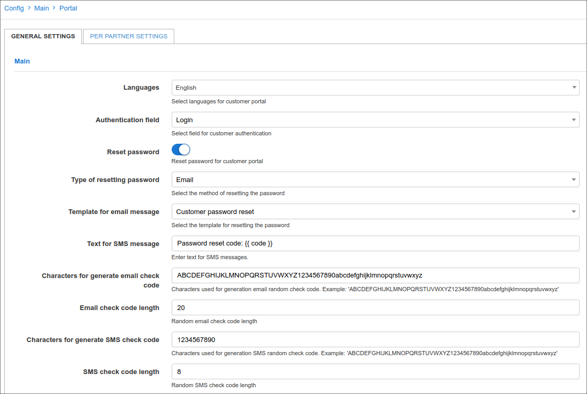
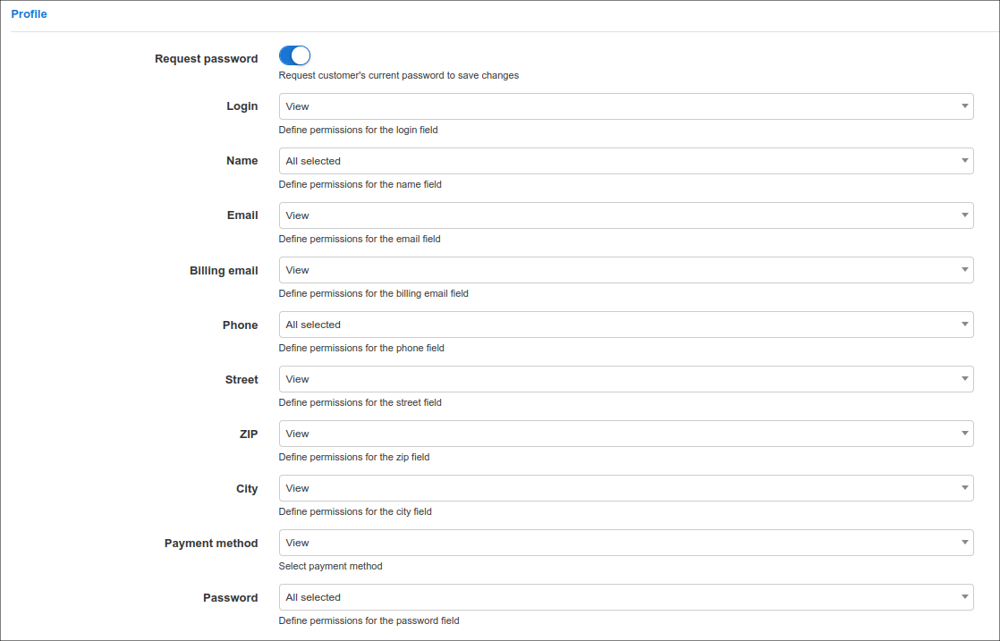
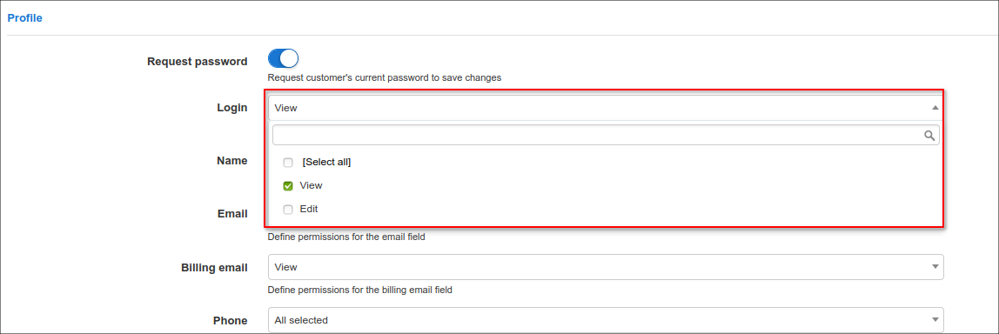
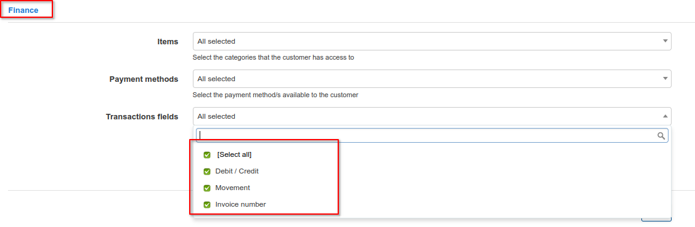

Portal
======

To configure parameters of the **Portal** navigate to `Config → Main → Portal`:

The **Portal** configuration includes the following **sections**:

## **General Settings**

### Main

This section includes customer's authentication way, password reset methods and language settings.

**Parameter descriptions**:

* **Languages** - select the languages available on the Portal;
* **Authentication field** - select the method of customer's authentication, the next options are available: `Email` or `Login`;
* **Reset password** -  enable or disable the option of resetting the password on the Portal;
* **Type of resetting password** - select the method of resetting passwords, options are: `SMS` or `Email`;
* **Template for email message** - select the template of the email for resetting the password;
* **Text for SMS message** - type the text for the SMS messages for resetting the password;
* **Characters for generate email check code** - specify the characters available to generate an email code;
* **Email check code length** - specify the number of characters to use when generating an email code;
* **Characters for generate SMS check code** - specify the characters available to generate a SMS code;
* **SMS check code length** - specify the number of characters to use when generating an SMS code.

## Customer Mobile app

In this section, we can configure elements of the customer mobile app.

Parameter descriptions:

* **Enabled** - enables/disables the displaying of the mobile app download links on the Portal login page;
* **Google Play App ID** - specify the Google play app ID, should be `com.splynx.portal`;
* **App Store App ID** - specify the AppStore App ID, should be `id1462886761`.

### Additional attributes in profile

In this section we can specify the permission to each field in Additional information section of customer's profile.

The following permissions can be set: `View`, `Edit` or `both` of them. After the necessary permission is set, the field will be visible in the **My profile** section of the Portal.

Items that you have chosen to view only on a customer account will have dimmed background field, and items for which you have granted edit rights to customer will be displayed with white background field.

For example, you want to add the **Home phone number** field to the Portal and give the customer the right to edit their number. In this case, once you select `Edit`, the customer will be able to see this attribute in their profile on the Portal and change it.

<icon class="image-icon"></icon> Information about configuring Additional fields in Splynx can be found here - [Additional fields](configuration/system/additional_fields/additional_fields.md).

---

## **Per Partner Settings**

### Main

* **Portal title** - specify a title for the Portal;
* **GDPR enabled** - enables/disables GDPR practices on the portal.

In case in Splynx system is used the multiple [partners](administration/main/partners/partners.md) scheme, you can divide configurations between partners. Create a new partner in Splynx, on this tab select the necessary partner and set the required settings.

<icon class="image-icon"></icon> **NOTE:**

The fields marked with `*` sign have the different values from original ones (original values are related to **Default** partner).

### Menu

This is the configuration of the main modules that will be displayed on the Portal.

You can choose whether or not to display certain modules by checking or unchecking each item.

You can choose from the following modules or select all of them:

- `Statistics`
- `Services`
- `Finance`
- `Messages`
- `Tickets`
- `Documents`
- `Profile`
- `About`
- `News`

### Dashboard

This is the configuration of the items that will be displayed on the Dashboard page of the Portal.

Here you can enable the option **Show portal news** and the last three portal news will be displayed. The options **Show FUP/CAP active services** and **Live Bandwidth Usage** are also available here.

**Parameter descriptions**:

* **Show FUP/CAP active services** - enables/disables the displaying of FUP/CAP statistics of active services on the Dashboard page;
* **Items** - select the items to be displayed on the dashboard.

You can choose from the following items or select all of them:

- `Balance`
- `New Tickets`
- `New Messages`
- `Unpaid Invoices`
- `Unpaid Proforma Invoices`

* **Show portal news** - enables/disables the display of the three most recent news articles on the dashboard;
* **Show Live Bandwidth Usage** - enables/disables real-time display of bandwidth usage on the dashboard.

Below is an example of the overall view of the Portal with all the elements selected to be displayed in the navigation menu sidebar and on the Dashboard:

### Documents

In this sub-menu you can customize the subject and the main text of the notification that the customer receives when the contract is signed.

* **Subject for contract notification** - set the subject of notification;

* **Text for contract notification** - set the main text of notification.

As a result, when the contract is signed, the customer will receive a notification with the contract attached to the letter as a PDF file

<icon class="image-icon"></icon> For more information about variables, see [Variables for templates](configuration/system/templates/templates_variables/templates_variables.md)

### Profile

This is the configuration of the customer profile which will give customers option to view their contact information or to edit it. To be able to edit and save changes customer can be asked for their current password, for this to work, you should enable the option to **Request Password**.

Profile information includes:

* `Login`
* `Name`
* `Email`
* `Billing email`
* `Phone`
* `Street`
* `ZIP`
* `City`
* `Payment method`
* `Password`

For each of these items you can choose the actions available for the customer: `View`, `Edit` or `both`.

Items that you choose to view only will have dimmed background fields and items that the customer can edit will be presented with white background fields.

### Internet Statistics

You can enable the following options here:

* **Show daily usage** - enable/disable displaying the daily usage graphs;
* **Show totals** - enable/disable displaying the usage totals for the selected period;
* **Show graph** - enable/disable displaying the bandwidth usage graph;
* **Show FUP statistics** - enable/disable displaying the detailed FUP statistics;
* **Show current limits** - enable/disable displaying the current speed limits information;
* **Show monthly limits (CAP)** - enable/disable displaying the information about monthly limits (CAP);
* **Show sessions statistics** - enable/disable displaying the detailed session statistics;
* **Show session termination cause** - enable/disable displaying the reason for session termination in session statistics.

### Voice Statistics

You can enable the next options here:

A customer can check this statistical information in `Statistics → Voice` section according to the selected period on the Portal

### Services

In this section, you can customize the display of services, service fields and hardware on the Portal.

For each type of service, you can select fields to display:

* **Bundle service** - `ID`, `Description`, `Price`, `Contract start date`, `Charged up`, `Contract end date`, `Status`;

* **Internet service** - `ID`, `Description`, `Plan`, `Price`, `Start date`, `Charged up`, `Service login`, `IPv4 address`, `End of contract`, `Type of connection`, `Stop/Active service`, `Self-change tariff plan`, `Request tariff plan change`, `Password change`, `Status`;

* **Voice service** - `ID`, `Description`, `Plan`, `Price`, `Start date`, `Charged up`, `Phone`, `Direction`, `Stop/Active service`, `Request tariff plan change`, `Status`;

* **Recurring service** - `ID`, `Description`, `Plan`, `Price`, `Start date`, `Charged up`, `Stop/Active service`, `Self-change tariff plan`, `Request tariff plan change`, `Status`;

* **Show days** (**only for prepaid customers**) - enable/disable displaying the number of days remaining to the end of the service;

* **Hardware** - enable/disable displaying the hardware (inventory item) linked to the customer;

* **ACS Devices** - enable/disable displaying the ACS device linked to the customer;

* **Show all services** - enable/disable displaying of all services (including all stopped and disabled) related to the customer.

##### Some fields need more explanation::

* **Password change** - when this field is enabled, it allows a customer to change password for their service. A customer should click on the <icon class="image-icon"></icon> icon in the *Actions* column of the **Services** table.

* **Self-change tariff plan** / **Request tariff plan change** - if one of these fields is enabled, it allows a customer to change a plan independently or to submit a request to technical support via a ticket. A customer should click on the <icon class="image-icon"></icon> icon in the *Actions* column of the **Services** table.

If the customer sends a request, in a new window the customer can select a priority, attach a file and write a short message:

<icon class="image-icon"></icon> For more information, see [Change Plan from Customer Portal](configuration/main_configuration/portal/portal.md).

### Tickets

In this section, you can configure the ticket fields that will be displayed on the Portal.

For the fields that will be displayed in the module, just check the box or leave the item unchecked if you do not want to display it

The following fields are available in the ticket modules:
`ID`, `Subject`, `Priority`, `Status`, `Group`, `Type`, `Assigned to`, `Watching`, `Created Date & Time`, `Updated date & time`, `Star`, `Add file`.

### Top-Up settings

In this section, you can configure the permissions of top-up plans on the Portal.

**Parameter descriptions**:

* **Enable** - enable/disable the top-ups on the Portal

Define the customers permissions to `View`, `Edit` or `both` for the following fields:

* **Auto Top-Up**
* **Auto top-up plans**
* **Limitation type**
* **Max number of top-up per month**

### Manual top-up

In this section, you can configure the Manual Top-ups on the Portal.

**Parameter descriptions**:

* **Enable** - enable/disable the manual top-up plans on the Portal;
* **Create finance document** - select which document the system should create after a customer performs a manual top-up. The following options are available: `Invoice` or `Proforma`;
* **Pay before top-up** - enable/disable whether the customer will receive their top-up data only after they pay for the top-up.

### Finance

In this section, you can configure the financial elements, available payment methods, transaction fields and customize the account balance view that will be displayed on the Portal.

**Parameter descriptions**:

* **Items** - enable/disable categories in the **Finance** section on the Portal. Available items to display: `Invoices`, `Payments`, `Credit Notes`, `Statements`, `Transactions`, `Proforma invoices`;
* **Payment methods** - enable/disable payment methods in the **Payments** section. Available item to display: `Refill card`;
* **Transactions fields** - enable/disable fields in the **Transactions** table on the Portal. Available item to display: `Debit/Credit`, `Movement`, `Invoice number`;
* **Invert account balance** - enable/disable displaying the inverted account balance on the Portal.

<icon class="image-icon"></icon> Suggested read:

- [Invoices](finance/invoices/invoices.md);
- [Payments](finance/payments/payments.md);
- [Credit Notes](finance/credit_notes/credit_notes.md);
- [Statements](finance/payment_statement_processing/payment_statement_processing.md);
- [Transactions](finance/transactions/transactions.md);
- [Proforma invoices](finance/proforma_invoices/proforma_invoices.md).

### Hotspot

In this section, you can configure the Hotspot logins

**Parameter descriptions**:

* **Enable hotspot** -  enables/disables the system Hotspot;
* **Hotspot hostname** - specify the URL of your Splynx system;
* **Login** - select the method of log in to the Hotspot, available options: `Automatic, after login to portal`, `Click to login button`, `Disabled`;
* **Hotspot status page** - enables/disables the Hotspot status page.
