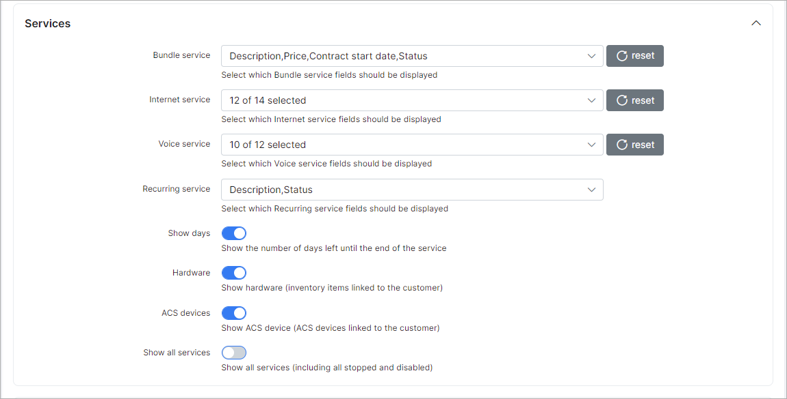
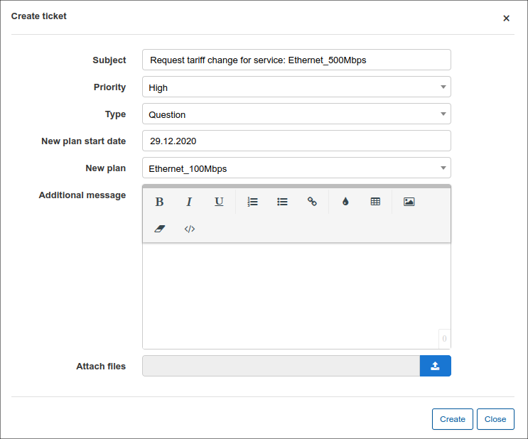

Portal
======

To configure parameters of the Customer portal navigate tp `Config → Main → Portal`.

The Customer Portal configuration includes the following sections:

## **General Settings**

### Main
This section of the portal configuration includes configurations of customer's authentication, password, ways of resetting password and languages in the Customer Portal.

**Parameter descriptions**:

* **Languages** - select the languages available for your Customer Portal
* **Authentication field** - select the method of customer's authentication, options available are: Email or Login
* **Reset password** -  enable or disable the option of resetting the password for the Customer Portal
* **Type of resetting password** - select the method of resetting passwords, options are: SMS or Email
* **Template for email message** - select the template of the email for resetting the password
* **Text for SMS message** - type the text for the SMS messages for resetting the password.
* **Characters for generate email check code** - specify the characters available to generate a email code.
* **Email check code length** - specify the number of characters to use when generating an email code.
* **Characters for generate SMS check code** - specify the characters available top generate a SMS code.
* **SMS check code length** - specify the number of characters to use when generating an SMS code

## Customer Mobile app

In this section, we can configure elements of the customer mobile app.

Parameter descriptions:

* **Enabled** - enables/disables the displaying of the mobile app download links on customer portal login page
* **Google Play App ID** - specify the Google play app ID, should be *com.splynx.portal*
* **App Store App ID** - specify the AppStore App ID, should *id1462886761*

### Additional attributes in profile

In this section we can specify the permission to each additional attribute field in the My profile section of the customer portal:

Configuration of additional attributes to be seen in Customer portal, for example, GPS, Contract ID, Bank Account etc. For each of these items you can specify the permission of the customer: View or Edit.
Items you've selected to be viewed only in the Customer Account will have dimmed fields and items that you've granted editing permissions to customers for, will be displayed with white fields.

For example, you'd like to add a Customer's bank account as additional attribute to the Customer portal and you'd also like to give customer the right to edit his account number. In that case, as soon as you will select options View and Edit in Bank account field in Configuration, customer will be able to see that attribute in his Profile in Customer portal and change it.

Information about configuring Additional fields in Splynx can be found here - [Additional fields](configuration/system/additional_fields/additional_fields.md).

## **Per Partner Settings**

### Main

* **Portal title** - specify a title for the Portal
* **GDPR enabled** - enables/disables GDPR practices in the portal.

### Menu
This is the configuration of main modules to be displayed in the Customer portal.
You can choose whether or not to display specific modules by ticking or unticking each module.

 Modules to choose from are: *Statistics, Services, Finance, Messages, Tickets, Documents, Profile, About, News*.

### Dashboard
This is the configuration of items to be shown on the Customer Dashboard.
Here you can enable the option Show Portal News and the last three portal news will be shown on a customer dashboard. The options to display CAP/FUP usage of active service and live bandwidth usage is also available here.

**Parameter descriptions**:

* **Show FUP/CAP active services** - enables/disables the displaying of FUP/CAP statistics of active services on the dashboard
* **Items** - select the items to be displayed on the dashboard

You can select following items to be displayed on Customer Dashboard: *Balance, New Tickets, New Messages, Unpaid Invoices, Unpaid Proforma Invoices*.

* **Show portal news** - enables/disables the displaying of portal News
* **Show Live Bandwidth Usage** - enables/disables the displaying of live bandwidth usage on the dashboard

Below is an example of a Customer account in the portal with all items selected to be displayed in the navigation menu and only Balance, New Messages and Unpaid Invoices selected to be displayed on the Dashboard.

### Profile

This is the configuration of the customer profile which will give customers option to view their contact information or to edit it. To be able to edit and save changes customer can be asked for their current password, for this to work, you should enable the option to *"Request Password"*.

Profile information includes:

* Login
* Name
* Email
* Phone
* Street
* ZIP
* City
* Password

For each of these items you can choose the actions available for the customer: View or Edit.

Items you've selected  to be viewed only in the Customer Account will have dimmed fields and items which customer can edit will be presented with white fields.

### Statistics

You can enable the following features here:

* **Show daily usage** - enables/disables the displaying of daily usage
* **Show totals** - enables/disables the displaying of usage totals
* **Show graph** - enables/disables the displaying the Bandwidth usage graph in Customer portal
* **Show FUP statistics** - enables/disables the displaying of the details of FUP statistics
* **Show current limits** - enables/disables the displaying current speed limits information
* **Show hard limits** - enables/disables the displaying hard limits information
* **Show monthly limits (CAP)** - enables/disables the displaying information of monthly CAP limits
* **Show sessions statistics** - enables/disables the displaying the details of session statistics

### Services

This is the configuration of services and service fields to be displayed in the Customer portal. You can also enable the option to display how many days is left until the end of the service, as well as wheteher or not to display the hardware linked to the customer.

For each type of service you can select the fields to be displayed:

** **Bundle Services** - *Customer ID, Description, Price, Contract start date, Contract end date, Status*

* **Internet Service** - *Customer ID, Price, Login, Radius IPv6, Change plan, Description, Start date, IPv4, Type of Connection, Password changed, Plan, End date, Test, Stop/Active service, Status*.

  

* **Voice Service** - *Customer ID, Price, Phone, Status, Description, Start date, Stop/Active service, Plan, End date, Change plan*.

  

* **Custom Service** - *ID, Price, New, Stop/active service, Description, Start date, USD/year, Change plane, Plan, End date, TEST field, Status*.

* **Show days** - enables/disables the displaying of the amount of days left until the end of the service.

* **Hardware** - enables/disables the displaying of hardware linked to the customer

### Tickets

This is the configuration of field to be displayed in the Tickets module of the Customer portal

Fields to be displayed in the module can simply be ticked or left unticked if you do not wish to display the field.

Fields available the tickets modules are:
*ID, Subject, Priority, Status, Group, Type, Assigned to, Created Date & Time, Updated date & time and Star*

### Top-Up settings

This is the configuration of permissions to top-ups in the customer portal.

**Parameter descriptions**-

* **Enable** - enables/disables the top-ups via the customer portal

Define the customers permissions to *View, Edit or Both* for the following fields:

* **Auto Top-Up**
* **Auto top-up plans**
* **Limitation type**
* **Max number of top-up per month**

### Manual Top-Up
This is the configuration of Manual Top-ups in the customer portal.

**Parameter descriptions**:

* **Enable** - enables/disables manual top-ups in the customer portal.
* **Create finance document** - select which document the system should create after a customer performs a manual top-up
* **Pay before Top-up** - enables/disables whether the customer will receive their top-up data only after they pay for the top-up.

### Finance

This is the configuration of financial items to be displayed in Customer portal such as: Invoices, Payments, Proforma Invoices and Transactions, and Payment methods available for Customer, for example, Refill cards. As well as the available payment methods for the customer and which transaction fields the customer can display.

### Hotspot

This is the configuration of Hotspot logins

**Parameter descriptions**:

* **Enable hotspot** -  enables/disables the system Hotspot
* **Hotspot hostname** - specify the URL of your Splynx System
* **Login** - select the method of logging into the hotspot.
* **Hotspot status page** - enables/disables the hotspot status page

----
##### Some fields need to be explained more detailed:

* **Password changed** - when this option is enabled, it will allow customers to change passwords for their services. Customers will be able to change their passwords by clicking on the <icon class="image-icon"></icon> icon in the *Actions section* of the table in Services.

  

* **Change plan** - when this option is enabled, it will allow customers to apply for a plan change via the Customer portal by sending a request to technical support. When this option is enabled customers will see an <icon class="image-icon"></icon> icon in the *Actions* column in Services. By clicking on that icon a window "Change plan", will appear where customers will choose an option *Manual change request*.

The window "Create ticket" will appear where customers will choose the Priority of the ticket (Minor, Major, Critical) and write a short message. Customer can also upload a file by clicking on the Upload icon <icon class="image-icon"></icon> below the text message.

