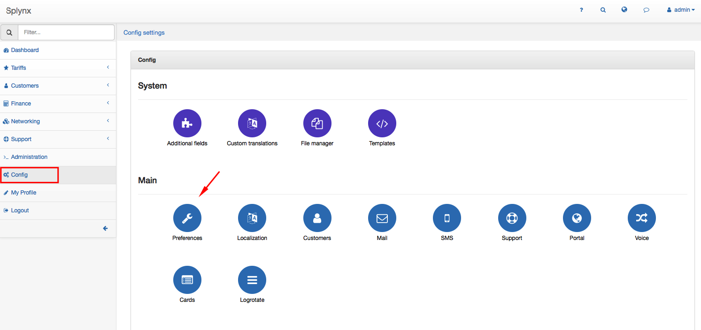
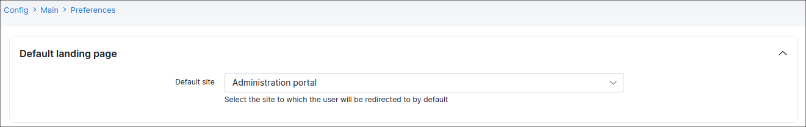
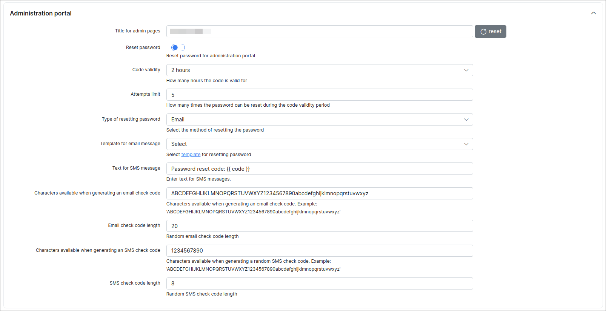
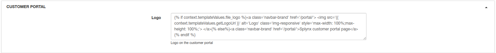
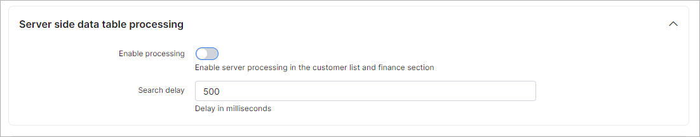
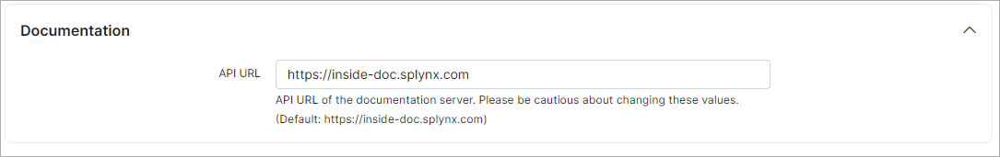
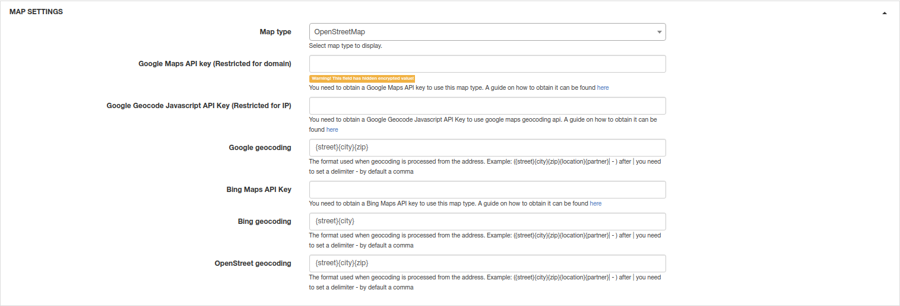
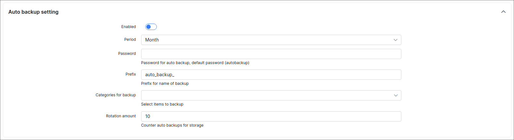
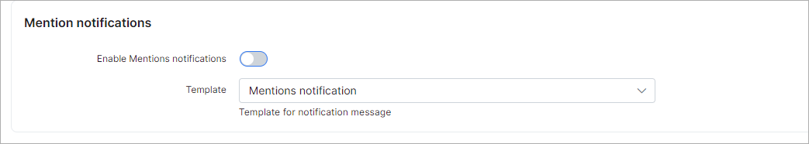
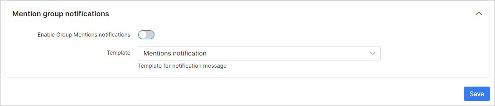

Preferences
==========

Basic settings of the administrator and customer portal can be configured under `Config → Main → Preferences`.

## Default landing page
Here you can select which page(customer or admin portal) will be opened when  your Splynx URL is accessed, https://yourSplynx.com :

## Administration portal

The following settings are for the admin portal only.

* **Title for admin pages** - header for the tab name in the browser(Splynx: Preferences, Splynx: Dashboard);
* **Logo** - default code for the admin portal logo. the size of the logo, and  other parameters can be changed here;
* **Reset password** - enables/disables the option to reset the password for the admin portal;
* **Code validity** - how many hours the code for the password reset is valid;
* **Attempts limit** - how many attempts can be made to change the password during the code validity period;
* **Type of resetting password** - select a method to reset password(Email or SMS);
* **Template for email message** - select the template for the email message to reset the password;
* **Template for SMS message** - select the template for the SMS message to reset the password;
* **Text for SMS message** - type the text for the SMS message with the code;
* **Characters for generate email check code** - specify the list of characters available for code generation via email;
* **Email check code length** - specify the length of the code for the email;
* **Characters for generate SMS check code** - specify the list of characters available for code generation via SMS;
* **SMS check code length** - specify the length of the code for SMS.

## Customer portal

Only the style of portal logo can be changed.

## Server side data table processing

* **Enable processing** - enables/disables server processing in the customer list and finance section;
* **Rule counter for server-side processing** - number of records after which server side data table processing will be enabled;
* **Search delay** - search delay in milliseconds.

## Documentation
Please do not change this field. It's used to load builtin- documentation.

## Map settings

Maps can be configured here.

* **Map type** - select the map type: Openstreet, GoogleMaps or BingMap(OpenStreet does not require any configuration);
* **Google Maps API key (Restricted for domain)** - if the map type selected as GoogleMaps, the API key restricted for the domain must be placed here. [Guide how to get Maps API key](https://developers.google.com/maps/documentation/javascript/get-api-key)
* **Google Geocode Javascript API Key (Restricted for IP)** - if the map type selected as GoogleMaps Geocode. the JavaScript API key restricted for the IP must be placed here(IP of Splynx server). [Guide how to get JavaScript API key](https://developers.google.com/maps/documentation/javascript/get-api-key);
* **Google geocoding** - geocoding format used for Google Maps;
* **Bing Maps API key** - If BingMap is used, the Bing API key must be entered here. [Manual here](https://docs.microsoft.com/en-us/bingmaps/getting-started/bing-maps-dev-center-help/getting-a-bing-maps-key);
* **Bing geocoding** - geocoding format used for Bing Maps;
* **OpenStreet geocoding** - geocoding format used for OpenStreet maps.

## Auto backup settings

Settings for auto backup.

* **Enabled** - enables/disables auto backup;
* **Period** - period for auto backup(Month, Week, Day);
* **Password** - password for auto backup;
* **Prefix** - prefix for auto backup files;
* **Categories for backup** - select what to backup(database, rrd files, templates, addons and handlers, uploads);
* **Rotation amount** - counter of auto backups for storage.

## Mention notifications

These notifications are used to notify administrators when they are mentioned in within Tasks, the CRM module, Tickets, as well as in Customer comments.

* **Enable mentions notifications** - enables/disables mentions notifications;
* **Subject** - type the subject of the notification message;
* **Template** - select the template for notification body.

## Mention group notifications

* **Enable group mentions notifications** - enable/disable group mentions notifications;
* **Subject** - subject of notification message;
* **Template** - template for notification body.
