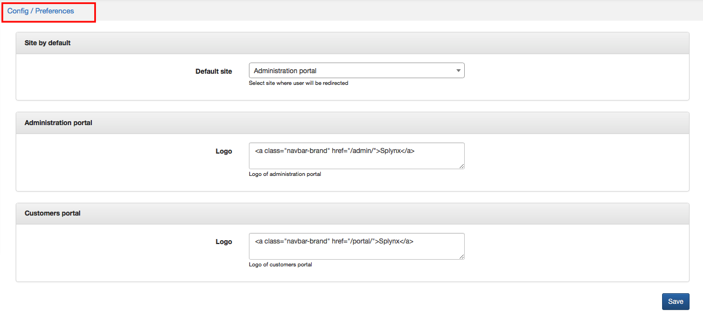

Preferences
==========

Basic settings of Administration and Customer portal can be configured in `Config →Main →Preferences`.

Following parameters can be set here:
* **Site by default** - select site where user will be redirected (Administration or Customer portal)
* **Administration portal** - create or change a Logo in Administration portal
* **Customer portal** - create or change a Logo in Customer portal

Information about creating and changing a logo of Admin or Customer portal you can find here - [File manager](configuration/system/file_manager/file_manager.md).
