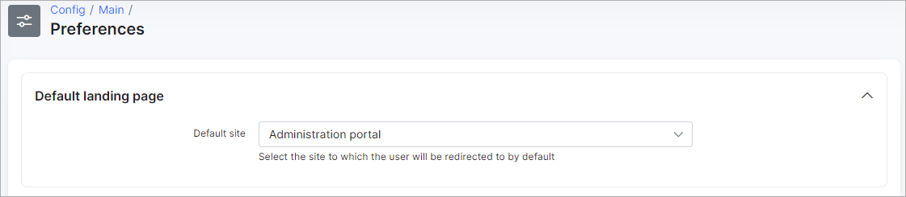
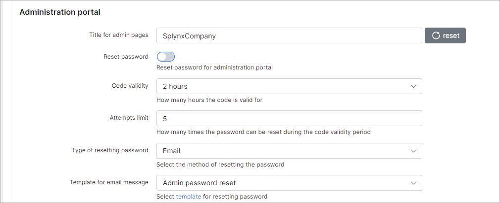

Preferences
==========

Basic settings of administrator and customer portal can be configured under `Config → Main → Preferences`.

## Default landing page
Here you can select what page(customer or admin portal) will be opened when somebody will visit your Splynx url https://yourSplynx.com :

## Administration portal

Here can be found settings for admin portal only.

* **Title for admin pages** - header for tab name in browser(Splynx: Preferences, Splynx: Dashboard);
* **Logo** - default code for admin portal logo. Here can be changed size of logo, and some other parameters;
* **Reset password** - enable/disable option to reset password for admin portal;
* **Code validity** - how much hours code for password reset is valid;
* **Attempts limit** - how many attempts can be changed password during the code validity period;
* **Type of resetting password** - method to reset password(Email or SMS);
* **Template for email message** - select template for email message to reset password;
* **Template for SMS message** - select template for SMS message to reset password;
* **Text for SMS message** - text for SMS message with code;
* **Characters for generate email check code** - list of characters for code generation over email;
* **Email check code length** - length of code for email;
* **Characters for generate SMS check code** - list of characters for code generation over SMS;
* **SMS check code length** - length of code for SMS.

## Customer portal

Here only style for portal logo can be changed.

## Server side data table processing

* **Enable processing** - enable/disable server processing in customer list and finance section;
* **Rule counter for server-side processing** - number of records after which server0side data table processing will be enabled;
* **Search delay** - search delay in milliseconds.

## Documentation
Please do not change this field. It's used to load in-built documentation.

## Map settings

Here you can configure maps.

* **Map type** - select map type: Openstreet, GoogleMaps or BingMap(OpenStreet is not required any configuration);
* **Google Maps API key (Restricted for domain)** - if map type selected as GoogleMaps here must be placed API key restricted for domain. [Guide how to get Maps API key](https://developers.google.com/maps/documentation/javascript/get-api-key)
* **Google Geocode Javascript API Key (Restricted for IP)** - if map type selected as GoogleMaps here must be placed JavaScript API key restricted for IP(IP of Splynx server). [Guide how to get JavaScript API key](https://developers.google.com/maps/documentation/javascript/get-api-key);
* **Google geocoding** - geocoding format used for Google Maps;
* **Bing Maps API key** - If BingMap is used, here must be placed Bing API key. [Manual here](https://docs.microsoft.com/en-us/bingmaps/getting-started/bing-maps-dev-center-help/getting-a-bing-maps-key);
* **Bing geocoding** - geocoding format used for Bing Maps;
* **OpenStreet geocoding** - geocoding format used for OpenStreet maps.

## Auto backup settings

Settings for auto backup.

* **Enabled** - enable/disable auto backup;
* **Period** - period for auto backup(Month, Week, Day);
* **Password** - password for auto backup;
* **Prefix** - prefix for auto backup files;
* **Categories for backup** - select what to backup(database, rrd files, templates, addons and handlers, uploads);
* **Rotation amount** - counter of auto backups for storage.

## Mention notifications

* **Enable mentions notifications** - enable/disable mentions notifications;
* **Subject** - subject of notification message;
* **Template** - template for notification body.

## Mention group notifications

* **Enable group mentions notifications** - enable/disable group mentions notifications;
* **Subject** - subject of notification message;
* **Template** - template for notification body.
