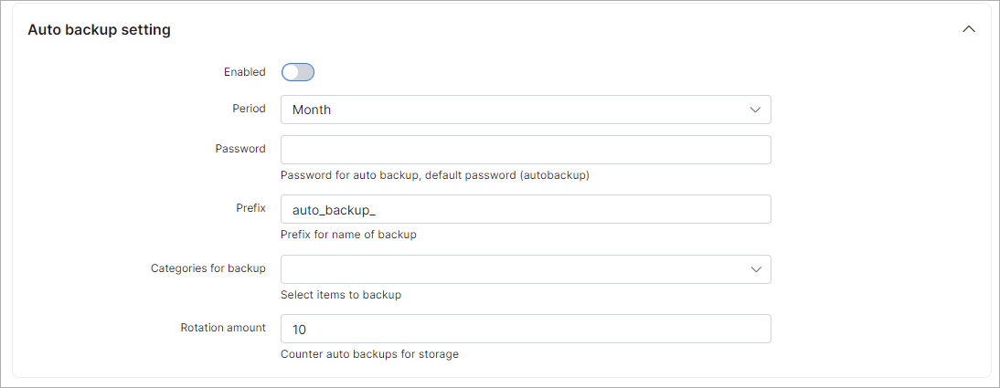

Preferences
==========

The main settings of the Administrator and Customer portal can be configured in `Config → Main → Preferences`.

### Default landing page
Here you can select which page (Customer or Admin portal) will be opened when your Splynx URL is accessed:

### Administration portal

The following settings apply to the Administration portal only:

* **Title for admin pages** - header for the tab name in the browser (`Splynx: Preferences`, `Splynx: Dashboard`);
* **Reset password** - enables/disables the option to reset the password for the Admin portal;
* **Code validity** - how many hours (from 1 up to 72) the code for the password reset is valid;
* **Attempts limit** - how many attempts can be made to change the password during the code validity period;
* **Type of resetting password** - select a method to reset password (Email or SMS);
* **Template for email message** - select the [template](configuration/system/templates/templates.md) for the email message to reset the password;
* **Text for SMS message** - type the text for the SMS message with the code (default field value: `Password reset code: {{ code }}`);
* **Characters available when generating an email check code** - specify the list of characters available for code generation via email;
* **Email check code length** - specify the length of the code for the email;
* **Characters available when generating an SMS check code** - specify the list of characters available for code generation via SMS;
* **SMS check code length** - specify the length of the code for SMS.

### Server side data table processing

* **Enable processing** - enables/disables server processing in the customer list and finance section;
* **Search delay** - search delay in milliseconds (`500` by default).

### Documentation

**Please do not change this field**. The URL is used to load built-in documentation by API.

### Auto backup settings

Settings for auto backup.

* **Enabled** - enables/disables auto backup;
* **Period** - period for auto backup (Month, Week, Day);
* **Password** - password for auto backup (`auto_backup_` by default);
* **Prefix** - prefix for auto backup files;
* **Categories for backup** - select what to backup (Full database, RRD files, Template, Addons and handlers, Public uploads);
* **Rotation amount** - counter of auto backups for storage.

### Mention notifications

These notifications are used to notify administrators when they are mentioned within Tasks, the CRM module, Tickets, as well as in customers' comments.

* **Enable Mentions notifications** - enables/disables mentions notifications;
* **Template** - select the template for notification body.

### Mention group notifications

* **Enable Group Mentions notifications** - enable/disable group mentions notifications;
* **Template** - template for notification body.

### Generate favicons

Here you can upload a custom image to create the favicons for your Splynx. A favicon serves as branding for your website. Its main purpose is to help visitors locate your page easier e.g. in opened tabs, bookmarks etc.

Click on `Download icons set` to download the archive with different size files (**.png** (from *16x16* to *310x310*) / **.ico** (*16x16* and *64x64*)).

Click on `Use as the system icons` to use the set of icons in the system.
